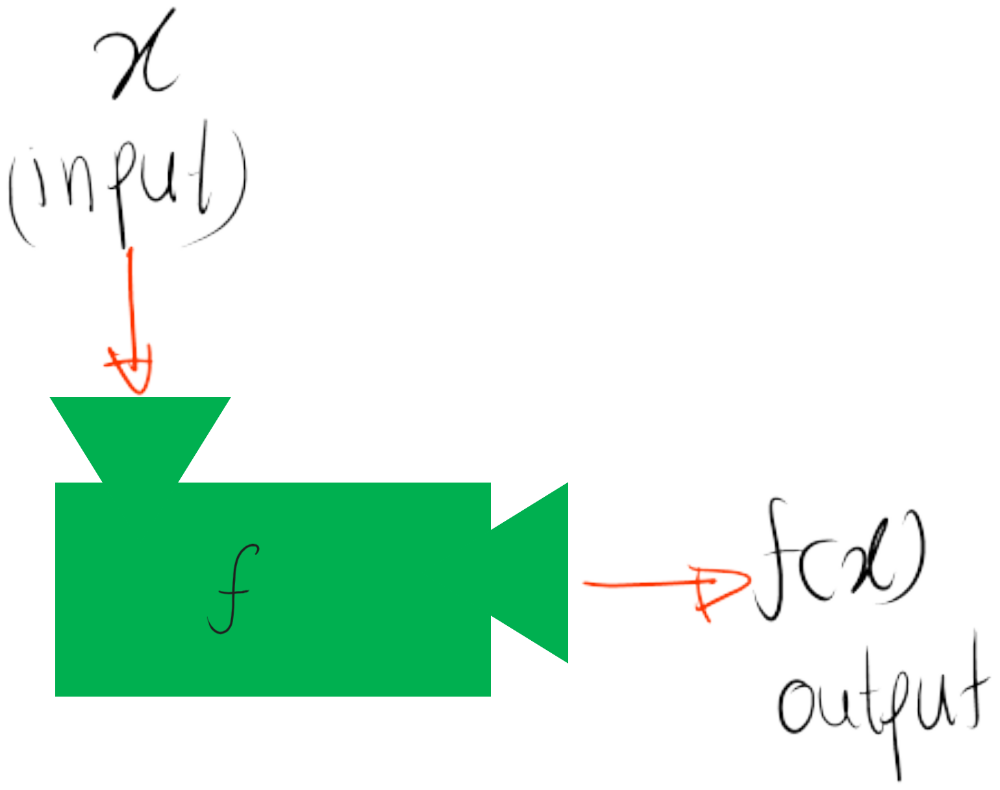
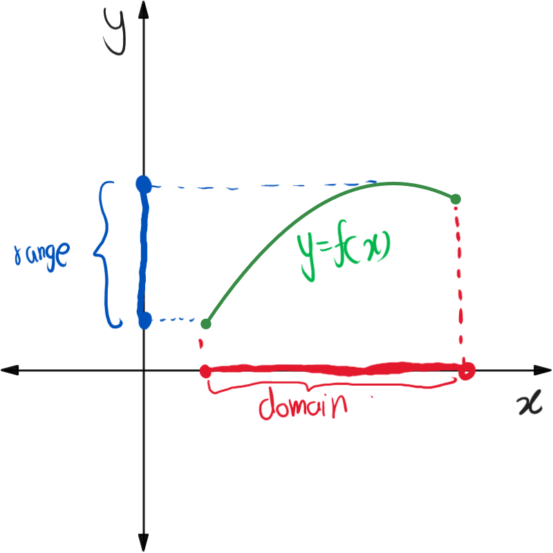
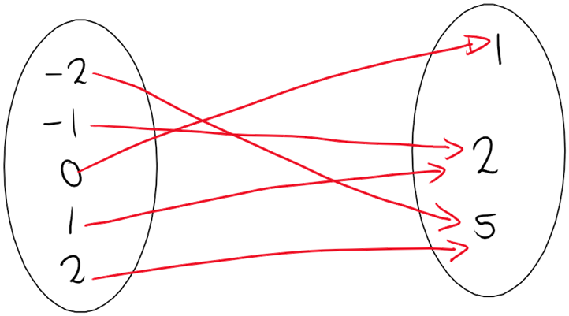
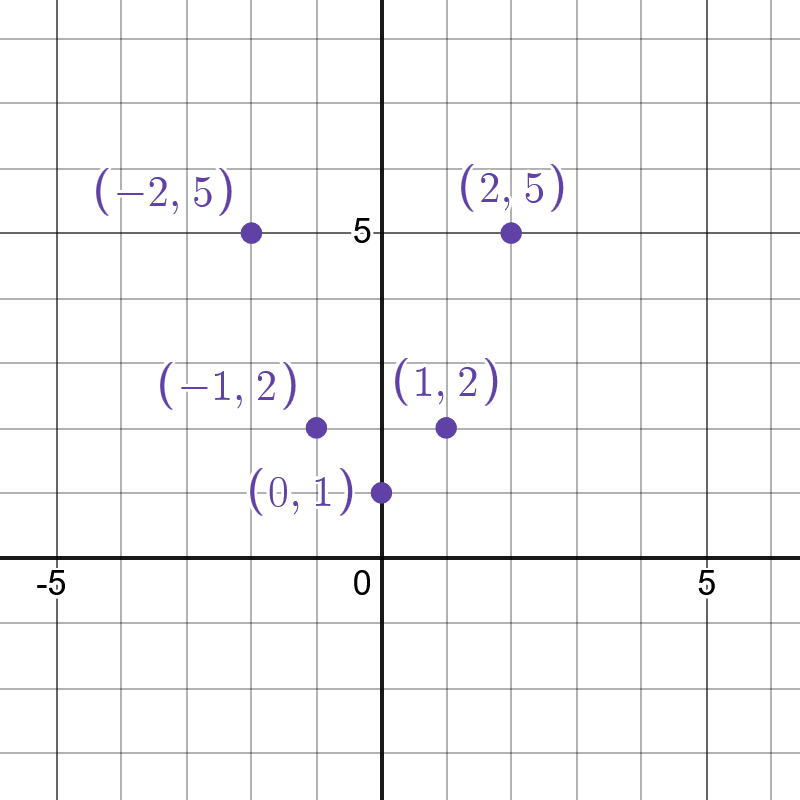
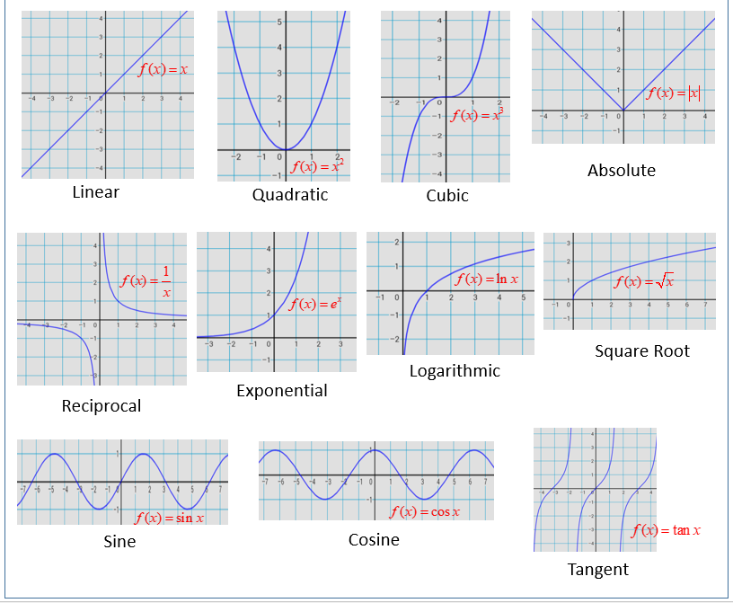
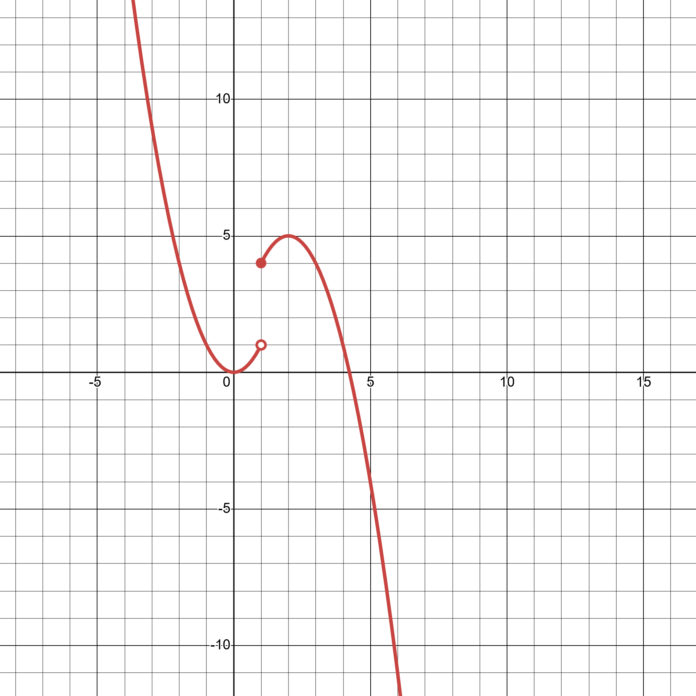

# Functions

## Functions

```{definition}
Let $A$ and $B$ be  two nonempty sets. A function from $A$ to $B$ is a rule of correspondence that assigns to each element in set $A$ exactly one element in $B$.

- The set $A$ in the definition is called the domain of the function.
- The set $B$ is called the co-domain of the function.
- The set of outputs is called the range of the function.
```

 It’s helpful to think of a function as a machine.
 



If is in the domain of  the function then when enters the machine, it’s accepted as an input and the machine  produces an output according to the rule of the function.  Thus we can think of the  domain as the set of all possible inputs and the range as the set of all possible outputs.

The graph of also allows us to picture the domain of on the $x$-axis and its  range on the $y$-axis as in Figure \@ref(fig:fig4).

{width=50%}
 
#### Representing Functions
The rule describing the function can be represented by a:

- Picture



- Table

| $x$ | $y$ |
|:----:|:---:|
| $−2$ | $5$ |
| $−1$ | $2$ |
| $0$ | $1$ |
| $1$ | $2$ |
| $2$ | $5$ |


- Formula $A = \{-2, -1, 0, 1, 2\}, B = \{1, 2, 5\}$ and $f(x) = x^2 + 1$
- Cartesian product $A = \{-2, -1, 0, 1, 2\}, B = \{1, 2, 5\}$ and $f = \{(-2, 5), (-1, 2), (0, 1), (1, 2), (2, 5)\}$
- Graph



- Function Notation
$$
f : A \rightarrow B\\
f(x) = \text{formula}
$$
The graph of also allows us to picture the domain of on the $x$-axis and its  range on the $y$-axis as in Figure


In this site, unless otherwise specified, the co-domain is the set of real numbers and the domain of a function is the set of real numbers for which the function is defined. We call this the domain convention.

```{example}
Determine the domain of each function

i. $f(x) = -5x + 1$
i. $f(x) = \frac{x}{3x^2 - 10x - 8}$
i. $f(x) = \sqrt{10x - 8}$
i. $f(x) = \sqrt{3x^2 - 10x + 8}$
```

```{definition,name='Graph of a Function'}  
The graph of a function $f$ consists of points whose coordinates $(x, y)$ satisfy $y = f(x)$, for all $x$ in the domain of $f$.

```



**Vertical Line Test** 

A function can only have one output, $y$, for each unique input, $x$. If a vertical line intersects a curve on an $xy$-plane more than once, then for one value of $x$ the curve has more than one value of $y$, and so, the curve does not represent a function.

```{example}
Use the vertical line test to determine when the graph is known.
```


## Piecewise Defined Functions

A piecewise-defined function (also called a piecewise function) is a function defined by multiple sub-functions, where each sub-function applies to a different interval in the domain.  
The absolute value function, $f(x) = |x|$
  
$$f(x) = \begin{cases} x & x \ge 0 \\ -x & x < 0 \end{cases}$$


$$g(x) = \begin{cases} x^2 & x < 1 \\ -(x - 2)^2 + 5 & x \geq 1 \end{cases}$$


```{example}
Given that $f(t) =\begin{cases} 2t & t \le 1 \\ 2t + 1 & 1 < t < 3 \\ -2t + 2 & t \ge 3 \end{cases}
$

Compute $f(0), f(1), f(2), f(3), f(5)$

```


## Combining Functions

If we are given two functions $f(x)$ and $g(x)$, is it possible to combine them in some way? YES!

1. Combining functions arithmetically
   - Addition of functions $(f + g)(x) = f(x) + g(x)$
   - Subtraction of functions $(f - g)(x) = f(x) - g(x)$
   - Multiplication of functions $(fg)(x) = (f(x)) \cdot (g(x))$
   - Division of functions $(f/g)(x) = \frac{f(x)}{g(x)}$. BE CAREFUL! We can do this only when $g(x) \neq 0$

2. Composition of functions $(g \circ f)(x) = g(f(x))$


```{example}
Given that $f(x) = x^2 + 5x + 6$ and $g(x) = \sqrt{x}$, find

i. $f + g$
i. $f - g$
i. $fg$
i. $\frac{f}{g}$
i. $f \circ g$ and $g \circ f$
```


## Inverse Functions

- QUESTION: Suppose you are given a function $y = f(x)$. For each value of $y$, can you find a corresponding value of $x$?  
- ANSWER: Maybe... depending on the actual $f(x)$ given.  
If we could, we have to solve the equation $y = f(x)$ for $x$. The solution is called the “inverse function of $f$”, and denoted by notation $f^{-1}$.


```{definition}
Let $f$ be a function with domain $D$ and range $R$. Then the function $g$ with domain $R$ and range $D$ is the inverse of $f$ if

$$
g \circ f(x) = x \quad \forall x \in D
$$
and

$$
f \circ g(x) = x \quad \forall x \in R
$$

If $g$ is the inverse of $f$, we denote it by $g = f^{-1}$.
```


```{example}
Given that $f(x) = \frac{2x + 8}{5}$, find $f^{-1}$, and verify that the function you found is the inverse of $f$.
```

