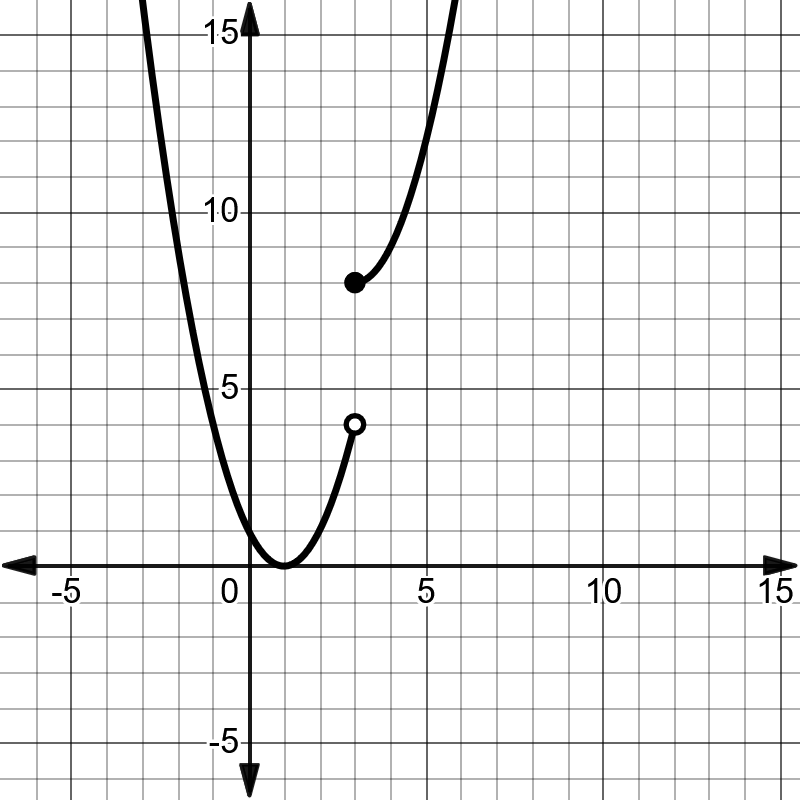
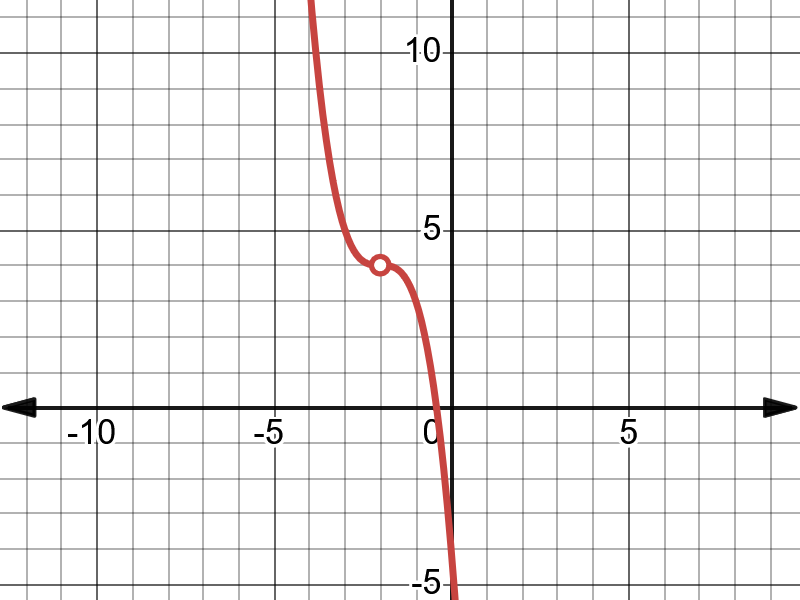
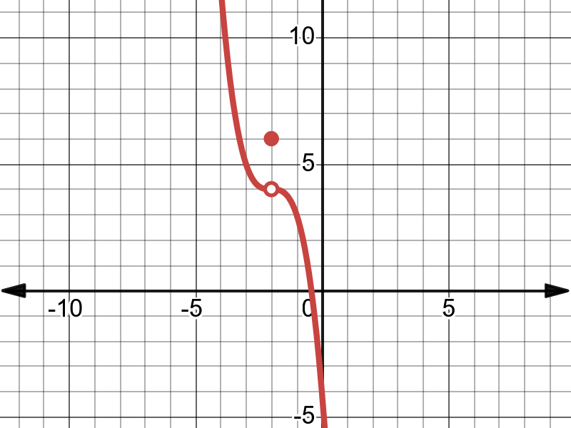
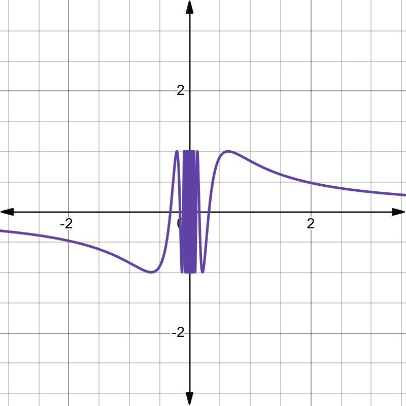

# Limits and Continuity

## The Limit of a Function

Intuitive definition of limit

```{definition,name='Left Limit'}
We write $\lim_{{x \to c^-}} f(x) = L$ if the number $f(x)$ (the function height) keeps getting close to $L$ as $x$ approaches $c$ from the left.
```

```{definition,name='Right Limit'}
We write $\lim_{{x \to c^+}} f(x) = L$ if the number $f(x)$ (the function height) keeps getting close to $L$ as $x$ approaches $c$ from the right.
}

 Left Limit and Right Limit are called one-sided limits.
 
 
 
```{definition,name='Two-sided Limit'}
We write

$\lim_{{x \to c}} f(x) = L$

if the number $f(x)$ (the function height) keeps getting close to the
same value $L$ as $x$ approaches $c$ from either direction.
```

```{theorem}
The two-sided limit

$$\lim_{{x \to c}} f(x)$$

exists if and only if the two one-sided limits

$$\lim_{{x \to c^-}} f(x) \quad \text{and} \quad \lim_{{x \to c^+}} f(x)$$

both exist and are equal. Furthermore, if

$$\lim_{{x \to c^-}} f(x) = L \quad \text{and} \quad \lim_{{x \to c^+}} f(x) = L$$

then

$$\lim_{{x \to c}} f(x) = L.$$
```

```{example,label='ex315',name='Evaluating limits using a graph'}

For each of the following functions, write down the left limit, right limit, two-sided limit, and the function value at the given point. If any limit is undefined, write \"UND\".


-   at $x = 4$


-   at $x = 3$



-   at $x = -2$



-   at $x = 3$



```


```{remark} 
In Example \@ref{exm:ex315}  

- part (a), you can observe that the limit (two-sided limit) at $x = 2$ is equal to the function value at that point. 

- In part (d), you can observe that the limit (two-sided
limit) at $x = 3$ is different from the function value at that point. 
- In general, there is no connection between the limit of a function at a point ($\lim_{{x \to c}} f(x)$) and the value of the function ($f(c)$)
at that point.

```


```{example}
| x      | f(x)     |
|--------|----------|
| -0.05  | 2.0025   |
| -0.25  | 2.0625   |
| -0.01  | 2.0001   |
| -0.001 | 2.000001 |
| 0.001  | 2.000001 |
| 0.01   | 2.0001   |
| 0.25   | 2.0625   |
| 0.5    | 2.25     |

Observing the table, we can say there is a good
chance that

$$\lim_{{x \to 0}} f(x) = 2.$$

One cannot use a table to calculate the limit exactly (Why?).
```


```{example}
The following figure shows the graph of
$f(x) = \sin\left(\frac{1}{x}\right)$. Observe that

$$\lim_{{x \to 0}} \sin\left(\frac{1}{x}\right)$$

is undefined.
```




The graph is better than the table when we use Definition 3.1. In this
course, we stick with Definition 3.1. It's not rigorous enough; you will learn the formal $\epsilon - \delta$ definition listed below in advanced math classes.


```{definition}
Let $f: \mathbb{R} \to \mathbb{R}$ and
$L \in \mathbb{R}$. We say that the limit of $f$ at $c$ is $L$ and
denote it by

$$\lim_{{x \to c}} f(x) = L,$$

if for each $\epsilon > 0$, there exists $\delta > 0$ such that:

$$|x - c| < \delta \Rightarrow |f(x) - L| < \epsilon.$$
```


## Continuity

In the most basic sense, a continuous function can be sketched in one
continuous stroke without lifting a pen or pencil. We would need to lift our pencil in drawing a function because it has a jump or hole in its graph. If there is a jump or hole in the graph, at that point, either the limit or function value is undefined, or they take different values. This leads to the following definition.

```{definition, name='Continuity at a point'}
We say a function is continuous at a point $x = c$, if the number $f(x)$ (the function height) keeps getting close to $f(c)$ as $x$ approaches $c$ from either direction. A function that is not continuous at $c$ is said to have a discontinuity at that point.
```


Following theorem is straightforward.


```{theorem,name='Continuity theorem I'}
A function $f$ is continuous
at a point $x = c$ if the following conditions are satisfied:

1.  $f(c)$ is defined;

2.  $\lim_{{x \to c}} f(x)$ is defined;

3.  $\lim_{{x \to c}} f(x) = f(c)$.
```

```{example}
For each of the following functions, state whether the function is continuous at the given point. If not, state which condition of continuity is broken at that point.

-   at $x = 4$

{width=30%}

-   at $x = 3$

{width=30%}

-   at $x = -2$

{width=30%}

-   at $x = 3$

{width=30%}
```


```{definition,name='Continuity of a function'}
A function is
**continuous on a set** $X$ if it is continuous at every point of $X$.
```


```{definition}
Let $f: \mathbb{R} \to \mathbb{R}$ and
$c \in \mathbb{R}$. $f$ is continuous at $c$ if for each $\epsilon > 0$,
there exists $\delta > 0$ such that:

$$|x - c| < \delta \Rightarrow |f(x) - f(c)| < \epsilon.$$
```


## Algebraic computation of limits

```{theorem,name='Basic properties and rules for limits'}
For any real number $c$, suppose that functions $f$ and $g$ both have
limits at $x = c$.

-   **Constant rule:** $\lim_{{x \to c}} k = k$.

-   **Multiple rule:**
    $\lim_{{x \to c}} [kf(x)] = k \lim_{{x \to c}} f(x)$ for any
    constant $k$.

-   **Sum rule:**
    $\lim_{{x \to c}} [f(x) + g(x)] = \lim_{{x \to c}} f(x) + \lim_{{x \to c}} g(x)$.

-   **Difference rule:**
    $\lim_{{x \to c}} [f(x) - g(x)] = \lim_{{x \to c}} f(x) - \lim_{{x \to c}} g(x)$.

-   **Product rule:**
    $\lim_{{x \to c}} [f(x) g(x)] = [\lim_{{x \to c}} f(x)][\lim_{{x \to c}} g(x)]$.

-   **Quotient rule:**
    $\lim_{{x \to c}} \frac{f(x)}{g(x)} = \frac{\lim_{{x \to c}} f(x)}{\lim_{{x \to c}} g(x)}$
    if $\lim_{{x \to c}} g(x) \neq 0$.

-   **Power rule:**
    $\lim_{{x \to c}} [f(x)]^n = [\lim_{{x \to c}} f(x)]^n$.

By using the $\epsilon - \delta$ definition of continuity and the above
theorem, we can establish the continuity of basic functions.


```{example}
Prove that $f(x) = x$ is continuous on the set of
real numbers.

```

```{proof}
For any $c \in \mathbb{R}$ and $\epsilon > 0$ let
$\delta = \epsilon$.

$$|x - c| < \delta \Rightarrow |x - c| < \epsilon \Rightarrow |f(x) - f(c)| < \epsilon$$
```

```{theorem,name='Continuity theorem II'}
If $f$ is a polynomial function, a rational function, a trigonometric
function, a trigonometric inverse function, an exponential function, or
a logarithmic function, then $f$ is continuous at any number $x = c$ for which $f(c)$ is defined.
```

```{proof}
Omitted
```

```{remark}
We can plug in the value to find the limit only if we
know that the function is continuous at that point.
```

```{example}
Evaluate each of the following limits:

i)   $\lim_{{x \to \frac{\pi}{6}}} \sin(x)$
i)   $\lim_{{x \to \frac{\pi}{6}}} \cos(x)$
i)   $\lim_{{x \to -\frac{\pi}{4}}} \sin(x)$
i)   $\lim_{{x \to 2}} x$
i)   $\lim_{{x \to \frac{\pi}{4}}} [\sin(x) + 2x + 3]$
i)   $\lim_{{x \to \frac{\sqrt{3}}{2}}} [\sin^{-1}(x) + \cos^{-1}(x)]$
i)   $\lim_{{x \to 2}} [2x^2 + 5x + 6]$
i)   $\lim_{{x \to 6}} [\ln(x) + e^x]$
i)   $\lim_{{x \to \frac{\pi}{6}}} \tan(x)$
i)   $\lim_{{x \to 2}} [2x^2 + 5x + 6]$
i)   $\lim_{{x \to \frac{\pi}{4}}} \frac{\sin(x) + \cos(x)}{\sin(x) \cos(x)}$
```

## Limits involving indeterminate forms $\frac{0}{0}$

**Rational functions**

Evaluate $\lim_{{x \to 5}} \frac{x^2 - 11x + 30}{x^2 - 25}$

Let us try applying the Quotient rule:

$$\lim_{{x \to 5}} \frac{x^2 - 11x + 30}{x^2 - 25} = \frac{\lim_{{x \to 5}} [x^2 - 11x + 30]}{\lim_{{x \to 5}} [x^2 - 25]} = \frac{25 - 55 + 30}{25 - 25} = \frac{0}{0}$$

The denominator (namely $\lim_{{x \to 5}} [x^2 - 25]$) is zero;
therefore, we cannot use the Quotient rule here.

```{remark}

_(Indeterminate form)_ In calculus and other branches of
mathematical analysis, an **indeterminate form** is an algebraic
expression obtained in the context of limits. Limits involving algebraic operations are often performed by replacing expressions by their limits;
if the expression obtained after this substitution does not give enough
information to determine the original limit, it is known as an
indeterminate form. $\frac{0}{0}$ is one of the indeterminate forms you
will encounter in calculus 1.

Let us examine a method that can be used to go around this problem. We
want to evaluate $\lim_{{x \to 5}} \frac{x^2 - 11x + 30}{x^2 - 25}$.

Set $f(x) = \frac{x^2 - 11x + 30}{x^2 - 25}$ and we are looking for
$\lim_{{x \to 5}} f(x)$. Let us take a closer look at $f(x)$:

$$f(x) = \frac{x^2 - 11x + 30}{x^2 - 25} = \frac{(x - 5)(x - 6)}{(x - 5)(x + 5)} = \frac{x - 6}{x + 5} \quad \text{when } x \neq \pm 5$$

Still, 5 is not in the domain of $f$. Define a new function $g(x)$ by
$g(x) = \frac{x - 6}{x + 5}$. Observe that $g(x)$ is originally defined
as $\frac{x - 6}{x + 5}$ and 5 is in the domain of $g(x)$.

Now look at the graphs of $f(x)$ and $g(x)$. Observe that $g(x)$ is
defined and continuous at $x = 5$. Therefore, we can plug in 5 to get
$\lim_{{x \to 5}} g(x)$:

$$\lim_{{x \to 5}} g(x) = g(5) = \frac{5 - 6}{5 + 5} = -\frac{1}{10}$$

Of course, the graph of $f(x)$ has a hole at 5. Therefore, $f$ is not
continuous at 5. We cannot plug in 5 to get $\lim_{{x \to 5}} f(x)$, but
comparing the graphs of $f(x)$ and $g(x)$, one can observe that:

$$\lim_{{x \to 5}} f(x) = \lim_{{x \to 5}} g(x)$$

Since $\lim_{{x \to 5}} g(x) = -\frac{1}{10}$, $\lim_{{x \to 5}} f(x)$
is also $-\frac{1}{10}$.

The following summarizes the observations we made. Suppose
$R(x) = \frac{f(x)}{g(x)}$ and we want to evaluate
$\lim_{{x \to c}} R(x)$. Use of the quotient rule leads to the
indeterminate form $\frac{0}{0}$. The following steps might help to go
around this problem:

1.  Factor out the numerator and denominator.

2.  Cancel the common factors.

3.  Use limits rules to evaluate the limit of the remaining function.

```


## Limits Involving Infinity

### Infinite Limits

It may happen that a function $f$ does not have a finite limit as $x \rightarrow c$. When $\lim _{x \rightarrow c} f(x)$ fails to exist, the function values $f(x)$ are said to diverge as $x \rightarrow c$.

```{example}
Consider the function $f(x)=\frac{1}{x^{2}}$.

| $x$ | $f(x)$ |
| :---: | :---: |
| 0.1 | 100 |
| 0.01 | 10000 |
| 0.001 | $10^{6}$ |
| 0.0001 | $10^{8}$ |
| 0.00001 | $10^{10}$ |

As $x \rightarrow 0, f(x) \rightarrow \infty$. The graph of $f(x)=\frac{1}{x^{2}}$ illustrates this behavior.
```

```{r,echo=FALSE,message=FALSE,warning=FALSE}
# Load required library
library(ggplot2)

# Define the data
x_left <- seq(-10, -0.1, by = 0.1)  # Left side of the graph
y_left <- 1 / x_left^2

x_right <- seq(0.1, 10, by = 0.1)   # Right side of the graph
y_right <- 1 / x_right^2

data_left <- data.frame(x = x_left, y = y_left)
data_right <- data.frame(x = x_right, y = y_right)

# Plot the graph
ggplot() +
  geom_line(data = data_left, aes(x = x, y = y), color = "blue") +
  geom_line(data = data_right, aes(x = x, y = y), color = "blue") +
  labs(
    title = "The Graph of f(x) = 1/x^2",
    x = "x",
    y = "f(x)"
  ) +
  geom_hline(yintercept = 0, color = "black") +
  geom_vline(xintercept = 0, color = "black") +
  theme_minimal()

```


```{definition}
A function $f$ that increases or decreases without bound as $x$ approaches $c$ is said to tend to infinity ( $\infty$ ) at c. We indicate this behavior by writing:

$$
\lim _{x \rightarrow c} f(x)=\infty \quad \text { or } \quad \lim _{x \rightarrow c} f(x)=-\infty
$$
```

```{example}

$$
\lim _{x \rightarrow 0} \frac{1}{x^{2}}=\infty
$$

$$
\lim _{x \rightarrow 0^{-}} \frac{1}{x}=-\infty \quad \text { and } \quad \lim _{x \rightarrow 0^{+}} \frac{1}{x}=\infty
$$
```

The graph of $f(x)=\frac{1}{x}$ shows this behavior:


```{r,echo=FALSE,message=FALSE,warning=FALSE}
# Load required library
library(ggplot2)

# Define the data
x_left <- seq(-10, -0.1, by = 0.1)  # Left side of the graph
y_left <- 1 / x_left

x_right <- seq(0.1, 10, by = 0.1)   # Right side of the graph
y_right <- 1 / x_right

data_left <- data.frame(x = x_left, y = y_left)
data_right <- data.frame(x = x_right, y = y_right)

# Plot the graph
ggplot() +
  geom_line(data = data_left, aes(x = x, y = y), color = "blue") +
  geom_line(data = data_right, aes(x = x, y = y), color = "blue") +
  labs(
    title = "The Graph of f(x) = 1/x",
    x = "x",
    y = "f(x)"
  ) +
  geom_hline(yintercept = 0, color = "black") +
  geom_vline(xintercept = 0, color = "black") +
  theme_minimal()

```


```{example}
Evaluate the limit:

$$
\lim _{x \rightarrow 1}\left(\frac{1}{x^{2}-1}-1\right)
$$

**Solution**: We begin by substituting $x=1+h$, where $h \rightarrow 0$. The expression becomes:

$$
\frac{1}{(1+h)^{2}-1}-1
$$

Expanding $(1+h)^{2}$ :

$$
(1+h)^{2}-1=2 h+h^{2}
$$

So, the expression becomes:

$$
\frac{1}{2 h+h^{2}}-1=\frac{1-\left(2 h+h^{2}\right)}{2 h+h^{2}}=\frac{1-2 h-h^{2}}{2 h+h^{2}}
$$

One-Sided Limits: As $h \rightarrow 0$ :

- For $h \rightarrow 0^{+}$(approaching from the right):

For $h>0$, we analyze the expression $\frac{1}{2 h+h^{2}}$. Since $h$ is positive and small, the term $h^{2}$ is negligible compared to $2 h$, so the expression behaves similarly to $\frac{1}{2 h}$.

As $h \rightarrow 0^{+}, 2 h$ becomes very small, and the reciprocal $\frac{1}{2 h}$ grows without bound towards $+\infty$.
Thus, the limit from the right is $+\infty$.

- For $h \rightarrow 0^{-}$(approaching from the left):

For $h<0$, the expression $\frac{1}{2 h+h^{2}}$ behaves similarly to $\frac{1}{2 h}$, but since $h$ is negative, $\frac{1}{2 h}$ becomes negative. As $h \rightarrow 0^{-}, 2 h$ still becomes very small, but the expression grows large and negative.

Thus, the limit from the left is $-\infty$.
Since the one-sided limits are not equal, the two-sided limit does not exist.
Thus, the limit is:

$$
\lim _{x \rightarrow 1}\left(\frac{1}{x^{2}-1}-1\right) \text { does not exist. }
$$
```


```{example}
Evaluate the limit:

$$
\lim \frac{x^{2}+3 x-4}{2}
$$
```

**Solution**
Step 1: Factor the numerator and denominator:

$$
\frac{x^{2}+3 x-4}{x^{2}-4}=\frac{(x-1)(x+4)}{(x-2)(x+2)}
$$

Step 2: Substitute $x=2+h$, where $h \rightarrow 0$ :
Substitute $x=2+h$ into the factored form:

- The numerator becomes:

$$
(x-1)(x+4)=(2+h-1)(2+h+4)=(1+h)(6+h)
$$

- The denominator becomes:

$$
(x-2)(x+2)=(2+h-2)(2+h+2)=h(4+h)
$$

Thus, the expression becomes:

$$
\frac{(1+h)(6+h)}{h(4+h)}=\frac{6+7 h+h^{2}}{4 h+h^{2}}
$$

Step 3: Analyze the one-sided limits:
Case 1: $h \rightarrow 0^{+}$(from the right):
As $h \rightarrow 0^{+}$, the numerator behaves like $6+7 h$ and the denominator behaves like $4 h$, which is positive. The expression behaves like:

$$
\frac{6+7 h}{4 h} \rightarrow \frac{6}{4 h} \rightarrow+\infty \quad\left(\text { as } h \rightarrow 0^{+}\right)
$$

Thus, the limit from the right is $+\infty$.

Case 2: $h \rightarrow 0^{-}$(from the left):

As $h \rightarrow 0^{-}$, the numerator behaves like $6+7 h$ and the denominator behaves like $4 h$, which is negative. The expression behaves like:

$$
\frac{6+7 h}{4 h} \rightarrow \frac{6}{4 h} \rightarrow-\infty \quad\left(\text { as } h \rightarrow 0^{-}\right)
$$

Thus, the limit from the left is $-\infty$.
Step 4: Conclusion:
Since the one-sided limits are not equal (the limit from the right is $+\infty$ and the limit from the left is $-\infty$ ), the two-sided limit does not exist.

$$
\lim _{x \rightarrow 2} \frac{x^{2}+3 x-4}{x^{2}-4} \text { does not exist.}
$$


```{example}
 Evaluate the limit:

$$
\lim _{x \rightarrow 0} \frac{1}{\sin (x)}
$$
```

### The Nature of Discontinuities

Discontinuities can be classified as jump, infinite, removable, or oscillating.

- Removable Discontinuities: The limit exists finitely. Removable discontinuities can be "fixed" by redefining the function.
- Jump Discontinuities: Both one-sided limits exist and are finite, but have different values.
- Infinite Discontinuities: An infinite discontinuity exists when one of the one-sided limits of the function is infinite.
- Oscillating Discontinuities: An oscillating discontinuity exists when the values of the function appear to be approaching two or more values simultaneously.


### Examples of Discontinuities

```{example}
(Removable Discontinuity). Consider the function $f(x)=\frac{x^{2}-1}{x-1}$. The function has a removable discontinuity at $x=1$.

$$
f(x)=\frac{(x-1)(x+1)}{x-1}=x+1 \quad \text { for } \quad x \neq 1
$$

By defining $f(1)=2$, the discontinuity is removed.
```

```{example,name="Jump Discontinuity"}
Consider the function

$$
f(x)= \begin{cases}x^{2} & \text { if } x<1 \\ 2-x & \text { if } x \geq 1\end{cases}
$$

The function has a jump discontinuity at $x=1$.
```

```{example,name="Infinite Discontinuity"} 
Consider the function

$$
f(x)=\frac{1}{x-1}
$$

The function has an infinite discontinuity at $x=1$.
```

```{example}
(Oscillating Discontinuity). Consider the function

$$
f(x)=\sin \left(\frac{1}{x}\right)
$$

The function has an oscillating discontinuity at $x=0$.
```

```{example}
 Evaluate the limit:

$$
\lim _{x \rightarrow 2} \frac{x^{2}-4}{x-2}
$$
```

**Solution**. The function has a removable discontinuity at $x=2$. Factor the numerator:

$$
\frac{x^{2}-4}{x-2}=\frac{(x-2)(x+2)}{x-2}=x+2 \quad \text { for } \quad x \neq 2
$$

Thus,

$$
\lim _{x \rightarrow 2} \frac{x^{2}-4}{x-2}=\lim _{x \rightarrow 2}(x+2)=4
$$

```{example}
Determine the continuity of the function:

$$
f(x)= \begin{cases}3 x+1 & \text { if } x<0 \\ 2 x-1 & \text { if } x>0\end{cases}
$$
```

**Solution**: Check the limits from both sides at $x=0$ :

$$
\lim _{x \rightarrow 0^{-}}(3 x+1)=1 \quad \text { and } \quad \lim _{x \rightarrow 0^{+}}(2 x-1)=-1
$$

The function has a jump discontinuity at $x=0$.


```{example}
Given

$$
g(x)=\frac{x-2}{(x-1)^{2}(x-3)}
$$

(a) $\lim _{x \rightarrow 1} g(x)$
(b) $\lim _{x \rightarrow 3} g(x)$
```

**Solution**.


a. $\lim _{x \rightarrow 1} g(x)$

Let's use the substitution $x=1+h$, where $h \rightarrow 0$.

$$
g(1+h)=\frac{(1+h)-2}{((1+h)-1)^{2}((1+h)-3)}=\frac{h-1}{h^{2}(h-2)}=\frac{h-1}{h^{3}-2 h^{2}}=\frac{1-\frac{1}{h}}{h^{2}-2 h}
$$

As $h \rightarrow 0$, we need to consider the behavior of the function from both sides of $x=1$ :

- For $h \rightarrow 0^{+}$(approaching 1 from the right):

$$
g(1+h) \approx \frac{-1}{h^{2}} \quad \Rightarrow \quad \lim _{h \rightarrow 0^{+}} g(1+h)=-\infty
$$

- For $h \rightarrow 0^{-}$(approaching 1 from the left):

$$
g(1+h) \approx \frac{-1}{h^{2}} \quad \Rightarrow \quad \lim _{h \rightarrow 0^{-}} g(1+h)=-\infty
$$

Since both one-sided limits approach $-\infty$ :

$$
\lim _{x \rightarrow 1} g(x)=-\infty
$$

b. $\lim _{x \rightarrow 3} g(x)$

Let's use the substitution $x=3+h$, where $h \rightarrow 0$.

$$
g(3+h)=\frac{(3+h)-2}{((3+h)-1)^{2}((3+h)-3)}=\frac{1+h}{h(2+h)^{2}}=\frac{1+h}{h\left(4+4 h+h^{2}\right)} \approx \frac{1}{4 h} \quad \text { as } \quad h \rightarrow 0
$$

As $h \rightarrow 0$, we need to consider the behavior of the function from both sides of $x=3$ :

- For $h \rightarrow 0^{+}$(approaching 3 from the right):

$$
g(3+h) \approx \frac{1}{4 h} \quad \Rightarrow \quad \lim _{h \rightarrow 0^{+}} g(3+h)=+\infty
$$

- For $h \rightarrow 0^{-}$(approaching 3 from the left):

$$
g(3+h) \approx \frac{1}{4 h} \quad \Rightarrow \quad \lim _{h \rightarrow 0^{-}} g(3+h)=-\infty
$$

Since the one-sided limits approach $\pm \infty$ :

$$
\lim _{x \rightarrow 3} g(x) \text { does not exist. }
$$

$$
\lim _{x \rightarrow-4^{+}} \frac{-x^{3}+5 x^{2}-6 x}{-x^{3}-4 x^{2}}
$$

```{definition}
(Vertical Asymptote). If $\lim _{x \rightarrow a} f(x)= \pm \infty, \lim _{x \rightarrow a^{+}} f(x)= \pm \infty$, or $\lim _{x \rightarrow a^{-}} f(x)= \pm \infty$, the line $x=a$ is called a vertical asymptote of $f$.
```


**Solution**. 

- The numerator is:

$$
-x^{3}+5 x^{2}-6 x=-x\left(x^{2}-5 x+6\right)
$$

Factorizing $x^{2}-5 x+6$ :

$$
x^{2}-5 x+6=(x-2)(x-3)
$$

Thus, the numerator becomes:

$$
-x^{3}+5 x^{2}-6 x=-x(x-2)(x-3)
$$

- The denominator is:

$$
-x^{3}-4 x^{2}=-x^{2}(x+4)
$$

Step 2: Rewrite the limit

Substitute the factored forms into the limit:

$$
\lim _{x \rightarrow-4^{+}} \frac{-x(x-2)(x-3)}{-x^{2}(x+4)}
$$

Simplify by canceling $-x($ note $x \neq 0)$ :

$$
\lim _{x \rightarrow-4^{+}} \frac{(x-2)(x-3)}{x(x+4)}
$$

Step 3: Substitute $x=-4+h$

Let $x=-4+h$, where $h \rightarrow 0^{+}$. Then:
$x+4=(-4+h)+4=h, \quad x=-4+h, \quad x-2=(-4+h)-2=-6+h, \quad x-3=(-4+h)-3=-7+h$.
Substitute these into the simplified expression:

$$
\frac{(x-2)(x-3)}{x(x+4)}=\frac{(-6+h)(-7+h)}{(-4+h) h}
$$

Step 4: Analyze dominant terms as $h \rightarrow 0^{+}$

For small $h$, the dominant terms are:

$$
-6+h \approx-6, \quad-7+h \approx-7, \quad-4+h \approx-4, \quad x+4 \approx h .
$$

Thus, the expression becomes approximately:

$$
\frac{(-6)(-7)}{(-4)(h)}
$$

Simplify the constants:

$$
\frac{(-6)(-7)}{(-4)(h)}=\frac{42}{-4 h}=-\frac{42}{4 h}=-\frac{21}{2 h} .
$$

Step 5: Take the limit as $h \rightarrow 0^{+}$

As $h \rightarrow 0^{+}, \frac{1}{h} \rightarrow \infty$. Therefore:

$$
-\frac{21}{2 h} \rightarrow-\infty
$$

Final Answer

The limit is:

$$
\lim _{x \rightarrow-4^{+}} \frac{-x^{3}+5 x^{2}-6 x}{-x^{3}-4 x^{2}}=-\infty
$$

---

```{r,echo=FALSE,message=FALSE,warning=FALSE}
  # Load required library
  library(ggplot2)
  # Define the data
  x_left <- seq(-10, 0.9, by = 0.1)  # Left side of the graph
  y_left <- 1/(x_left-1)
  x_right <- seq(1.1, 10, by = 0.1)   # Right side of the graph
  y_right <- 1/(x_right-1)
  data_left <- data.frame(x = x_left, y = y_left)
  data_right <- data.frame(x = x_right, y = y_right)
  # Plot the graph
  ggplot() +
    geom_line(data = data_left, aes(x = x, y = y, color = "y = f(x)")) +
    geom_line(data = data_right, aes(x = x, y = y, color = "y = f(x)")) +
    geom_hline(yintercept = 0, color = "black") +
    geom_vline(xintercept = 0, color = "black") +
    geom_vline(aes(xintercept = 1, color = "x = a"), linetype = "dashed") +
    scale_color_manual(values = c("y = f(x)" = "blue", "x = a" = "red")) +
    labs(
      title = "Graph of a function with a vertical asymptote at  x=a.",
      x = "x",
      y = "f(x)"
    ) +
    theme_minimal() +
    theme(legend.position = c(0.9, 0.9),
          legend.box = "vertical",
          legend.title = element_blank())
```


```{example}
Let

$$
f(x)=\frac{x^{2}-4 x+3}{x^{2}-1}
$$
Evaluate the following limits and find the vertical asymptotes of $f$ . Verify your work with a graphing utility.

a. $\lim _{x \rightarrow 1} f(x)$
b. $\lim _{x \rightarrow-1^{-}} f(x)$
c. $\lim _{x \rightarrow-1^{+}} f(x)$
```

**Solution**. We are given the function

$$
f(x)=\frac{x^{2}-4 x+3}{x^{2}-1}
$$

First, we factorize both the numerator and the denominator:

$$
x^{2}-4 x+3=(x-3)(x-1), \quad x^{2}-1=(x-1)(x+1) .
$$

Thus, the function becomes:

$$
f(x)=\frac{(x-3)(x-1)}{(x-1)(x+1)}
$$

We can cancel out the common factor of $(x-1)($ note that $x \neq 1)$ :

$$
f(x)=\frac{x-3}{x+1}, \quad \text { for } x \neq 1
$$

**Vertical Asymptotes**\
Vertical asymptotes occur where the denominator is zero but the numerator is not zero. From the factorized form, we can see that: - The denominator $x^{2}-1=(x-1)(x+1)$ is zero when $x=1$ or $x=-1$. - At $x=1$, the factor $(x-1)$ cancels out, so there is a removable discontinuity (not a vertical asymptote). - At $x=-1$, the denominator is zero, but the numerator $x-3$ is not zero. Therefore, there is a **vertical asymptote at $x=-1$**.

Thus, the function has a vertical asymptote at $x=-1$.
Step-by-Step Evaluation of Limits

(a) $\lim _{x \rightarrow 1} f(x)$

Since $x=1$ is a removable discontinuity, we evaluate the limit using the simplified function:

$$
f(x)=\frac{x-3}{x+1}
$$

Substitute $x=1$ :

$$
\begin{gathered}
\lim _{x \rightarrow 1} f(x)=\frac{1-3}{1+1}=\frac{-2}{2}=-1 \\
\lim _{x \rightarrow 1} f(x)=-1
\end{gathered}
$$

(b) $\lim _{x \rightarrow-1^{-}} f(x)$

Now, we substitute $x=-1+h$, where $h \rightarrow 0^{-}$(approaching -1 from the left). We have:

$$
x-3=(-1+h)-3=-4+h, \quad x+1=(-1+h)+1=h .
$$

Thus, the function becomes:

$$
f(x)=\frac{x-3}{x+1}=\frac{-4+h}{h} .
$$

For small $h$, the dominant terms are:

$$
f(x) \approx \frac{-4}{h} .
$$

As $h \rightarrow 0^{-}$, the expression $\frac{-4}{h}$ approaches $+\infty$ because $h$ is negative.

$$
\lim _{x \rightarrow-1^{-}} f(x)=+\infty
$$
c)  $\lim _{x \rightarrow-1^{+}} f(x)$

Similarly, let $x=-1+h$, where $h \rightarrow 0^{+}$(approaching -1 from the right). We have:

$$
x-3=(-1+h)-3=-4+h, \quad x+1=(-1+h)+1=h .
$$

Thus, the function becomes:

$$
f(x)=\frac{x-3}{x+1}=\frac{-4+h}{h} .
$$

For small $h$, the dominant terms are:

$$
f(x) \approx \frac{-4}{h}
$$

As $h \rightarrow 0^{+}$, the expression $\frac{-4}{h}$ approaches $-\infty$ because $h$ is positive.

$$
\lim _{x \rightarrow-1^{+}} f(x)=-\infty
$$

**Conclusion**

a) $\lim _{x \rightarrow 1} f(x)=-1$, 
b) $\lim _{x \rightarrow-1^{-}} f(x)=+\infty$, 
c) $\lim _{x \rightarrow-1^{+}} f(x)=-\infty$.

The function has a **vertical asymptote** at $x=-1$.


```{r,echo=FALSE,message=FALSE,warning=FALSE}
library(ggplot2)

# Define the function: f(x) = (x² - 4x + 3)/(x² - 1) = (x-1)(x-3)/[(x-1)(x+1)] = (x-3)/(x+1) for x ≠ 1
# This creates a vertical asymptote at x = -1 and removable discontinuity at x = 1

# Left side of vertical asymptote (x < -1)
x_left <- seq(-5, -1.005, by = 0.05)
y_left <- (x_left - 3)/(x_left + 1)

# Right side of vertical asymptote (-1 < x < 1)
x_middle <- seq(-0.905, 0.905, by = 0.05)
y_middle <- (x_middle - 3)/(x_middle + 1)

# Right side of removable discontinuity (x > 1)
x_right <- seq(1.005, 5, by = 0.05)
y_right <- (x_right - 3)/(x_right + 1)

# Create data frames
data_left <- data.frame(x = x_left, y = y_left)
data_middle <- data.frame(x = x_middle, y = y_middle)
data_right <- data.frame(x = x_right, y = y_right)

# Plot
ggplot() +
  # Function curves
  geom_line(data = data_left, aes(x = x, y = y), color = "black", size = 1.2) +
  geom_line(data = data_middle, aes(x = x, y = y), color = "black", size = 1.2) +
  geom_line(data = data_right, aes(x = x, y = y), color = "black", size = 1.2) +
  
  # Vertical asymptote at x = -1
  geom_vline(xintercept = -1, color = "red", linetype = "dashed", size = 1) +
  
  # Removable discontinuity at x = 1 (open circle)
  # At x = 1, the function value would be (1-3)/(1+1) = -2/2 = -1
  geom_point(aes(x = 1, y = -1), color = "black", fill = "white", size = 3, shape = 21, stroke = 1.5) +
  
  # Axes
  geom_hline(yintercept = 0, color = "black", size = 0.8) +
  geom_vline(xintercept = 0, color = "black", size = 0.8) +
  
  # Add arrow to x-axis
  geom_segment(aes(x = 4.8, y = 0, xend = 5, yend = 0), 
               arrow = arrow(length = unit(0.2, "cm"), type = "closed"),
               color = "black", size = 0.8) +
  
  # Add arrow to y-axis
  geom_segment(aes(x = 0, y = 4.8, xend = 0, yend = 5), 
               arrow = arrow(length = unit(0.2, "cm"), type = "closed"),
               color = "black", size = 0.8) +
  
  # Add axis labels
  annotate("text", x = 5.2, y = -0.2, label = "x", size = 4) +
  annotate("text", x = -0.2, y = 5.2, label = "y", size = 4) +
  
  # Add tick marks and labels
  annotate("text", x = -2, y = -0.3, label = "-2", size = 3) +
  annotate("text", x = 1, y = -0.3, label = "1", size = 3) +
  annotate("text", x = 3, y = -0.3, label = "3", size = 3) +
  annotate("text", x = 5, y = -0.3, label = "5", size = 3) +
  geom_segment(aes(x = -2, y = -0.1, xend = -2, yend = 0.1), color = "black") +
  geom_segment(aes(x = 1, y = -0.1, xend = 1, yend = 0.1), color = "black") +
  geom_segment(aes(x = 3, y = -0.1, xend = 3, yend = 0.1), color = "black") +
  geom_segment(aes(x = 5, y = -0.1, xend = 5, yend = 0.1), color = "black") +
  
  # Set limits and remove background
  xlim(-5.5, 5.5) +
  ylim(-5, 5) +
  theme_void() +
  theme(
    panel.background = element_blank(),
    plot.background = element_blank()
  )
```
<center>
Graph of a function with a vertical asymptote at $x=-1$ and a removable discontinuity at $x=1$.
</center>

