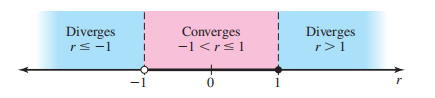

# Sequence

## The \(\epsilon- N\) Definition of a Limit of Sequence

```{definition,name='The epsilon− N  Definition of a Limit of Sequence'}
The number $L$ is the limit of the sequence $\{a_n\}$. If for each \(\epsilon> 0 , \exists N \in \mathbb{R}\),such that $$n > N \implies |an − L| < \epsilon.$$
```

Now let us look at examples demonstrating the use of the \( \epsilon - N \) definition in proofs. Note that the definition provides no help in postulating the value of the limit. It is only applicable when proving that the postulated value is correct. As we are concentrating on the proofs, in the upcoming examples, we will provide the value of the limits.

Before that, let us concentrate on some technical aspects of the definition. To establish the \( \epsilon - N \) definition in a proof: For each \( \epsilon > 0 \), you must guarantee the existence of an \( N \) such that the condition \( |a_n - L| < \epsilon \) is satisfied for all \( n > N \). It is required to develop an argument that will work for any given \( \epsilon \). To achieve this, adhere to the following principles:

- Start the proof by saying, "Let \( \epsilon > 0 \)."
- Throughout the proof, do not make any "special" assumptions^[Also, you can assume that $\epsilon$ is less than some value. In general, if you are proving a statement is valid for all $\epsilon > 0$, this is not allowed. However, the nature of the definition permits it. As we discussed earlier when constructing the definition, if you find an $N$ value for some $\epsilon$, say, $\epsilon_0$, the same $N$ works for all $\epsilon \geq \epsilon_0$.
]. You cannot choose the \( \epsilon \) value (you can only assume that \( \epsilon > 0 \)).

The phrase "there exists" in a mathematical statement is always a signal for a scavenger hunt. In this case:

- First, somehow find a starting \( N \) value.
- Show that for any \( n > N \), the condition \( |a_n - L| < \epsilon \) is satisfied.

The epsilon definition does not provide a method to find the starting \( N \) value. 

In proofs, it is not required to describe how you found the starting \( N \) value. As long as there are correct arguments to establish that "all \( a_n \) afterwards \( N \) satisfy the necessary condition," the proof is valid. Even though it is not required to explain how you found it, you still need an \( N \). 

The following technique can help get the wheels in motion. You are expected to show that \( a_n \) values after \( N \) satisfy the inequality \( |a_n - L| < \epsilon \). Therefore, start with the inequality \( |a_n - L| < \epsilon \) and think backward to figure out a possible starting \( N \). Once you determine \( N \), you can construct the formal proof to establish that the \( a_n \) values after \( N \) satisfy the necessary condition.


```{example}
Prove that 
\[
\lim_{n \to \infty} \frac{1}{n} = 0.
\]
```

We have to prove that \(\lim_{n \to \infty} \frac{1}{n} = 0\). There are two aspects associated with this statement: the intuitive meaning and the proper mathematical semantics. Since we are writing a proof, let us focus on the mathematical semantics. 

According to the definition, to prove this, we have to establish that:  
For each \(\epsilon > 0\), \(\exists N \in \mathbb{R}\), such that \(n > N \implies \left| \frac{1}{n} - 0 \right| < \epsilon\).

Now let us start the hunt for \(N\). The steps below describe the backward thinking process. These are just scratch work and do not need to follow rigorous rules.

We are looking for \(N\) such that \(n > N \implies \left| \frac{1}{n} - 0 \right| < \epsilon\). Let us start with the inequality:
\[
\left| \frac{1}{n} - 0 \right| < \epsilon
\]
and try to isolate \(n\).

\[
\left| \frac{1}{n} - 0 \right| < \epsilon \tag{3.1}
\]
\[
\left| \frac{1}{n} \right| < \epsilon \tag{3.2}
\]
\[
\frac{1}{n} < \epsilon \quad (\text{since } \frac{1}{n} > 0, \text{ we can drop the absolute value}) \tag{3.3}
\]
\[
\frac{1}{\epsilon} < n \quad (\text{since } n > 0, \epsilon > 0) \tag{3.4}
\]

Now that we know the starting \(N\) value, we can present the formal proof.

```{proof} 
Let \(\epsilon > 0\). Choose \(N = \frac{1}{\epsilon}\). Then for \(n > N\), we have:
\[
n > \frac{1}{\epsilon} \tag{3.5}
\]
\[
\implies \frac{1}{n} < \epsilon \quad (\text{since } n > 0, \epsilon > 0) \tag{3.6}
\]
\[
\implies \left| \frac{1}{n} \right| < \epsilon \tag{3.7}
\]
\[
\implies \left| \frac{1}{n} - 0 \right| < \epsilon. \tag{3.8}
\]

Thus, for each \(\epsilon > 0\), \(\exists N = \frac{1}{\epsilon} \in \mathbb{R}\), such that \(n > N \implies \left| \frac{1}{n} - 0 \right| < \epsilon\).  

```

Observe that:

```{remark}
- We construct the proof by reversing steps (3.1) to (3.4). So, when you originally simplify, ensure that you are backtracking the steps.  
- We did not enforce additional restrictions on \( \epsilon \).  
- It is not required to choose an integer as the starting \( N \) value.  
```
For example, the \( N \) value for \( \epsilon = 0.3 \) is \( N = \frac{1}{0.3} = 3.33 \). In this case, \( n > N \) refers to the terms \( a_4, a_5, a_6, \dots \).  

```{remark}
This proof can be used as a blueprint:  

1. Start the hunt for \( N \) by setting \( |a_n - L| < \epsilon \) as in step (3.1).  
2. Get an upper estimate for \( |a_n - L| < \epsilon \). In most cases, you can simplify this to \( \frac{k}{n} < \epsilon \).  
   - If possible, drop the absolute value.  
   - Remember that you are working in reverse; therefore, you can replace the lesser side of the inequality with an upper bound at any step.  
   - Choose an upper bound that will help simplify the process of isolating \( n \).  
```

```{example} 
Prove that  
\[
\lim_{n \to \infty} \frac{n - 200}{n^2} = 0.
\]
```

According to the definition, to prove this, we have to establish that:  
For each \(\epsilon > 0\), \(\exists N \in \mathbb{R}\), such that \(n > N \implies \left| \frac{n - 200}{n^2} - 0 \right| < \epsilon\).

Now let us start the hunt for \(N\):  
\[
\left| \frac{n - 200}{n^2} - 0 \right| < \epsilon \tag{3.10}
\]
\[
\left| \frac{n - 200}{n^2} \right| < \epsilon \tag{3.11}
\]

If we can drop the absolute value, we can start isolating \(n\). Notice that if \(n < 200\), the term inside the absolute value is negative. Since we have not yet chosen a starting \(N\) value, we can impose restrictions on \(n\). To keep things positive, we add the condition \(n > 200\). Under this restriction, the term inside the absolute value is always positive. From this point onward, we consider only \(n > 200\).

\[
\frac{n - 200}{n^2} < \epsilon \quad (\text{since } n > 200) \tag{3.12}
\]

To simplify this inequality and isolate \(n\), we replace \(\frac{n - 200}{n^2}\) with an upper bound. Let us choose an upper bound that will assist in isolating \(n\):  
\[
\frac{n}{n^2} < \epsilon \quad (\text{since we are working backward}) \tag{3.13}
\]

Note that \(\frac{n}{n^2} > \frac{n - 200}{n^2}\). While moving forward in the actual proof, we go from (3.13) to (3.12).  

\[
\frac{1}{n} < \epsilon \quad (\text{by canceling } n) \tag{3.14}
\]
\[
\frac{1}{\epsilon} < n \quad (\text{since } n > 0, \epsilon > 0) \tag{3.15}
\]

Now that we know the starting \(N\) value, we can present the formal proof.  

```{proof}
Let \(\epsilon > 0\). From (3.15), take \(N = \frac{1}{\epsilon}\) as our starting point. The assumption in step (3.12) forces us to only consider \(n > 200\). Choosing \(N = \max\left(\frac{1}{\epsilon}, 200\right)\) satisfies both conditions.

\[
n > N \implies n > \frac{1}{\epsilon} \tag{3.16}
\]
\[
\implies \frac{1}{n} < \epsilon \quad (\text{since } n > 0, \epsilon > 0) \tag{3.17}
\]
\[
\implies \frac{n}{n^2} < \epsilon \tag{3.18}
\]
\[
\implies \frac{n - 200}{n^2} < \epsilon \quad (\text{since } \frac{n - 200}{n^2} < \frac{n}{n^2}) \tag{3.19}
\]
\[
\implies \left| \frac{n - 200}{n^2} \right| < \epsilon \quad (\text{since } n > 200) \tag{3.20}
\]
\[
\implies \left| \frac{n - 200}{n^2} - 0 \right| < \epsilon. \tag{3.21}
\]

Thus, we have proved that for each \(\epsilon > 0\), \(\exists N = \max\left(\frac{1}{\epsilon}, 200\right) \in \mathbb{R}\), such that \(n > N \implies \left| \frac{n - 200}{n^2} - 0 \right| < \epsilon\). Therefore,  
\[
\lim_{n \to \infty} \frac{n - 200}{n^2} = 0.
\]
```


```{example} 
Prove that  
\[
\lim_{n \to \infty} \frac{2n}{n^2 + 2} = 0.
\]
```

We constructed the \(\epsilon - N\) Definition of a Limit of a Sequence from its intuitive notion. In the subsequent discussion, we focused on technical details. We developed a proof template based on the technical breakdown of the definition. By mechanically following logical arguments in proofs, we aimed to help you become familiar with the terminology in the \(\epsilon - N\) Definition of a Limit of a Sequence. Additionally, we expected you to develop the skills to identify and write correct proofs.

The ability to read and write grammatically correct proofs is essential. In the examples we discussed, you followed an algorithmic approach to develop proofs. However, it is rare to find general algorithms for proof writing. In most cases, this is a skill you must build with experience. There is no universal algorithm that will always work; you have to figure things out on a case-by-case basis. Sometimes, your proofs may be based on intuitive observations.

```{theorem,name='Uniqueness Theorem for Limits'}
A sequence \(\{a_n\}\) has at most one limit.
```

Usually, a uniqueness theorem is proved by either direct proof or by contradiction. First, let’s look at the proof by contradiction.

Now, let's move on to the direct proof. We begin the direct proof by stating that there are two limits, \(L_1\) and \(L_2\), but we do not assume that \(L_1 \neq L_2\). The goal is to prove that \(L_1 = L_2\). 

Since \(L_1\) is a limit, we can make the terms of the sequence arbitrarily close to \(L_1\) by choosing a sufficiently large \(n\). Similarly, since \(L_2\) is a limit, we can make the terms arbitrarily close to \(L_2\) by choosing a sufficiently large \(n\).

As the tail of the sequence gets closer and closer to both \(L_1\) and \(L_2\), they must get closer to each other. This observation can be used to prove that \(L_1 = L_2\). Typically, the triangle inequality is used to establish this type of argument in a formal proof.

```{proof}
Let \(\lim_{n \to \infty} a_n = L_1\) and \(\lim_{n \to \infty} a_n = L_2\).

For any given \(\epsilon > 0\), since \(\lim_{n \to \infty} a_n = L_1\), there exists \(N_1 \in \mathbb{R}\) such that  
\[
n > N_1 \implies |a_n - L_1| < \frac{\epsilon}{2}. \tag{3.22}
\]
Similarly, since \(\lim_{n \to \infty} a_n = L_2\), there exists \(N_2 \in \mathbb{R}\) such that  
\[
n > N_2 \implies |a_n - L_2| < \frac{\epsilon}{2}. \tag{3.23}
\]
Let \(N = \max\{N_1, N_2\}\). Now we will use a common trick.

For any \(m > N\),  
\[
|L_1 - L_2| = |L_1 - a_m + a_m - L_2| \tag{3.24}
\]
\[
\leq |L_1 - a_m| + |a_m - L_2| \quad (\text{by the triangle inequality}) \tag{3.25}
\]
\[
\leq |a_m - L_1| + |a_m - L_2| \quad (\text{since from (3.22) and (3.23), we have}) \tag{3.26}
\]
\[
< \frac{\epsilon}{2} + \frac{\epsilon}{2} = \epsilon. \tag{3.27}
\]

Thus, for each \(\epsilon > 0\), \(|L_1 - L_2| < \epsilon\), and therefore, \(L_1 = L_2\).

```


```{example}
Prove that  
\[
\lim_{n \to \infty} \frac{20 \times n}{n + 0.5 + (-1)^n} = 20.
\]
```


```{example}
Prove that  
\[
\lim_{n \to \infty} \left( \sqrt{n + 1} - \sqrt{n} \right) = 0.
\]
```

```{definition,name='Bounded Sequence'}  
A sequence \(\{a_n\}\) is bounded if there exists \(C \in \mathbb{R}\) such that \(|a_n| \leq C\) for all \(n \in \mathbb{N}\).
```


```{r,echo=FALSE,message=FALSE,warning=FALSE}
# Install and load plotly for interactive plotting
if (!requireNamespace("plotly", quietly = TRUE)) {
  install.packages("plotly")
}
library(plotly)

# Define the sequence range
n <- 1:60 # Sequence index

# Define the sequences
s_n <- cos(n) # Sequence 1: s_n = cos(n)
t_n <- n / 5 # Sequence 2: t_n = n / 5
k_n <- -n^2 / 100 # Sequence 3: k_n = -n^2 / 100

# Create an interactive scatter plot
fig <- plot_ly()

# Add s_n = cos(n) (green), hide legend
fig <- fig %>% add_trace(x = n, y = s_n, type = 'scatter', mode = 'markers', 
                         name = 's_n = cos(n)', marker = list(color = 'green'), showlegend = FALSE)

# Add t_n = n/5 (black), hide legend
fig <- fig %>% add_trace(x = n, y = t_n, type = 'scatter', mode = 'markers', 
                         name = 't_n = n/5', marker = list(color = 'black'), showlegend = FALSE)

# Add k_n = -n^2/100 (red)
fig <- fig %>% add_trace(x = n, y = k_n, type = 'scatter', mode = 'markers', 
                         name = 'k_n = -n^2/100', marker = list(color = 'red'))

# Add y = 1 line (blue), hide legend
fig <- fig %>% add_trace(x = n, y = rep(1, length(n)), type = 'scatter', mode = 'lines',line = list(color = 'blue'), showlegend = FALSE,text = "y = 1",   
  hoverinfo = 'text')

# Add y = -1 line (blue), hide legend
fig <- fig %>% add_trace(x = n,y = rep(-1, length(n)),type = 'scatter',mode ='lines', line = list(color = 'blue'),  showlegend = FALSE,  text = "y = -1 line", hoverinfo = 'text')


# Customize the layout
fig <- fig %>% layout(
  xaxis = list(title = "n (Sequence Index)")
)

# Display the plot
fig

```

- The sequence \(s_n = \cos(n)\) (green) is bounded with \(C = 1\) (\(|s_n| \leq 1\)). We could choose \(C \geq 1\).
- The sequences \(t_n = \frac{n}{5}\) are unbounded.
- The  sequences \(t_n = -\frac{n^2}{100}\) are unbounded.

```{proposition}  
The sequence \(\{a_n\}\) is bounded if the range \(\{a_n : n \in \mathbb{N}\}\) is bounded, i.e., there exist a lower bound \(L \in \mathbb{R}\) and an upper bound \(U \in \mathbb{R}\) such that  
\[
L \leq a_n \leq U \quad \text{for all } n \in \mathbb{N}.
\]
```

```{proposition}  
Every convergent sequence is bounded.
```


```{proof}
Let \(\{a_n\}\) be a convergent sequence, i.e., there exists \(a \in \mathbb{R}\) such that  
\[
\lim_{n \to \infty} a_n = a.
\]
Let \(\epsilon = 1\), then there exists \(N \in \mathbb{R}\) such that  
\[
n > N \implies |a_n - a| < 1.
\]
Thus,  
\[
-1 < a_n - a < 1 \quad \Rightarrow \quad a - 1 < a_n < a + 1. \tag{3.28}
\]
Now, let  
\[
L = \min\{a - 1, a_1, a_2, \dots, a_{N+1}\} \quad \text{and} \quad U = \max\{a + 1, a_1, a_2, \dots, a_{N+1}\}.
\]
Then,  
\[
L \leq a_n \leq U \quad \text{for all } n \in \mathbb{N}.
\]
Thus, the sequence \(\{a_n\}\) is bounded.
```


## Divergent Sequences

```{definition,name='Divergent Sequences'}  
If a sequence $\{a_n\}$ does not converge, then it diverges. Divergence can occur in three forms:
  
- The sequence $\{a_n\}$ diverges to $+\infty$} (denoted by $\lim_{n \to \infty} a_n = \infty$).  
    This means that for every $M > 0$, there exists $N \in \mathbb{R}$ such that for all $$n > N \implies a_n > M.$$
    
- The sequence $\{a_n\}$ diverges to $-\infty$} (denoted by $\lim_{n \to \infty} a_n = -\infty$).  
    This means that for every $M < 0$, there exists $N \in \mathbb{R}$ such that for all $$n > N \implies a_n < M.$$
    
- Otherwise, the sequence $\{a_n\}$ does not have a limit.

```


As in Definition 3.2.1, the first two cases of Definition 3.3.1 do not provide
a method to find the $N$ value. In proofs, it is not required to describe how you
found the $N$ value. As long as there are correct arguments to establish "terms
after $N$ satisfy the necessary condition," the proof is valid.

Even though it is not required to explain how you found it, you need an $N$. In most cases, to find the $N$, start by assuming the necessary condition is
satisfied and trace back to figure out a possible $N$. In doing so, at any step, in
the case of positive infinity, you can replace the greater side of the inequality
with a lower bound, and in the case of negative infinity, you can replace the
lower side of the inequality with an upper bound. 

Also, as before, it is worth
mentioning that it is not required to find the smallest possible $N$. It is enough
that terms after it satisfy the necessary condition; the behaviour of terms before it is
irrelevant.

Once you figure out the $N$, you can construct the formal proof establishing
that the $a_n$'s after $N$ satisfy the necessary condition.


```{example}
Prove that
\[
\lim_{n \to \infty} \frac{n^3}{2n^2 - 5} = \infty
\]
```


We have to prove that
\[
\lim_{n \to \infty} \frac{n^3}{2n^2 - 5} = \infty.
\]
Let’s concentrate on mathematical semantics. According to the definition, we have to establish that for each $M > 0$, there exists $N \in \mathbb{R}$ such that for all $n > N$, we have
\[
\frac{n^3}{2n^2 - 5} > M.
\]
Steps listed in blue describe the backtracking in the hunt for $N$. They are just scratch work and do not need to follow rigorous rules.

We are looking for $N$ such that $n > N \Rightarrow \frac{n^3}{2n^2 - 5} > M$. Let’s start with the inequality
\[
\frac{n^3}{2n^2 + 1} > M,
\]
and backtrack to isolate $n$:
\[
\frac{n^3}{2n^2 - 5} > M \quad (n > 1) \tag{3.30}
\]
\[
\frac{n^3}{2n^2} > M \tag{3.31}
\]
\[
\frac{n}{2} > M \tag{3.32}
\]
\[
n > 2M \tag{3.33}
\]
Observe that $M > 0$. Therefore, $\frac{n^3}{2n^2 - 5}$ must stay positive, and $n$ must be greater than 1 at step (3.30). As we are going backward, we can replace $\frac{n^3}{2n^2 - 5}$ in step (3.30) by the lower bound $\frac{n^3}{2n^2}$ in step (3.31).

Now that we know the starting $N$ value, we can construct the formal proof.

```{proof}
For any given $M > 0$, choose $N = \max\{2M, 1\}$. Then, for $n > N$:
\[
n > 2M \tag{3.34}
\]
\[
\Rightarrow \frac{n}{2} > M \tag{3.35}
\]
\[
\Rightarrow \frac{n^3}{2n^2} > M \tag{3.36}
\]
\[
\Rightarrow \frac{n^3}{2n^2 - 5} > M \tag{3.37}
\]
For each $M > 0$, there exists $N = 2M \in \mathbb{R}$ such that $n > N \Rightarrow \frac{n^3}{2n^2 - 5} > M$.

Therefore,
\[
\lim_{n \to \infty} \frac{n^3}{2n^2 - 5} = \infty.
\]


```


```{example}
Prove that
\[
\lim_{n \to \infty} \frac{n \cos(n) - n^2}{n} = -\infty.
\]
We have to prove that
\[
\lim_{n \to \infty} \frac{n \cos(n) - n^2}{n} = -\infty.
\]
Let’s concentrate on mathematical semantics. According to the definition, we have to establish that for each $M < 0$, there exists $N \in \mathbb{R}$ such that for all $n > N$, we have
\[
\frac{n \cos(n) - n^2}{n} < M.
\]
Steps listed in blue describe the backtracking in the hunt for $N$. They are just scratch work and do not need to follow rigorous rules.

We are looking for $N$ such that $n > N \Rightarrow \frac{n \cos(n) - n^2}{n} < M$. Let’s start with the inequality
\[
\frac{n \cos(n) - n^2}{n} < M,
\]
and backtrack to isolate $n$:
\[
\frac{n \cos(n) - n^2}{n} < M \tag{3.38}
\]
\[
\cos(n) - n < M \tag{3.39}
\]
\[
1 - n < M \tag{3.40}
\]
\[
1 - M < n \tag{3.41}
\]
As we are going backward, we can replace $1 - \cos(n)$ in step (3.39) by the upper bound $1 - n$ in step (3.40).

Now that we know the starting $N$ value, we can construct the formal proof.
```


```{proof}
For any given $M < 0$, choose $N = 1 - M$. Then, for $n > N$:
\[
n > 1 - M \tag{3.42}
\]
\[
\Rightarrow 1 - n < M \tag{3.43}
\]
\[
\Rightarrow \cos(n) - n < M \tag{3.44}
\]
\[
\Rightarrow \frac{n \cos(n) - n^2}{n} < M \tag{3.45}
\]
For each $M < 0$, there exists $N = 1 - M \in \mathbb{R}$ such that $n > N \Rightarrow \frac{n \cos(n) - n^2}{n} < M$.

Therefore,
\[
\lim_{n \to \infty} \frac{n \cos(n) - n^2}{n} = -\infty.
\]
```

In the third case of divergence, a limit does not exist. Given a sequence $\{a_n\}$, typically this case is established by eliminating other possibilities. That is, one has to prove that the following statements are false:


- $\lim_{n \to \infty} a_n = L$: For each $\epsilon > 0$, there exists $N \in \mathbb{R}$ such that
    \[
    n > N \Rightarrow |a_n - L| < \epsilon.
    \]
- $\lim_{n \to \infty} a_n = \infty$: For each $M > 0$, there exists $N \in \mathbb{R}$ such that
    \[
    n > N \Rightarrow a_n > M.
    \]
- $\lim_{n \to \infty} a_n = -\infty$: For each $M < 0$, there exists $N \in \mathbb{R}$ such that
    \[
    n > N \Rightarrow a_n < M.
    \]

Usually, proof by contradiction is used to show that the statement regarding the finite limit is false.


```{example}
Let $a_n = \cos\left(\frac{n\pi}{2}\right)$. Prove that the sequence $\{a_n\}$ diverges and the limit does not exist.
```

```{r,echo=FALSE,message=FALSE,warning=FALSE}
# Install and load plotly for interactive plotting
if (!requireNamespace("plotly", quietly = TRUE)) {
  install.packages("plotly")
}
library(plotly)

# Define the sequence
n <- 1:50  # Sequence index
a_n <- cos(n * pi / 2)  # Sequence formula

# Create an interactive Plotly plot with red dots only
fig <- plot_ly(x = n, y = a_n, type = "scatter", mode = "markers",
               marker = list(color = 'red', size = 10)) %>%
  layout(
    title = "The Sequence a_n = cos(nπ/2)",
    xaxis = list(title = "n (Sequence Index)"),
    yaxis = list(title = "a_n"),
    hovermode = "closest"
  )

# Display the plot
fig

```

$a_n = \cos\left(\frac{n\pi}{2}\right)$


```{proof}
The sequence $a_n = \cos\left(\frac{n\pi}{2}\right)$ oscillates between $-1$ and $1$ as $n$ keeps getting larger. Thus, we have
\[
-1 \leq a_n \leq 1 \quad \forall n \in \mathbb{N}.
\]
The sequence is bounded, so it cannot attain an infinite limit (i.e., $-\infty$ or $\infty$). 

As shown in the figure above, when $\cos\left(\frac{n\pi}{2}\right)$ oscillates between $-1$ and $1$, the terms of the sequence are clustered around $-1$, $0$, and $1$. Therefore, the terms are not getting closer to a single value. Let’s prove this by contradiction.

Assume that $\lim_{n \to \infty} a_n = L$, where $L \in \mathbb{R}$. That is, for each $\epsilon > 0$, there exists $N \in \mathbb{R}$ such that
\[
n > N \Rightarrow |a_n - L| < \epsilon.
\]
Let $\epsilon = \frac{1}{2}$. Then, there exists $N \in \mathbb{R}$ such that for all $n > N$, we have
\[
|a_n - L| < \frac{1}{2}.
\]
Choose $n_0 > N$. Let $m_0 = 4n_0$. Then, $m_0 > N$ and
\[
|a_{m_0} - L| < \frac{1}{2}.
\]
This gives
\[
-\frac{1}{2} < a_{m_0} - L < \frac{1}{2}. \tag{3.46}
\]
Substituting $a_{m_0} = \cos\left( \frac{4n_0\pi}{2} \right)$:
\[
-\frac{1}{2} < \cos(2n_0\pi) - L < \frac{1}{2}. \tag{3.47}
\]
Since $\cos(2n_0\pi) = 1$, we get:
\[
-\frac{1}{2} < 1 - L < \frac{1}{2}. \tag{3.48}
\]
Thus, we have
\[
\frac{1}{2} < L < \frac{3}{2}. \tag{3.50}
\]

Now, choose $n_0 > N$. Let $m_1 = 4n_0 + 2$. Then, $m_1 > N$ and
\[
|a_{m_1} - L| < \frac{1}{2}.
\]
This gives
\[
-\frac{1}{2} < a_{m_1} - L < \frac{1}{2}. \tag{3.51}
\]
Substituting $a_{m_1} = \cos\left( \frac{(4n_0 + 2)\pi}{2} \right)$:
\[
-\frac{1}{2} < \cos\left((2n_0 + 1)\pi\right) - L < \frac{1}{2}. \tag{3.52}
\]
Since $\cos\left((2n_0 + 1)\pi\right) = -1$, we get:
\[
-\frac{1}{2} < -1 - L < \frac{1}{2}. \tag{3.53}
\]
Thus, we have
\[
-\frac{3}{2} < L < -\frac{1}{2}. \tag{3.55}
\]

If the assumption $\lim_{n \to \infty} a_n = L$ were true, the statements (3.50) and (3.55) should hold simultaneously, but they contradict each other. Therefore, the assumption is false, i.e., $\lim_{n \to \infty} a_n \neq L$. Since we have eliminated other possibilities, the sequence diverges and the limit does not exist.


```

## Limit Laws


```{theorem,name='Sequence Limit Laws'}
Let \(\{a_n\}\) and \(\{b_n\}\) be convergent real sequences, and \(k \in \mathbb{R}\).


- **Sum Rule**: 
\[\lim_{n \to \infty} (a_n + b_n) = \lim_{n \to \infty} a_n + \lim_{n \to \infty} b_n\]

- **Difference Rule**:
\[\lim_{n \to \infty} (a_n - b_n) = \lim_{n \to \infty} a_n - \lim_{n \to \infty} b_n\]

- **Product Rule**:
\[\lim_{n \to \infty} (a_n \cdot b_n) = \left( \lim_{n \to \infty} a_n \right) \cdot \left( \lim_{n \to \infty} b_n \right) \]


- **Constant Multiple Rule**
\[\lim_{n \to \infty} (k \cdot a_n) = k \cdot \lim_{n \to \infty} a_n\]


- **Quotient Rule**:
\[\lim_{n \to \infty} \frac{a_n}{b_n} = \frac{\lim_{n \to \infty} a_n}{\lim_{n \to \infty} b_n}, \quad \text{if } b_n \neq 0 \forall n \in \mathbb{N} \text{ and } \lim_{n \to \infty} b_n \neq 0 \]


Each rule states that the order of operations can be interchanged. For example, the Sum Rule states that we get the same result by first taking the limits and then adding the individual limits, as by taking the sum first and then taking the limit of the resulting sequence.
```


- **Sum Rule**:

```{proof}
For any given $\epsilon > 0$:\

\begin{eqnarray} 
\exists N_1 \in \mathbb{R} \text{ such that } n > N_1 \implies |a_n - L_1| < \frac{\epsilon}{2} (\#eq:556) \\
\exists N_2 \in \mathbb{R} \text{ such that } n > N_2 \implies |b_n - L_2| < \frac{\epsilon}{2} (\#eq:557)
\end{eqnarray}

Choose \( N = \max(N_1, N_2) \). Then for any \( n > N\)\
\begin{eqnarray}                                                  
|a_n + b_n - (L_1 + L_2)| &=& |(a_n - L_1) + (b_n - L_2)| \\
&\leq& |a_n - L_1| + |b_n - L_2| \quad (\text{By triangle inequality}) 
\end{eqnarray}
By \@ref(eq:556) adn \@ref(eq:557), \(|a_n - L_1| < \frac{\epsilon}{2}, \quad |b_n - L_2| < \frac{\epsilon}{2}\)\
\begin{eqnarray}     
|a_n + b_n - (L_1 + L_2)|&\leq& |a_n - L_1| + |b_n - L_2|\\
&<& \frac{\epsilon}{2}+\frac{\epsilon}{2}\\
&=& \epsilon
\end{eqnarray}
Therefore, \(\forall  \epsilon > 0  \exists N \in \mathbb{R} \) such that \(n > N \implies |a_n + b_n - (L_1 + L_2)| < \epsilon\).\
Hence,\
\[\lim_{n \to \infty} (a_n + b_n) = L_1 + L_2\]
```  


- **Difference Rule**:

```{proof}
Leave as an exercise
```

- **Product **:

```{proof}

Since the sequence {b_n} is convergent, it is bounded. Let \( C \in \mathbb{R} \) such that


\[
|b_n| \leq C \quad \forall n \in \mathbb{N}.
\]


For any given \( \epsilon > 0 \),
\begin{eqnarray}
 \exists N_1  \text{ such that } n > N_1 \implies |a_n - L_1| < \frac{\epsilon}{2|C| + 1}.(\#eq:564)\\
 \exists N_2  \text{ such that } n > N_2 \implies |b_n - L_2| < \frac{\epsilon}{2|L_1| + 1}.(\#eq:565)
\end{eqnarray}

Let \( N = \max(N_1, N_2) \). Then for any \

\begin{eqnarray}
|a_n \cdot b_n - L_1 \cdot L_2| &=& |a_n \cdot b_n - L_1 \cdot b_n + L_1 \cdot b_n - L_1 \cdot L_2|\\
& \leq &|b_n| \cdot |a_n - L_1| + |L_1| \cdot |b_n - L_2|\quad \because \text{ the triangle inequality}
\end{eqnarray}

By \@ref(eq:564) and \@ref(eq:565),


\[
|b_n| \leq |C|, \quad |a_n - L_1| < \frac{\epsilon}{2|C| + 1}, \quad |b_n - L_2| < \frac{\epsilon}{2|L_1| + 1}.
\]


Thus,
\begin{eqnarray}
|a_n \cdot b_n - L_1 \cdot L_2| &<& |C| \cdot \frac{\epsilon}{2|C| + 1} + |L_1| \cdot \frac{\epsilon}{2|L_1| + 1}\\
&<& \epsilon.
\end{eqnarray}


Therefore, 
\[\forall \epsilon > 0  \exists N \in \mathbb{R}  \text{ such that }
n > N \implies |a_n \cdot b_n - L_1 \cdot L_2| < \epsilon. \]


Hence,


\[
\lim_{n \to \infty} (a_n \cdot b_n) = L_1 \cdot L_2.
\]
```


- **Constant Multiple Rule**:

```{proof}
Leave and exercise
```

- **Quotient Rule**:

```{proof}
Leave as an exercise
```


```{theorem}
Let \(\lim_{n \to \infty} a_n = L, \quad \lim_{n \to \infty} c_n = L\)
and \( a_n \leq b_n \leq c_n \) for all \( n \in \mathbb{N} \). Then \(\lim_{n \to \infty} b_n = L.\)
```

**Intuitive Aspects** :Each term of the sequence \( \{b_n\} \) lies between corresponding terms of the sequences \( \{a_n\} \) and \( \{c_n\}. \) As the sequences \( \{a_n\} \) and \( \{c_n\} \) approach \( L \), the terms of \( b_n \) get squeezed in between and dragged toward \( L \).

```{proof}
For any given \( \epsilon > 0 \):


\(\exists N_1 \in \mathbb{N} \text{ such that }\)

\begin{eqnarray}
n > N_1 
& \implies & |a_n - L| < \epsilon\\
& \implies & -\epsilon < a_n - L < \epsilon \\
& \implies & L - \epsilon < a_n < L + \epsilon.
\end{eqnarray}


\(\exists N_2 \in \mathbb{N} \text{ such that }\)

\begin{eqnarray}
n > N_2 
&\implies & |c_n - L| < \epsilon\\
&\implies & -\epsilon < c_n - L < \epsilon \\
&\implies & L - \epsilon < c_n < L + \epsilon.
\end{eqnarray}


Let \( N = \max(N_1, N_2) \). 

\begin{eqnarray}
n > N 
&\implies &  L - \epsilon < a_n \leq b_n \leq c_n < L + \epsilon\\
&\implies &  L - \epsilon < b_n < L + \epsilon \\
&\implies &  -\epsilon < b_n - L < \epsilon \\
&\implies &  |b_n - L| < \epsilon.
\end{eqnarray}


Therefore, for each \( \epsilon > 0 \), \( \exists N \in \mathbb{R} \) such that \( n > N \implies |b_n - L| < \epsilon \), and hence \(\lim_{n \to \infty} b_n = L.\)
```


```{definition,name='Monotonically Increasing/Decreasing'}
- A sequence $\{a_n\}$ is **monotonically increasing** if $a_n \leq a_{n+1}$ for all $n \in \mathbb{N}$.
- A sequence $\{a_n\}$ is **monotonically decreasing** if $a_n \geq a_{n+1}$ for all $n \in \mathbb{N}$.

```

```{r,echo=FALSE, message=FALSE, warning=FALSE}
library(plotly)

# Define intervals
K1 <- 1:28
K2 <- 29:40
K3 <- 41:59
K4 <- 60:100 

# Define functions
f <- function(x) { 0.05 * x^2 }
g <- function(x) { 0.025 * x^2 }
cos_fn <- function(x) { 30* cos(x * pi / 2) }
quadratic_fn <- function(x) { -0.005*x^2 + 80 }  # New function

# Values for each interval
y_K1 <- f(K1)
y_K2 <- rep(40, length(K2))
y_K3 <- g(K3)
y_K4 <- rep(90, length(K4))

# Combine all intervals and values
x <- c(K1, K2, K3, K4)
y <- c(y_K1, y_K2, y_K3, y_K4)
cos_values <- cos_fn(x)
quadratic_values <- quadratic_fn(x)  

# Create an interactive scatter plot
fig <- plot_ly()

# Add piecewise function points
fig <- fig %>% add_trace(x = x, y = y, type = 'scatter', mode = 'markers',
                         name = 'a_n', marker = list(color = 'blue'))

# Add cosine function points
fig <- fig %>% add_trace(x = x, y = cos_values, type = 'scatter', mode = 'markers',
                         name = 'b_n', marker = list(color = 'green'))

# Add new quadratic function points
fig <- fig %>% add_trace(x = x, y = quadratic_values, type = 'scatter', mode = 'markers',
                         name = 'c_n', marker = list(color = 'red'))

# Customize layout
fig <- fig %>% layout(xaxis = list(title = "n"))

# Display the plot
fig
```

In this plot,

- The sequence $\{a_n\}$ (blue sequence) is monotonically increasing,
- The sequence $\{b_n\}$ (green sequence) is neither monotonically increasing nor monotonically decreasing,
- The sequence $\{c_n\}$ (red sequence) is  monotonically decreasing.

Standard techniques show a sequence {an} is increasing by:

- Difference:  
  \[a_{n+1} - a_n \geq 0\]

- Ratio:  
  \[\frac{a_{n+1}}{a_n} \geq 1 \text{ (only for sequences of positive terms) }\]

- Derivative: (if \(\{a_n\}\) is embedded in \(f\), i.e., \(f(n) = a_n\)):  
  \[f'(x) \geq 0\]


```{theorem,name='Monotone Convergence Theorem'}
If $\{a_n\}$ is a monotone sequence of real numbers (i.e., monotonically increasing or monotonically decreasing), then $\{a_n\}$ is convergent if and only if the sequence is bounded.
```

```{proof}
Let $\{a_n\}$ be a monotonic sequence. Suppose the sequence $\{a_n\}$ is bounded; then the set $\{a_n : n \in \mathbb{N}\}$ is bounded.


- **Case 1**: $\{a_n\}$ is monotonically increasing.
Let $L = \sup\{a_n : n \in \mathbb{N}\}$. For any given $\epsilon > 0$, $\exists n_0 \in \mathbb{N}$ such that $L - \epsilon < a_{n_0}$ ($L - \epsilon$ is not an upper bound). Let $N = n_0$.

For $n > N$, $a_n > L - \epsilon$ ($\{a_n\}$ is monotonically increasing). Also, $a_n \leq L < L + \epsilon \forall n \in \mathbb{N}$ (supremum $L$ is an upper bound).

Thus, for $n > N$:


\[
L - \epsilon < a_n < L + \epsilon
\]


This implies:


\[
-\epsilon < a_n - L < \epsilon \implies |a_n - L| < \epsilon
\]


Therefore, for each $\epsilon > 0$, $\exists N \in \mathbb{R}$ such that $n > N \implies |a_n - L| < \epsilon$, i.e.:


\[
\lim_{n \to \infty} a_n = L
\]


- **Case 2**: $\{a_n\}$ is monotonically decreasing.
Similar to Case 1, the proof is left as an exercise.


\[
\text{If the sequence is monotonic and Bounded } \implies \text{Convergent.}
\]


Conversely,
Suppose the sequence $\{a_n\}$ is convergent. Then, from Proposition 5.2.13, the sequence is bounded.


\[
\text{Convergent } \implies \text{Bounded.}
\]


Combining both:


\[
\text{If the sequence is monotonic, then (Bounded } \iff \text{Convergent).}
\]
```


```{example}
Given that $a_{n+1} = \frac{1}{2}a_n + 2$ and $a_1 = 2$, determine whether the sequence $\{a_n\}$ converges or diverges. If it converges, find the limit.
```


**Solution**

Observing few terms of the sequence $\{a_n\}$:


|$n$    |$a_n$                |  $n$  |$a_n$                |
|:-----:|:-------------------:|:-----:|:-------------------:|
| 1     | 2.000000000000      | 19    | 3.999992370605      |
| 2     | 3.000000000000      | 20    | 3.999996185303      |
| 3     | 3.500000000000      | 21    | 3.999998092651      |
| 4     | 3.750000000000      | 22    | 3.999999046326      |
| 5     | 3.875000000000      | 23    | 3.999999523163      |
| 6     | 3.937500000000      | 24    | 3.999999761581      |
| 7     | 3.968750000000      | 25    | 3.999999880791      |
| 8     | 3.984375000000      | 26    | 3.999999940395      |
| 9     | 3.992187500000      | 27    | 3.999999970198      |
| 10    | 3.996093750000      | 28    | 3.999999985099      |
| 11    | 3.998046875000      | 29    | 3.999999992549      |
| 12    | 3.999023437500      | 30    | 3.999999996275      |
| 13    | 3.999511718750      | 31    | 3.999999998137      |
| 14    | 3.999755859375      | 32    | 3.999999999069      |
| 15    | 3.999877929688      | 33    | 3.999999999534      |
| 16    | 3.999938964844      | 34    | 3.999999999767      |
| 17    | 3.999969482422      | 35    | 3.999999999884      |
| 18    | 3.999984741211      | 36    | 3.999999999942      |


```{r,echo=FALSE, message=FALSE, warning=FALSE}
# Install and load plotly for interactive plotting
if (!requireNamespace("plotly", quietly = TRUE)) {
  install.packages("plotly")
}
library(plotly)

# Define the data for n and a_n
n <- c(1, 2, 3, 4, 5, 6, 7, 8, 9, 10, 11, 12, 13, 14, 15, 16, 17, 18, 19, 20, 
       21, 22, 23, 24, 25, 26, 27, 28, 29, 30, 31, 32, 33, 34, 35, 36)
a_n <- c(2.000000000000, 3.000000000000, 3.500000000000, 3.750000000000, 3.875000000000, 3.937500000000, 3.968750000000, 3.984375000000, 3.992187500000, 3.996093750000, 3.998046875000, 3.999023437500, 3.999511718750, 3.999755859375, 3.999877929688, 3.999938964844, 3.999969482422, 3.999984741211, 3.999992370605, 3.999996185303, 3.999998092651, 3.999999046326, 3.999999523163, 3.999999761581, 3.999999880791, 3.999999940395, 3.999999970198, 3.999999985099, 3.999999992549, 3.999999996275, 3.999999998137, 3.999999999069, 3.999999999534, 3.999999999767, 3.999999999884, 3.999999999942)

# Create an interactive scatter plot with tooltips showing exact coordinates
fig <- plot_ly(x = n, y = a_n, type = 'scatter', mode = 'markers',
               marker = list(color = 'red', size = 8),
               text = paste("(", n, ", ", a_n, ")", sep = ""), # Custom tooltip
               hoverinfo = 'text') %>%
  layout(
    xaxis = list(title = "n (Sequence Index)"),
    yaxis = list(title = "a_n"),
    hovermode = "closest"
  )

# Display the plot
fig


```


We can postulate the following hypothesis by the behavior of the first 36  terms.

- The sequence is monotonically increasing.
- $4$ is an upper bound (and actually the supremum) of $\{a_n : n \in \mathbb{N}\}$.
- The limit of the sequence is $4$.


```{proof}

\begin{align}
T_n : a_n \leq 4 \quad \forall n \in \mathbb{N} \\
T_1 : a_1 \leq 4 \quad \text{(true)} \\
\text{Assume } T_k : a_k \leq 4 \quad \text{(true)} \\
T_{k+1} : a_{k+1} = \frac{1}{2}a_k + 2 \\
\leq \frac{1}{2} \cdot 4 + 2 \quad \text{(from } T_k\text{)} \\
\leq 4
\end{align}

By induction, $\{a_n\}$ is bounded above by $4$.

Proof (Monotonically Increasing)
To show that $\{a_n\}$ is increasing:


\[
a_{n+1} - a_n = \frac{1}{2}a_n + 2 - a_n \\
= 2 - \frac{1}{2}a_n \\
\geq 2 - \frac{1}{2} \cdot 4 \quad \text{(since } a_n \leq 4\text{)} \\
\geq 0
\]
```


By the Monotone Convergence Theorem, $\lim_{n \to \infty} a_n$ exists and is finite.

Let $\lim_{n \to \infty} a_n = L$. Then:


\[
\lim_{n \to \infty} a_{n+1} = L.
\]


From the recurrence relation:


\[
a_{n+1} = \frac{1}{2}a_n + 2 \quad \implies \quad L = \frac{1}{2}L + 2 \\
\implies \quad L = 4
\]


Thus, the limit of the sequence is $4$.


## Limits of Some Important Sequences

1. 
Let \(r\) be a real number. Then, 


\[
\lim_{n \to \infty} r^n =
\begin{cases} 
0 & \text{if } |r| < 1 \\
1 & \text{if } r = 1 \\
\text{does not exist} & \text{if } r \leq -1 \text{ or } r > 1 
\end{cases}
\]


If  \(r > 0\),  then  \(\{r^n\}\) converges or diverges monotonically. If  \(r < 0\),  then \( \{r^n\}\) converges or diverges by oscillation.
<center>

</center>

2. 

\[
\lim_{n \to \infty} \frac{\ln n}{n^p} = 0 \text{ for each } p > 0
\]


3. 

\[
\lim_{n \to \infty} \frac{n^p}{e^n} = 0 \text{ for each } p \in \mathbb{R}
\]


4. 

\[
\lim_{n \to \infty} \frac{1}{n^{1/n}} = 1
\]


5. 

\[
\lim_{n \to \infty} \frac{1}{a^{1/n}} = 1 \text{ for each } a > 0
\]


6. 

\[
\lim_{n \to \infty} \left(1 + \frac{x}{n}\right)^n = e^x \text{ for each } x \in \mathbb{R}
\]


7. 

\[
\lim_{n \to \infty} \frac{a^n}{n!} = 0 \text{ for each } a \in \mathbb{R}
\]


## Exercise

1. Prove the following using the definition of sequence convergence:
    
  a. $\lim_{n \to \infty} \frac{n+1}{n^2+1} = 0$
  a. $\lim_{n \to \infty} \frac{n^2 - 1}{n^3 + 1} = 0$
  a. $\lim_{n \to \infty} \frac{\cos n a}{n} = 0$
  a. $\lim_{n \to \infty} \frac{n+1}{\sqrt{n}} = 1$
    
1. Let $a_n = \frac{2n - 2}{\sqrt{5n+1}}$. Show that $\lim_{n \to \infty} a_n = \frac{2}{\sqrt{5}}$ using the definition of sequence convergence.
1. Let $a_n = 7 - \frac{\sqrt{1/n + \sqrt{n + 13}}}{n}$. Show that $\lim_{n \to \infty} a_n = 7$ using the definition of sequence convergence.
1. Prove that $\lim_{n \to \infty} (n+1 - \sqrt{n}) = 0$ using the definition of sequence convergence.
1. Suppose that the sequence $\{a_n\}$ converges to $0.001$. Prove that finitely many values of $a_n$ are negative.
1. Give an example or prove that no such example exists:
    a. A sequence with infinitely many zeros that does not converge to zero.
    b. A sequence with infinitely many zeros that converges to a non-zero number.
    c. A sequence of positive numbers that converge to a negative number.
    d. A sequence of irrational numbers that converges to a rational number.
    
1. Given a sequence $\{a_n\}$, prove that if $\lim_{n \to \infty} a_n$ exists, and $\forall n \in \mathbb{N}, a_n > L$, then $\lim_{n \to \infty} a_n \geq L$.
1. Let $\lim_{n \to \infty} a_n = L_1$ and $\lim_{n \to \infty} b_n = L_2$. Prove the following:
    
1. If $\exists N_0 \in \mathbb{R}$ such that $\forall n > N_0, a_n > b_n$, then $L_1 \geq L_2$.
1. $\lim_{n \to \infty} (a_n + b_n) = L_1 + L_2$.
1. If $b = 0$ and $b_n = 0 \, \forall n \in \mathbb{N}$, prove that $\lim_{n \to \infty} \frac{a_n}{b_n} = \frac{a}{b}$.
    
1. Let $L_1, L_2 \in \mathbb{R}$. If for each $\epsilon > 0$, $|L_1 - L_2| < \epsilon$, prove that $L_1 = L_2$.
1. Let $\{a_n\}$ be a sequence of positive real numbers and $0 < x < 1$. If $a_{n+1} < x a_n$ for all $n \in \mathbb{N}$, prove that $\lim_{n \to \infty} a_n = 0$.
1. If $c > 1$, prove that $\lim_{n \to \infty} c^{1/n} = 1$.
1. Let $s_1 = \sqrt{2}$ and let $s_{n+1} = \sqrt{2} \cdot \sqrt{s_n}$ for $n \geq 2$. Prove:
    
    a. By induction, that $s_n \leq 2$ for all $n$.
    a. That $s_{n+1} \geq s_n$ for all $n$.
    a. That the sequence $\{s_n\}$ is convergent.
    a. That $\lim_{n \to \infty} s_n = 2$.
    
1.  Suppose $s_1 > s_2 > 0$, and let $s_{n+1} = \frac{1}{2}(s_n + s_{n-1})$ for $n \geq 2$. Prove:
    
    a. $s_1, s_3, s_5, \dots$ is monotonically increasing.
    a. $s_2, s_4, s_6, \dots$ is monotonically increasing.
    a. The sequence $\{s_n\}$ is convergent.
    

