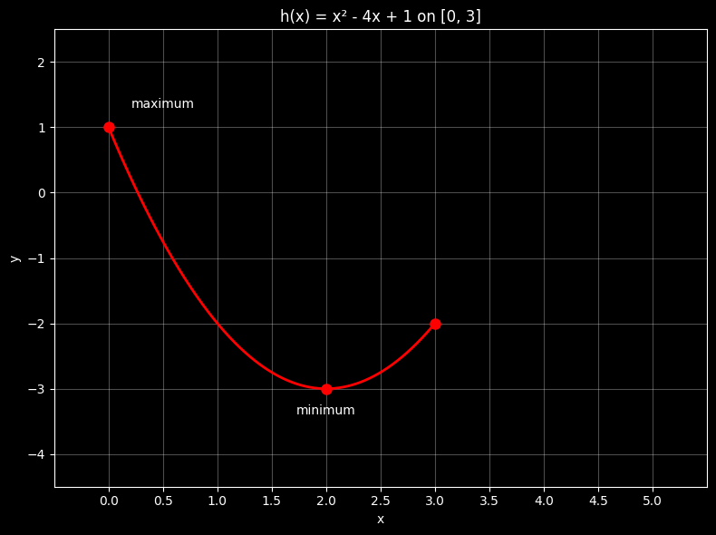
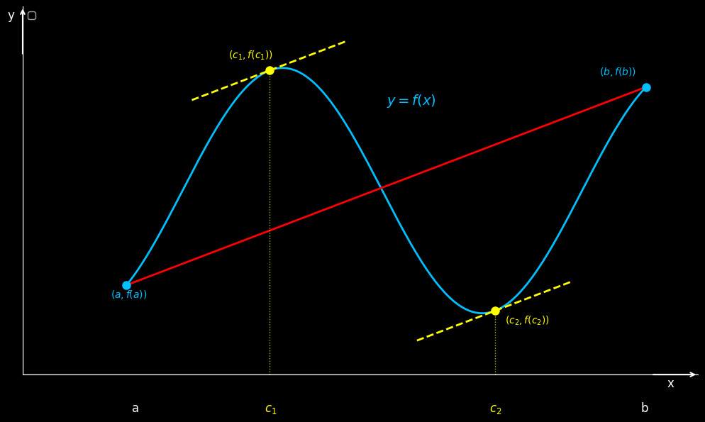
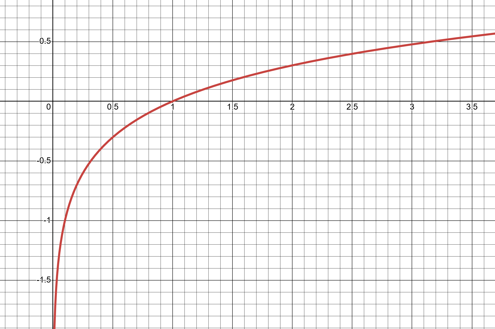
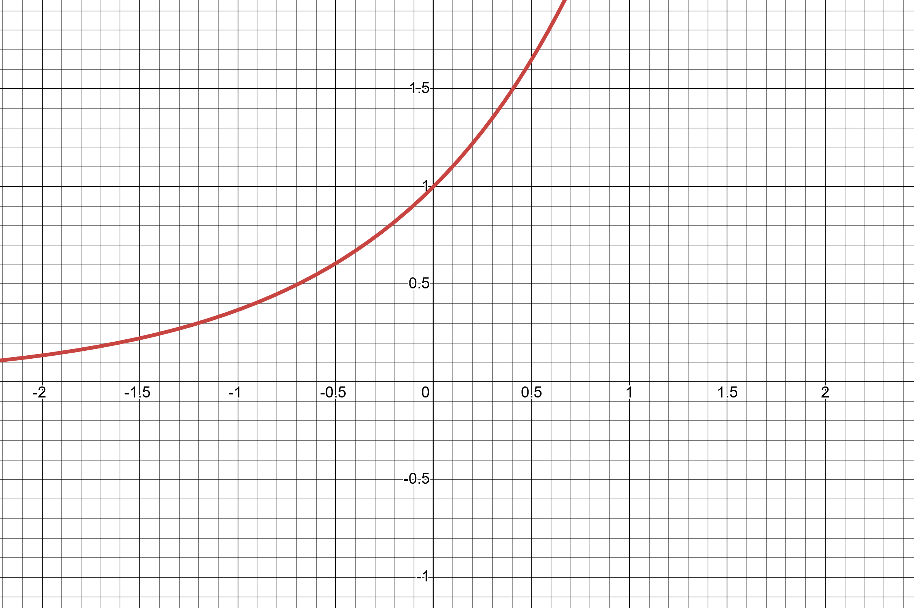
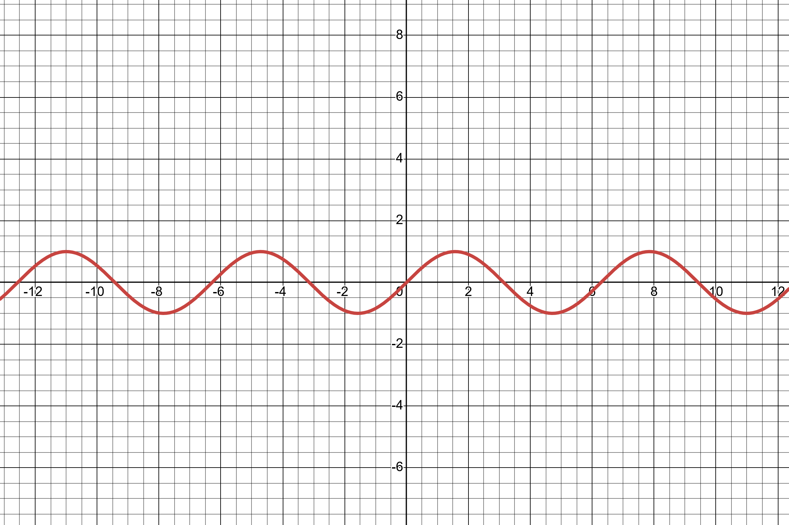
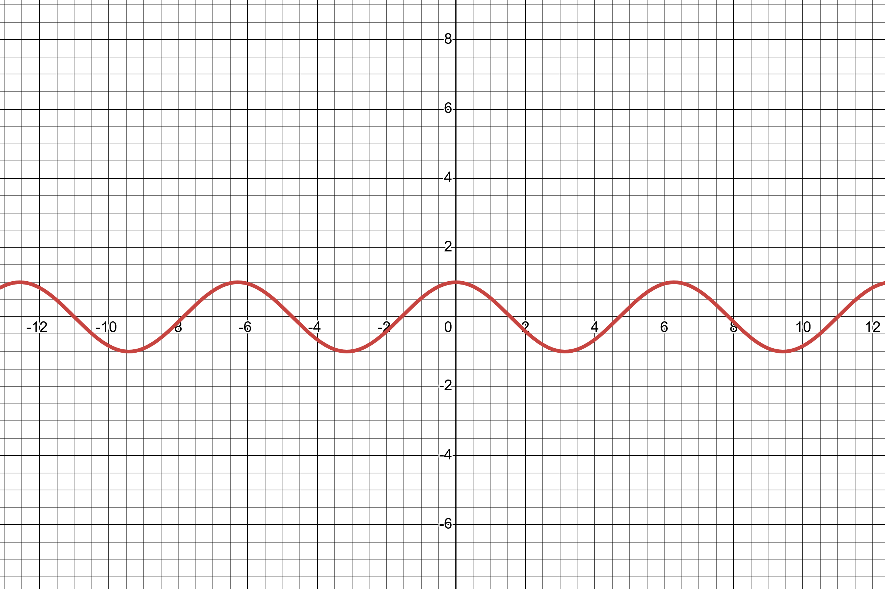
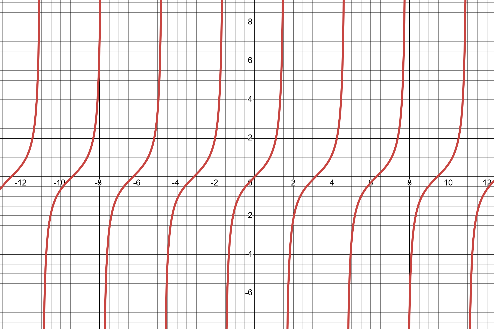
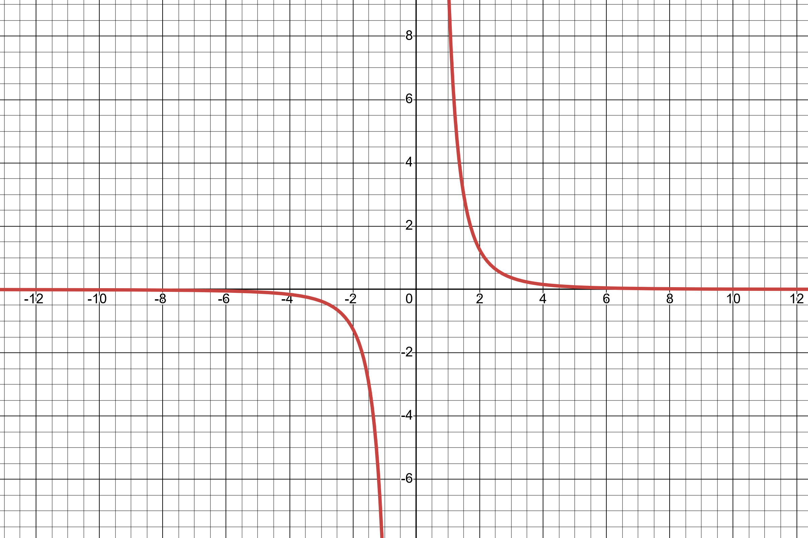
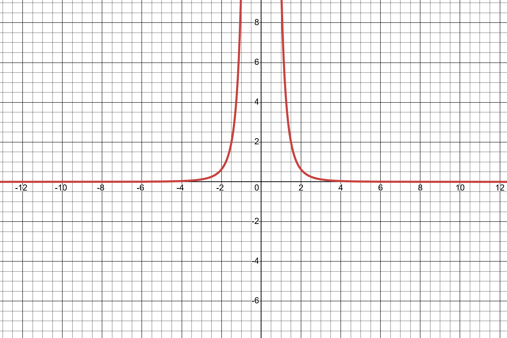
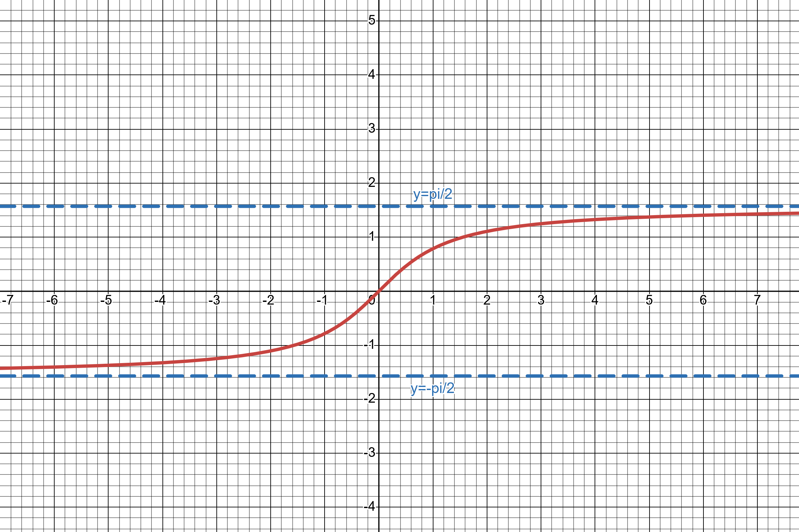

# Differentiation

##  Introduction

Having established both conceptual understanding and computational techniques for limits, we now possess the fundamental tools necessary for studying calculus. Calculus encompasses the mathematical discipline concerned with derivatives and integrals. Historical consensus attributes the independent development of calculus to Isaac Newton of England and Gottfried Leibniz of Germany. Their crucial contribution was recognizing the fundamental relationship connecting derivatives and integrals.

The derivative generalizes the notion of slope from straight lines to arbitrary functions. We begin by examining the familiar concept of slope.

### Linear Functions and Slope

A straight line represents a one-dimensional geometric object of zero width, conceptualized as an infinite collection of connected points without curvature.

```{definition,name='Slope'}
The slope (also called gradient, incline, or pitch) quantifies the steepness of a straight line. Key properties include:

- The slope remains constant throughout the entire line
- Greater slope values correspond to steeper lines
- Slope indicates the line's directional behavior (increasing or decreasing)
- Slope represents the rate of change

```

```{theorem,name='Slope Formula'}
For a straight line passing through points $P(x_1, y_1)$ and $Q(x_2, y_2)$, the slope is:
$$m = \frac{y_2 - y_1}{x_2 - x_1}$$
```

```{remark,name='Linear Equations'}
Straight lines can be expressed in various forms:

- Slope-intercept form: $y = mx + c$ (where $m$ is slope and $c$ is y-intercept)
- Point-slope form: $y = m(x - x_1) + y_1$ (passing through point $(x_1, y_1)$)

```


```{r,echo=FALSE,message=FALSE,warning=FALSE}
# Load required library
library(ggplot2)

# Define x values
x <- seq(-3, 3, by = 0.1)

# Define different slopes and y-intercepts
slopes <- c(0.5, 1, 2, 3, 5)
intercepts <- c(-1, 0, 1, 2, 3)
colors <- c("red", "orange", "green", "blue", "purple")
line_labels <- c("slope = 0.5", "slope= 1", "slope = 2", "slope = 3", "slope = 5")

# Create data frame for all lines
data_all <- data.frame()
for(i in 1:length(slopes)) {
  y <- slopes[i] * x + intercepts[i]
  temp_data <- data.frame(
    x = x, 
    y = y, 
    slope = as.factor(slopes[i]),
    color = colors[i],
    label = line_labels[i]
  )
  data_all <- rbind(data_all, temp_data)
}

# Create the plot
ggplot(data_all, aes(x = x, y = y, color = slope)) +
  geom_line(size = 1.2) +
  scale_color_manual(values = colors, labels = line_labels) +
  labs(
    title = "Higher the slope, the steeper the line",
    x = "",
    y = "",
    color = "Slope"
  ) +
  geom_hline(yintercept = 0, color = "black", size = 0.5) +
  geom_vline(xintercept = 0, color = "black", size = 0.5) +
  theme_minimal() +
  theme(
    plot.title = element_text(hjust = 0.5, size = 16, face = "bold"),
    legend.position = "right",
    legend.title = element_text(size = 12, face = "bold"),
    legend.text = element_text(size = 10),
    axis.text = element_text(size = 10)
  ) +
  coord_cartesian(xlim = c(-3, 3), ylim = c(-10, 10))
```

```{r,echo=FALSE,message=FALSE,warning=FALSE}
# Load required libraries
library(ggplot2)
library(gridExtra)

# Define x values
x <- seq(-3, 3, by = 0.1)

# Create data for increasing line (positive slope)
y_increasing <- 2 * x + 1
data_increasing <- data.frame(x = x, y = y_increasing)

# Create data for decreasing line (negative slope)
y_decreasing <- -4 * x + 1
data_decreasing <- data.frame(x = x, y = y_decreasing)

# Create the increasing plot
plot1 <- ggplot(data_increasing, aes(x = x, y = y)) +
  geom_line(color = "blue", size = 1.2) +
  labs(
    title = "Positive slope : increasing",
    x = "",
    y = ""
  ) +
  geom_hline(yintercept = 0, color = "black", size = 0.5) +
  geom_vline(xintercept = 0, color = "black", size = 0.5) +
  theme_minimal() +
  theme(
    plot.title = element_text(hjust = 0.5, size = 16, face = "bold"),
    axis.text = element_text(size = 10)
  ) +
  coord_cartesian(xlim = c(-3, 3), ylim = c(-5, 7))

# Create the decreasing plot
plot2 <- ggplot(data_decreasing, aes(x = x, y = y)) +
  geom_line(color = "blue", size = 1.2) +
  labs(
    title = "Negative slope: decreasing",
    x = "",
    y = ""
  ) +
  geom_hline(yintercept = 0, color = "black", size = 0.5) +
  geom_vline(xintercept = 0, color = "black", size = 0.5) +
  theme_minimal() +
  theme(
    plot.title = element_text(hjust = 0.5, size = 16, face = "bold"),
    axis.text = element_text(size = 10)
  ) +
  coord_cartesian(xlim = c(-3, 3), ylim = c(-5, 7))

# Arrange the plots side by side
grid.arrange(plot1, plot2, ncol = 2)
```

### Applications of Slope
Slope provides valuable information across numerous contexts. For instance, 

- a mountain's slope indicates its steepness, 
- while in physics, slope might represent 
  - velocity, 
  - acceleration, or 
  - other rates of change.


<center>  
{width=100%}
</center>


Consider an object travelling 20 meters in 5 seconds. 

The slope calculation yields:
$$\text{Speed} = \frac{\text{change in }y}{\text{change in }x}=\frac{\text{change in distance}}{\text{change in time}}=\frac{20 \text{ meters}}{5 \text{ seconds}} = 4 \text{ meters per second}$$


### The Challenge of Curved Functions

Most real-world applications involve curved rather than linear graphs. Unfortunately, curved functions present a fundamental challenge: their rate of change varies continuously from point to point, making the standard slope formula inapplicable.


```{example,name='Position Function'}
Consider a car whose position follows $f(t) = t^2$. To find the speed at $t = 1$ second, we might attempt using the slope formula with different point pairs:

Points $(1,1)$ and $(2,4)$:
$$m = \frac{4-1}{2-1} = 3$$

Points $(1,1)$ and $(3,9)$:
$$m = \frac{9-1}{3-1} = 4$$

This yields two different "slopes" at $t = 1$, but the car should have exactly one speed at that instant.
```

```{r,echo=FALSE,warning=FALSE}

# Load required library
library(ggplot2)

# Define the data
t_vals <- seq(0, 4, length.out = 100)
f_vals <- t_vals^2  # Quadratic function for distance vs time
points_t <- c(1, 2, 3)
points_f <- c(1, 4, 9)

# Create data frames for plotting
curve_data <- data.frame(time = t_vals, distance = f_vals)
points_data <- data.frame(time = points_t, distance = points_f)

# Create the plot
p <- ggplot() +
  # Plot the function curve
  geom_line(data = curve_data, aes(x = time, y = distance), 
            color = "cyan", size = 1, alpha = 0.8) +
  
  # Plot the points
  geom_point(data = points_data, aes(x = time, y = distance), 
             color = "red", size = 3) +
  
  # Draw straight line from (1,1) to (2,4)
  geom_segment(aes(x = 1, y = 1, xend = 2, yend = 4), 
               color = "yellow", linetype = "dashed", size = 0.8) +
  
  # Draw straight line from (1,1) to (3,9)
  geom_segment(aes(x = 1, y = 1, xend = 3, yend = 9), 
               color = "magenta", linetype = "dotdash", size = 0.8) +
  
  # Add annotations for points
  annotate("text", x = 1, y = 1, label = "(1,1)", 
           color = "red", hjust = 1.5, vjust = -0.5) +
  annotate("text", x = 2, y = 4, label = "(2,4)", 
           color = "red", hjust = -0.3, vjust = 1.5) +
  annotate("text", x = 3, y = 9, label = "(3,9)", 
           color = "red", hjust = -0.5, vjust = -0.5) +
  
  # Customize the plot appearance
  labs(x = "Time (seconds)", 
       y = "Distance (meters)", 
       title = "Time Vs Distance") +
  
  # Apply dark theme
  theme_dark() +
  theme(
    plot.background = element_rect(fill = "black"),
    panel.background = element_rect(fill = "black"),
    text = element_text(color = "white"),
    axis.text = element_text(color = "white"),
    axis.title = element_text(color = "white"),
    plot.title = element_text(color = "white"),
    panel.grid.major = element_line(color = "gray", linetype = "dotted"),
    panel.grid.minor = element_line(color = "gray", linetype = "dotted")
  ) +
  
  # Set axis limits to match the original
  xlim(0, 4) +
  ylim(0, 16)

# Display the plot
print(p)

```

### Secant and Tangent Lines

To resolve this dilemma, we introduce two fundamental concepts:

```{definition,name='Secant Line'}
A secant line is a straight line connecting two distinct points on a function's graph.
```

```{definition,name='Tangent Line'}
A tangent line is a straight line that "just touches" a curve at exactly one point, representing the instantaneous direction of the curve at that point.
```


### From Average to Instantaneous Rates

In our car example, the value 3 represents the slope of the secant line through $(1,1)$ and $(2,4)$, giving the average speed between $t = 1$ and $t = 2$. Similarly, 4 represents the average speed between $t = 1$ and $t = 3$.

However, we seek the instantaneous speed at $t = 1$ - the speedometer reading at that precise moment. This corresponds to the slope of the tangent line at that point.

The challenge lies in computing the tangent line's slope using the two-point slope formula when we know only one point on the tangent line. The derivative resolves this by expressing the tangent line's slope as the limit of secant line slopes as the second point approaches the first.

## Definition of the Derivative

```{definition,name='Derivative'}
Let $f: \mathbb{R} \to \mathbb{R}$. At a point $(x_0, f(x_0))$, if the limit
\[
\lim_{h \to 0} \frac{f(x_0 + h) - f(x_0)}{h}
\]
exists, then this limit represents the slope of the tangent line to the curve at $(x_0, f(x_0))$. When this limit exists, we say that $f$ is **differentiable** at $x_0$.
```
{width=100%}
**Important Notes**:

- This is a two-sided limit, meaning $h$ approaches zero from both positive and negative directions.
- The slope of the tangent line to $f(x)$ at $x_0$ is called the derivative of $f$ at $x = x_0$.

```{example,name='Derivative of $f(x) = x^2$'}
Let $f(x) = x^2$. We want to find the derivative of $f
{width=100%}
To find the slope of the tangent line to $f(x) = x^2$ at $x = x_0$:

\begin{align}
m_{x_0} &= \lim_{h \to 0} \frac{f(x_0 + h) - f(x_0)}{h} \\
&= \lim_{h \to 0} \frac{(x_0 + h)^2 - x_0^2}{h} \\
&= \lim_{h \to 0} \frac{x_0^2 + 2x_0h + h^2 - x_0^2}{h} \\
&= \lim_{h \to 0} \frac{2x_0h + h^2}{h} \\
&= \lim_{h \to 0} (2x_0 + h) \\
&= 2x_0
\end{align}
```


Notice that the derivative of $f(x) = x^2$ depends on $x$. In general, the derivative of a function is itself a function.

## Derivative Notation

### Lagrange's Notation
The derivative of $f(x)$ is denoted as $f'(x)$.

```{example}
 If $f(x) = x^2$, then $f'(x) = 2x$.
```
### Leibniz Notation
The derivative of $f(x)$ is denoted as $\frac{df}{dx}$ or $\frac{d}{dx}f(x)$.

```{example}

- If $f(x) = x^2$, then $\frac{d}{dx}f(x) = 2x$
- If $y = t^2$, then $\frac{dy}{dt} = 2t$


The variable in the denominator (e.g., $x$ in $\frac{d}{dx}$) indicates the variable of differentiation.
```


## Derivatives of Standard Functions

#### Constant Function
**Function** $f(x) = k$ where $k$ is a constant.

**Derivative**  $f'(x) = 0$

```{proof} 
\begin{align}
f'(x) &= \lim_{h \to 0} \frac{f(x + h) - f(x)}{h} \\
&= \lim_{h \to 0} \frac{k - k}{h} \\
&= \lim_{h \to 0} \frac{0}{h} = 0
\end{align}
```
#### Power Rule
**Function** $f(x) = x^n$ where $n$ is a positive integer.

**Derivative** $f'(x) = nx^{n-1}$

```{proof} 
for $f(x) = x^3$
\begin{align}
\frac{df}{dx} &= \lim_{h \to 0} \frac{(x + h)^3 - x^3}{h} \\
&= \lim_{h \to 0} \frac{x^3 + 3x^2h + 3xh^2 + h^3 - x^3}{h} \\
&= \lim_{h \to 0} \frac{3x^2h + 3xh^2 + h^3}{h} \\
&= \lim_{h \to 0} (3x^2 + 3xh + h^2) \\
&= 3x^2
\end{align}
```

```{proof} 
**General proof for $f(x) = x^n$
Using the binomial theorem:
\begin{align}
(x + h)^n &= \sum_{k=0}^{n} \binom{n}{k} x^{n-k} h^k \\
&= x^n + nx^{n-1}h + \frac{n(n-1)}{2}x^{n-2}h^2 + \ldots + h^n
\end{align}
```
Therefore:
\begin{align}
\frac{df}{dx} &= \lim_{h \to 0} \frac{(x + h)^n - x^n}{h} \\
&= \lim_{h \to 0} \frac{nx^{n-1}h + \frac{n(n-1)}{2}x^{n-2}h^2 + \ldots + h^n}{h} \\
&= \lim_{h \to 0} \left(nx^{n-1} + \frac{n(n-1)}{2}x^{n-2}h + \ldots + h^{n-1}\right) \\
&= nx^{n-1}
\end{align}

#### Linear Function
**Function**$f(x) = mx + c$ where $m, c \in \mathbb{R}$ are constants.

**Derivative** $f'(x) = m$

```{proof}
\begin{align}
f'(x) &= \lim_{h \to 0} \frac{f(x + h) - f(x)}{h} \\
&= \lim_{h \to 0} \frac{m(x + h) + c - (mx + c)}{h} \\
&= \lim_{h \to 0} \frac{mh}{h} \\
&= m
\end{align}
```
This confirms that the derivative of a linear function equals its slope.

#### Trigonometric Functions
**Function**$f(x) = \sin(x)$

**Derivative** $f'(x) = \cos(x)$

```{proof}
\begin{align}
\frac{df}{dx} &= \lim_{h \to 0} \frac{\sin(x + h) - \sin(x)}{h} \\
&= \lim_{h \to 0} \frac{2\cos\left(\frac{2x + h}{2}\right)\sin\left(\frac{h}{2}\right)}{h} \\
&= \cos(x) \lim_{h \to 0} \frac{\sin\left(\frac{h}{2}\right)}{\frac{h}{2}} \\
&= \cos(x) \cdot 1 = \cos(x)
\end{align}
```
Similarly $\frac{d}{dx}[\cos(x)] = -\sin(x)$

```{exercise}
Proove that $\frac{d}{dx}[\cos(x)] = -\sin(x)$
```
#### Square Root Function
**Function**$f(x) = \sqrt{x}$

**Derivative** $f'(x) = \frac{1}{2\sqrt{x}}$

### Summary Table

| Function Type | Function | Derivative | Notes |
|----------|----------|------------|----------|
| **Constant**    | $f(x) = k$ | $f'(x) = 0$ | Where $k$ is any constant |
| **Power Rule**  | $f(x) = x^n$ | $f'(x) = nx^{n-1}$ | Where $n$ is a positive integer |
| **Linear**      | $f(x) = mx + c$ | $f'(x) = m$ | Where $m, c \in \mathbb{R}$ are constants |
| **Sine**        | $f(x) = \sin(x)$ | $f'(x) = \cos(x)$ | |
| **Cosine**      | $f(x) = \cos(x)$ | $f'(x) = -\sin(x)$ | |
| **Square Root** | $f(x) = \sqrt{x}$ | $f'(x) = \frac{1}{2\sqrt{x}}$ | |


## Existence of Derivative

We have introduced the definition of derivatives and observed the use of the definition to compute derivatives. All the examples up now involved differentiable functions; in this section, we see examples of functions and points where the function is not differentiable.

```{example}
Let $f(x) = |x|$. Find derivative of curve $f(x)$ at:

a) $x = 1$
a) $x = -1$
a) $x = 0$

```

*proof:*
Let $f(x) = |x|$.


||**Visual Explanation:**|**proof**|
|-|---|---|
|a.||\[
\begin{aligned}
f'(1) &= \lim_{h \to 0} \frac{f(1+h) - f(1)}{h} \\
&= \lim_{h \to 0} \frac{|1+h| - 1}{h} \\
&= \lim_{\substack{h \to 0 \\ |h| < \frac{1}{2}}} \frac{1+h - 1}{h} \\
&= \lim_{\substack{h \to 0 \\ |h| < \frac{1}{2}}} \frac{h}{h} \\
&= \lim_{\substack{h \to 0 \\ |h| < \frac{1}{2}}} 1 \\
&= 1
\end{aligned}
\]|
|b.||\begin{align}
f'(-1) &= \lim_{h \to 0} \frac{f(-1+h) - f(-1)}{h} \\
&= \lim_{h \to 0} \frac{|-1+h| - |-1|}{h} \\
&= \lim_{\substack{h \to 0 \\ |h| < \frac{1}{2}}} \frac{-(-1+h) - 1}{h} \\
&= \lim_{\substack{h \to 0 \\ |h| < \frac{1}{2}}} \frac{-h}{h} \\
&= \lim_{\substack{h \to 0 \\ |h| < \frac{1}{2}}} -1 \\
&= -1
\end{align}|


c. 

<div style="display: flex; justify-content: center; gap: 20px;">
<div>
<br>
<center><em>h takes negative values on left side</em></center>
</div>
<div>
<br>
<center><em>h takes positive values on right side</em></center>
</div>
</div>


How small we pick $h$ to be at 0, $h$ takes both negative and positive values and ends up being on different pieces of the graph.

| | |
|-|-|
| \begin{align} \lim_{h \to 0^-} \frac{f(0+h) - f(0)}{h} &= \lim_{h \to 0^-} \frac{|0+h| - |0|}{h} \\ &= \lim_{\substack{h \to 0 \\ h < 0}} \frac{|h|}{h} \\ &= \lim_{\substack{h \to 0 \\ h < 0}} \frac{-h}{h} \\ &= \lim_{\substack{h \to 0 \\ h < 0}} -1 \\ &= -1 \end{align} | \begin{align} \lim_{h \to 0^+} \frac{f(0+h) - f(0)}{h} &= \lim_{h \to 0^+} \frac{|0+h| - |0|}{h} \\ &= \lim_{\substack{h \to 0 \\ h > 0}} \frac{|h|}{h} \\ &= \lim_{\substack{h \to 0 \\ h > 0}} \frac{h}{h} \\ &= \lim_{\substack{h \to 0 \\ h > 0}} 1 \\ &= 1 \end{align} |

Since $$\lim_{h \to 0^-} \frac{f(0+h) - f(0)}{h} \neq \lim_{h \to 0^+} \frac{f(0+h) - f(0)}{h}$$, the limit $\lim_{h \to 0} \frac{f(0+h) - f(0)}{h}$ does not exist. Derivative of $|x|$ does not exist at $x = 0$. Note that the graph of $|x|$ has a corner point at 0.


## Common examples where a derivative does not exist:

**Points where the derivative does not exist.**


|Points|Visual|
|-|---|
|Cusp||
|Corner ||
|Vertical Tangent||
|Point of Discontinuity:||


```{theorem,label=derivative-continuity}
If $f$ is differentiable at $c$, then it is also continuous at $c$.

The converse is not true in general (If function is continuous at $x = c$ it may or may not be differentiable at $x = c$).
```


```{proof}
Let $f$ be differentiable at $c$, then
\begin{equation}
f'(c) = \lim_{h \to 0} \frac{f(x) - f(c)}{h}
\end{equation}

Let's use theorem \@ref(thm:derivative-continuity) establish the continuity. First let's show that $\lim_{x \to c} [f(x) - f(c)] = 0$.

\begin{align}
\lim_{x \to c} [f(x) - f(c)] &= \lim_{x \to c} (f(x) - f(c)) \times \frac{h}{h} \quad \text{where } h = x - c \\
&= \lim_{x \to c} \frac{f(x) - f(c)}{h} \times h \\
&= \lim_{h \to 0} \frac{f(x) - f(c)}{h} \times \lim_{h \to 0} h \quad \text{since } x \to c \Rightarrow h \to 0 \\
&= \underbrace{\lim_{h \to 0} \frac{f(x) - f(c)}{h}}_{f'(c)} \times \underbrace{\lim_{h \to 0} h}_{0} \\
&= f'(c) \times 0 = 0
\end{align}

Therefore:
\begin{align}
\lim_{x \to c} [f(x) - f(c)] &= 0 \\
\lim_{x \to c} f(x) - \lim_{x \to c} f(c) &= 0 \\
\lim_{x \to c} f(x) - f(c) &= 0 \\
\lim_{x \to c} f(x) &= f(c)
\end{align}

Thus $f$ is continuous at $x = c$.


If $f$ is differentiable at $c$, then it is also continuous at $c$. The converse is not true in general (If function is continuous at $x = c$ it may or may not be differentiable at $x = c$).

```

## Derivative of $f(x)$ and Tangent Line to the Graph of $f(x)$

Recall that: We already know that the derivative of $f(x)$ at $x = x_0$ gives the slope of the tangent line to the graph of $y = f(x)$ at $x = x_0$. This section will go over problems that revolve around this concept.

```{example}
a) Find the equation for tangent line to the graph of $y = 3x^2 + 1$ at $x = 1$
b) Find the equation for normal line to the graph of $y = 3x^2 + 1$ at $x = 2$
c) Find the equation of all tangent lines to the graph of $y = 2x^2 + 4$ that passes through $(0,2)$
d) Find the coordinates of each point on the graph of $f(t) = \frac{1}{3}t^3 + \frac{5}{2}t^2 + 6t$, where the tangent line is horizontal.
```


**Solution:**

a) Find the equation for tangent line to the graph of $y = 3x^2 + 1$ at $x = 1$}

Let's draw a rough sketch to record the given information (The graph does not have to resemble the actual graph of $y = 3x^2 + 1$). We are supposed to find the equation of the tangent line to the graph at $x = 1$.

<center>
{width=50%}
</center>

The graph and tangent line both pass through the same point at $x = 1$. We know the equation of the graph. We can easily find the $y$-coordinate of the common point by plugging in $x = 1$ to the equation of the graph.

\begin{align}
y_1 &= f(1) \\
&= 3 \cdot (1)^2 + 1 \\
&= 4
\end{align}

The tangent line passes through the point $(1,4)$. The equation of a line whose slope is $m$ and which passes through a point $(x_1, y_1)$ is:
\begin{equation}
y = m(x - x_1) + y_1 \quad \text{(Point-slope form)}
\end{equation}

We already know a point; we just need the slope. Let $m$ be the slope of the tangent line.

\begin{align}
m &= \frac{dy}{dx}\bigg|_{x=1} \\
&= 6x\bigg|_{x=1} \\
&= 6(1) \\
&= 6
\end{align}

The tangent line passes through the point $(x_1, y_1) = (1, 4)$ and has a slope of $m = 6$. By substituting this information into equation (4.105), we get:
\begin{equation}
y = 6(x - 1) + 4
\end{equation}

The equation of the tangent line to the graph of $y = 3x^2 + 1$ at $x = 1$ is $y = 6(x - 1) + 4$.

The figure below shows the actual graph and the  tangent line. Even if we used this initially, It would not have provided any additional insight that would help solve the problem.


b) Find the equation for normal line to the graph of $y = 3x^2 + 1$ at $x = 2$}

Let’s draw a rough sketch to record the given information ( The graph does not have to resemble the actual graph of $y = 3x^2 +1$)

<center>
{width=50%}
</center>

We are supposed to find the equation of the normal line to the graph at $x = 2$. The graph, tangent line, and normal line all pass through the same point at $x = 2$. We know the equation of the graph. We can easily find the $y$-coordinate of the common point by plugging in $x = 2$ to the equation of the graph.

\begin{align}
y_1 &= f(2) \\
&= 3 \cdot (2)^2 + 1 \\
&= 13
\end{align}

The normal line passes through the point $(2, 13)$. We already know a point; we just need the slope. Let $m_t$ be the slope of the tangent line and $m_n$ be the slope of the normal line.

\begin{align}
f'(x) &= 6x \\
m_t &= f'(2) \\
&= 6 \times 2 \\
&= 12
\end{align}

Since the normal line is perpendicular to the tangent line:
\begin{align}
m_n \times m_t &= -1 \\
m_n &= -\frac{1}{m_t} \\
&= -\frac{1}{12}
\end{align}

The slope of the normal line is $-\frac{1}{12}$ and it passes through the point $(2, 13)$. Substituting these values, the equation of the normal line is:
\begin{equation}
y = -\frac{1}{12}(x - 2) + 13
\end{equation}


c) Find the equation of all tangent lines to the graph of $y = 2x^2 + 4$ that passes through $(0,2)$}

<center>
{width=50%}
</center>

The problem states that the tangent line passes through $(0,2)$; the point $(0,2)$ may not be on the graph. Let's check it by plugging $(0,2)$ into the equation of the graph.

\begin{align}
y &= 2x^2 + 4 \\
(0, 2) &\Rightarrow x = 0, y = 2 \\
2 &= 2(0)^2 + 4 \\
2 &= 4
\end{align}

Plugging $(0,2)$ into the equation $y = 2x^2 + 4$ produces a contradiction $2 = 4$ (a false statement). The point $(0,2)$ is not on the graph of $y = 2x^2 + 4$. We don't know the $x$-coordinate of the tangent point. If we know the $x$-coordinate, we could follow the steps in part a). Let the $x$-coordinate be $a$, where $a$ is an arbitrary constant.

Let's follow the steps in part a) while having $a$ as the $x$-coordinate of the tangent point. The tangent point is on the graph of $y = 2x^2 + 4$ and has an $x$-coordinate of $a$. Therefore, we can find the $y$-coordinate by substituting $x = a$ in $y = 2x^2 + 4$.

\begin{equation}
y = 2a^2 + 4
\end{equation}

The point $(a, 2a^2 + 4)$ is on the tangent line. We need the slope of the tangent line. Let's label the slope by $m$.

\begin{align}
m &= \frac{dy}{dx}\bigg|_{x=a} \\
&= 4x\bigg|_{x=a} \\
&= 4a
\end{align}

The point $(a, 2a^2 + 4)$ is on the tangent line and the tangent line has a slope of $4a$. Substituting this information, we get:
\begin{equation}
y = 4a(x - a) + 2a^2 + 4
\end{equation}

If we can find the value of $a$, we are done. To find $a$, we can construct an equation by using the fact that "the tangent line passes through $(0,2)$." Since it's on the line, it should satisfy the equation of the tangent line given by $y = 4a(x - a) + 2a^2 + 4$. So substituting $x = 0$ and $y = 2$:

\begin{align}
2 &= 4a(0 - a) + 2a^2 + 4 \\
2 &= -4a^2 + 2a^2 + 4 \\
2 &= -2a^2 + 4 \\
-2a^2 &= -2 \\
a^2 &= 1 \\
a &= \pm 1
\end{align}

We got two values for $a$; each value gives a tangent line. There are two tangent lines satisfying the given conditions. We can find them by plugging in the $a$ values in $y = 4a(x - a) + 2a^2 + 4$. The two tangent lines are:

\begin{align}
y &= 4(x - 1) + 6 \quad \text{(given by } a = 1\text{)} \\
y &= -4(x + 1) + 6 \quad \text{(given by } a = -1\text{)}
\end{align}


d) Find the coordinates of each point on the graph of $f(t) = \frac{1}{3}t^3 + \frac{5}{2}t^2 + 6t$ where the tangent line is horizontal

Horizontal lines have a slope of zero, and the derivative gives the slope of the tangent line. Therefore, when the derivative is zero, the tangent line is horizontal. We are hunting for the points that will make the derivative zero. Find the derivative, set it to zero, and solve the resulting equation for the independent variable.


Find the derivative:
\begin{align}
f(t) &= \frac{1}{3}t^3 + \frac{5}{2}t^2 + 6t \\
f'(t) &= \frac{3t^2}{3} + \frac{5 \times 2t}{2} + 6 \\
&= t^2 + 5t + 6
\end{align}

Set the derivative equal to zero and solve for $t$:
\begin{align}
t^2 + 5t + 6 &= 0 \\
(t + 2)(t + 3) &= 0 \\
t + 2 = 0 \quad &\text{or} \quad t + 3 = 0 \\
t = -2 \quad &\text{or} \quad t = -3
\end{align}

The tangent line is horizontal at $t = -2$ and $t = -3$. To find the coordinates, plug these values into the original equation:

\begin{align}
f(t) &= \frac{1}{3}t^3 + \frac{5}{2}t^2 + 6t \\
f(-2) &= \frac{1}{3}(-2)^3 + \frac{5}{2}(-2)^2 + 6(-2) \\
&= \frac{1}{3}(-8) + \frac{5}{2}(4) + (-12) \\
&= -\frac{8}{3} + 10 - 12 \\
&= -\frac{8}{3} - 2 \\
&= -\frac{14}{3}
\end{align}

\begin{align}
f(-3) &= \frac{1}{3}(-3)^3 + \frac{5}{2}(-3)^2 + 6(-3) \\
&= \frac{1}{3}(-27) + \frac{5}{2}(9) + (-18) \\
&= -9 + \frac{45}{2} - 18 \\
&= -27 + \frac{45}{2} \\
&= \frac{-54 + 45}{2} \\
&= -\frac{9}{2}
\end{align}

The tangent line is horizontal at points $\left(-2, -\frac{14}{3}\right)$ and $\left(-3, -\frac{9}{2}\right)$.

## Derivative as Instantaneous Rate of Change

We know that the derivative of $f(x)$ at $x_0$ is given by:
\begin{equation}
\lim_{h \to 0} \frac{f(x_0 + h) - f(x_0)}{h}
\end{equation}

Observe that:
\begin{align}
f(x_0 + h) - f(x_0) &\text{ is the change in } y\text{-coordinates} \\
x_0 + h - x_0 = h &\text{ is the change in } x\text{-coordinates} \\
\frac{f(x_0 + h) - f(x_0)}{h} &\text{ is tgive the the instantaneous rate of change of } f(x) \text{at a  point} x0
\end{align}

The limit $\lim_{h \to 0} \frac{f(x_0 + h) - f(x_0)}{h}$ gives the **instantaneous rate of change** of $f(x)$ at a point $x_0$. That is, the derivative of $f(x)$ at $x_0$ (which is the slope of the tangent line to the graph of $y = f(x)$ at $x_0$) gives the instantaneous rate of change of $f(x)$ at $x_0$. This interpretation of the derivative is helpful in solving real-world problems.

### Rectilinear Motion

If $s(t)$ represents the position of an object on a line at time $t$, then:

- $v(t)$, the (instantaneous) velocity, is equal to $\frac{ds}{dt}$ ($s'(t)$)
- $a(t)$, the (instantaneous) acceleration, is equal to $\frac{dv}{dt}$ ($v'(t)$), which is $\frac{d^2s}{dt^2}$ ($s''(t)$)
    


Thus, velocity is the rate of change of position, and acceleration is the rate of change of velocity. Also note that the speed of the object is $|v(t)|$.

```{example}
Assume that the position at time $t$ of an object moving along a line is given by:
\[
s(t) = 2\cos(t) + 2\sin(t) - 2
\]


a. Find the initial position, velocity, and acceleration for the object.
a. Find the times where the object is stationary.
a. Find the time interval where the object is advancing.
a. Find the time interval where the object is retracting.

```

**Solution**

\begin{align}
    s(t) &= 2\cos(t) + 2\sin(t) - 2  \\
    v(t) &= \frac{d}{dt}[2\cos(t) + 2\sin(t) - 2]  \\
         &= -2\sin(t) + 2\cos(t)  \\
    a(t) &= \frac{d}{dt}[-2\sin(t) + 2\cos(t)]  \\
         &= -2\cos(t) - 2\sin(t) 
\end{align}

a. 

- Initial position: $s(0) = 2\cos(0) + 2\sin(0) - 2 = 0$ \\
- Initial velocity: $v(0) = -2\sin(0) + 2\cos(0) = 2$ \\
- Initial acceleration: $a(0) = -2\cos(0) - 2\sin(0) = -2$

b. The object is stationary when velocity is zero:
\begin{align}
    v(t) &= 0  \\
    2\cos(t) - 2\sin(t) &= 0 \\
    \sin(t) &= \cos(t)  \\
    \tan(t) &= 1  \\
    t &= n\pi + \frac{\pi}{4}, \quad n \in \mathbb{Z}
\end{align}

c. Find the time interval where object is advancing in interval \([0,2\pi]\). 
The object is advancing when $s(t) > 0, v(t) > 0$ or $s(t) < 0, v(t) < 0$ in $[0, 2\pi]$.
Let’s make a sign chart.
 
- First, let’sidentifythepointswhere \( s(t) = 0 \).
\begin{align}
s(t) &=0\\
2\cos(t) + 2\sin(t) - 2 &= 0\\
2\cos(t) + 2\sin(t)  &= 2\\
\cos(t) + \sin(t) &= 1\\
\underbrace{\frac{1}{\sqrt{2}}\cos(t) + \frac{1}{\sqrt{2}}\sin(t)} &= \frac{1}{\sqrt{2}}\\
\sin\left(t + \frac{\pi}{4}\right) &= \frac{1}{\sqrt{2}}\\
t + \frac{\pi}{4} &= n\pi+(-1)^n\frac{\pi}{4},\quad n \in \mathbb{Z}\\
t &= n\pi+(-1)^n\frac{\pi}{4}- \frac{\pi}{4} ,\quad n \in \mathbb{Z}\\
\end{align}

Since we are looking for solutions in \([0,2\pi]\)
\[t = 0, \quad  t = \frac{\pi}{2} \quad t=2\pi\]

Mark the solution on the number line.
 \[s(t) = 2cos(t) + 2sin(t) − 2\]


Pick a test value from each sub interval and evaluate \(s(t)\) at test  values.(only interested in sub intervals \(I \subset [0,2\pi]\)


|Interval | \( \left(0, \frac{\pi}{2}\right) \) | \( \left(\frac{\pi}{2}, 2\pi\right) \)|
|:---:|:---:|:---:|
|Test Value | \( \frac{\pi}{4} \) | \( \frac{5\pi}{4} \)|
Sign of \( s(t) \) | \( + \) | \( - \) |

 \[s(t) = 2cos(t) + 2sin(t) − 2\]
 
- Second, let’s identify the points where \(v(t) = 0\)

    - If \( s(t) > 0 \) at the test value, then it is positive throughout that subinterval.
    - If \( s(t) < 0 \) at the test value, then it is negative throughout that subinterval.

\[ v(t) = 2\cos(t) − 2\sin(t)\]


-  Object is advancing when $s(t) > 0,v(t) > 0$ and $s(t) < 0,v(t) < 0$.

\[ s(t) = 2\cos(t) + 2\sin(t) − 2\]

\[ v(t) = 2\cos(t) − 2\sin(t)\]


Object is advancing from \(\left(0, \frac{\pi}{4} \right)\)\
Object is advancing from \(\left(\frac{\pi}{2},\frac{5\pi}{4}\right)\)

d. The object is retracting when $s(t) > 0, v(t) < 0$ or $s(t) < 0, v(t) > 0$ in $[0, 2\pi]$.

Object is advancing from \(\left(0, \frac{\pi}{4} \right)\)\
Object is advancing from \(\left(\frac{\pi}{2},\frac{5\pi}{4}\right)\)


### Falling Body Problems
An object projected directly upward with initial velocity $v_0$ from height $s_0$, under constant downward acceleration $g$ (32 ft/s$^2$ or 9.8 m/s$^2$), has height at time $t$ given by:
\[
h(t) = -\frac{1}{2}gt^2 + v_0 t + s_0
\]

```{example} 
A projectile is shot upward from Earth with initial velocity 320 ft/s.

a. What is the velocity after 5 seconds?
a. What is the acceleration after 5 seconds?
a. Find the maximum height reached.
a. When does the ball hit the ground, and what is the impact velocity?

```


```{example}
A bucket containing 5 gallons of water has a leak. After $t$ seconds, the remaining water is:
\[
Q(t) = 5\left(1 - \frac{t}{25}\right)^2 \text{ gallons}
\]

a. At what rate (to the nearest hundredth gallon) is water leaking after 2 seconds?
a. How long does it take for all water to leak out?
a. At what rate is water leaking when the last drop leaks out?

```

## Real-World Application of Chain Rule

An importer estimates that local consumers will buy:
\[
D(p) = \frac{4374}{p^2} \text{ pounds of coffee per week}
\]
when the price is $p$ dollars per pound. The estimated price of coffee $t$ weeks from now is:
\[
p(t) = 0.02t^2 + 0.1t + 6 \text{ dollars per pound}
\]
At what rate will the weekly demand for coffee be changing with respect to time 10 weeks from now? Will the demand be increasing or decreasing?

## Extreme Values of a Function

```{definition,name='Absolute Extrema'}
Let $f$ be a function defined on an interval $I$ that contains the number $c$. Then

- $f(c)$ is an **absolute maximum** of $f$ on $I$ if $f(c) \geq f(x)$ for all $x$ in $I$.
- $f(c)$ is an **absolute minimum** of $f$ on $I$ if $f(c) \leq f(x)$ for all $x$ in $I$.

Absolute maximums and minimums are called **extreme values** or the **absolute extrema**.
```


```{example}
Locate the extreme values of $f$ defined on the closed interval $[a, b]$.
```


```{example}
The function defined by
\[
h(x) = \begin{cases}
x^2 & \text{if } x \neq 0 \\
1 & \text{if } x = 0
\end{cases}
\]
has a maximum which is on the closed interval $[-1,1]$, but no minimum.
<center>
{width=50%}
</center>
```

```{example}
The continuous function $g(x) = x$ has neither a maximum nor a minimum on the open interval $(0,1)$.
<center>
{width=50%}
</center>
```

```{theorem,name='Extreme Value Theorem'}
A function $f$ has both an absolute maximum and an absolute minimum on any closed, bounded interval $[a,b]$ where it is continuous.
```

```{definition,name='Relative Extrema'}

- If there is an open interval containing $c$ on which $f(c)$ is a maximum, then $f(c)$ is called a **relative maximum} of $f$.
- If there is an open interval containing $c$ on which $f(c)$ is a minimum, then $f(c)$ is called a **relative minimum} of $f$.

Relative maximums and minimums are called **relative extrema}.
```
<center>

</center>

```{definition,name='Critical Number'}
Let $f$ be defined at $c$. If $f'(c) = 0$ or if $f'(c)$ is undefined, then $c$ is a **critical number** of $f$. The point $(c, f(c))$ on the graph of $f$ is called a **critical point**.
```

### Steps to Find Critical Numbers


1. Find $f'(x)$
2. Set $f'(x) = 0$ and solve for $x$. Solutions give you critical numbers.
3. Also look for the points where $f(x)$ is defined, but $f'(x)$ is not defined. These will also give critical numbers.
    a.  One way to identify points where $f'(x)$ is not defined is setting the denominator of $f'(x)$ to zero. (Don't forget the fact that functions have to be defined at the critical value)
    b.  Occasionally you might have to use the definition of derivative.


```{example}
Find the critical numbers of $f(x) = \frac{\sqrt[3]{x}}{1-x}$.

**Solution:**

1.  Find $f'(x)$
\begin{align}
f(x) &= \frac{\sqrt[3]{x}}{1-x} \\
f'(x) &= \left(\frac{\sqrt[3]{x}}{1-x}\right)' \\
&= \frac{(1-x)(\sqrt[3]{x})' - \sqrt[3]{x}(1-x)'}{(1-x)^2} \\
&= \frac{(1-x) \cdot \frac{1}{3x^{2/3}} + \sqrt[3]{x}}{(1-x)^2} \\
&= \frac{\frac{1-x+3x}{3x^{2/3}}}{(1-x)^2} \\
&= \frac{1+2x}{3x^{2/3}(1-x)^2}
\end{align}

2. Set $f'(x) = 0$ and solve for $x$. Solutions give you critical numbers.
\begin{align}
f'(x) &= 0 \\
\frac{2x+1}{3x^{2/3}(1-x)^2} &= 0 \\
2x+1 &= 0 \quad (x \neq 0, x \neq 1) \\
x &= -\frac{1}{2}
\end{align}
$-\frac{1}{2}$ is a critical number.

3. Setting the denominator of $f'(x)$ to zero:
\begin{align}
3x^{2/3}(1-x)^2 &= 0 \\
x &= 1 \text{ or } x = 0
\end{align}
The function $f$ is undefined at $x = 1$, therefore $1$ is not a critical number. The function $f$ is defined at $x = 0$, but the derivative is undefined at $x = 0$. $0$ is a critical number.


Therefore, $0$ and $-\frac{1}{2}$ are critical numbers of $f(x) = \frac{\sqrt[3]{x}}{1-x}$.
```


```{theorem,name='Critical Point Theorem'}
Relative maximum or minimum of a continuous function can occur only at its critical points.
```

### Absolute Extrema

Suppose we are looking for the absolute extrema of a continuous function $f$ on the closed, bounded interval $[a,b]$. The Extreme Value Theorem tells us that these extrema exist and the Critical Point Theorem enables us to narrow the list of "candidates" for points where extrema can occur from the entire interval $[a,b]$ to just the endpoints $x = a$, $x = b$, and the critical numbers between $a$ and $b$. This suggests the following procedure.

#### Procedure for Finding Absolute Extrema

To find the absolute extrema of a continuous function $f$ on $[a,b]$ follow these steps:


1. Find all critical numbers of $f$ on $[a,b]$.
1. Evaluate $f$ at the endpoints $a$ and $b$ and at each critical number $c$.
1. Compare the values in step 2. The largest value of $f$ is the absolute maximum of $f$ on $[a,b]$. The smallest value of $f$ is the absolute minimum of $f$ on $[a,b]$.  


| Pictures | Descriptions |
|-----|---|
|  | $f(x) = x^3 - 4x^2 + 3x + 3$ on $[0.5, 2]$<br>$f$ is continuous with an extremum at each endpoint |
|  | $g(x) = \sin(x)$ on $[0, 2\pi]$<br>$g$ is continuous; neither extremum at an endpoint |
|  | $h(x) = x^2 - 4x + 1$ on $[0, 3]$<br>$h$ is continuous; one extremum at an endpoint |


```{example}
Find the absolute extrema of the function defined by the equation $f(x) = x^4 - 2x^2 + 3$ on the closed interval $[-1,2]$.
```

## The Mean Value Theorem

### Introduction

If a car travels smoothly down a straight, level road with average velocity 60 mi/h, we would expect the speedometer reading to be exactly 60 mi/h at least once during the trip. After all, if the car's velocity were always above 60 mi/h, the average velocity would also be above that level, and the same reasoning applies if the velocity were always below 60 mi/h. 

More generally, if $f(t)$ is the car's position at time $t$ during a trip over the time interval $a < t < b$, then there should be a time $t = c$ when the velocity $f'(c)$ equals the average velocity between times $t = a$ and $t = b$. That is, for some $c$ with $a < c < b$,

$$f'(c) = \frac{f(b) - f(a)}{b - a}$$


```{theorem,name='Rolle`s theorem'}
Suppose $f$ is continuous on the closed interval $[a, b]$ and differentiable on the open interval $(a,b)$. If $f(a) = f(b)$, then there exists at least one number $c$ between $a$ and $b$ such that $f'(c) = 0$.
```


```{theorem,name='The mean value theorem for derivatives (MVT)'}
If $f$ is continuous on the closed interval $[a,b]$ and differentiable on the open interval $(a, b)$, then there exists in $(a,b)$ at least one number $c$ such that

$$f'(c) = \frac{f(b) - f(a)}{b - a}$$


```
```{example}
Show that the function $f(x) = x^3 + x^2$ satisfies the hypotheses of the MVT on the closed interval $[1,2]$, and find a number $c$ between 1 and 2 so that 

$$f'(c) = \frac{f(2) - f(1)}{2 - 1}$$
```

```{example}
Show that $|\sin x_2 - \sin x_1| \leq |x_2 - x_1|$ for all numbers $x_1$ and $x_2$ by applying the mean value theorem.
```


```{theorem,name='Zero-derivative theorem'}
Suppose $f$ is a continuous function on the closed interval $[a,b]$ and is differentiable on the open interval $(a,b)$, with $f'(x) = 0$ for all $x$ on $(a,b)$. Then the function $f$ is constant on $[a,b]$.
```

```{theorem,name='Constant difference theorem'}
Suppose the functions $f$ and $g$ are continuous on the closed interval $[a,b]$ and differentiable on the open interval $(a, b)$. Then if $f'(x) = g'(x)$ for all $x$ in $(a,b)$, there exists a constant $C$ such that $f(x) = g(x) + C$.
```


## Derivative and the Shape of the Graph

```{definition,name='Strictly Increasing and Strictly Decreasing Functions'}

The function $f$ is **strictly increasing** on an interval $I$ if
$$f(x_1) < f(x_2) \text{ whenever } x_1, x_2 \in I \text{ and } x_1 < x_2$$

The function $f$ is **strictly decreasing** on an interval $I$ if
$$f(x_1) > f(x_2) \text{ whenever } x_1, x_2 \in I \text{ and } x_1 < x_2$$
```


```{theorem,name='Monotone Function Theorem'}
Let $f$ be differentiable on the open interval $(a,b)$. If $f'(x) > 0$ for every $x$ in $(a,b)$, then $f$ is strictly increasing on $(a,b)$. If $f'(x) < 0$ for every $x$ in $(a,b)$, then $f$ is strictly decreasing on $(a,b)$.
```

## Derivative and the Shape of the Graph

```{definition,name='Strictly Increasing and Strictly Decreasing Functions'}

The function $f$ is **strictly increasing** on an interval $I$ if
$$f(x_1) < f(x_2) \text{ whenever } x_1, x_2 \in I \text{ and } x_1 < x_2$$

The function $f$ is **strictly decreasing** on an interval $I$ if
$$f(x_1) > f(x_2) \text{ whenever } x_1, x_2 \in I \text{ and } x_1 < x_2$$
```
```{theorem,name='Monotone Function Theorem'}
Let $f$ be differentiable on the open interval $(a,b)$. If $f'(x) > 0$ for every $x$ in $(a,b)$, then $f$ is strictly increasing on $(a,b)$. If $f'(x) < 0$ for every $x$ in $(a,b)$, then $f$ is strictly decreasing on $(a,b)$.
```


```{definition,name='Strictly Increasing and Strictly Decreasing Functions'}

The function $f$ is **strictly increasing** on an interval $I$ if
$$f(x_1) < f(x_2) \text{ whenever } x_1, x_2 \in I \text{ and } x_1 < x_2$$

The function $f$ is **strictly decreasing** on an interval $I$ if
$$f(x_1) > f(x_2) \text{ whenever } x_1, x_2 \in I \text{ and } x_1 < x_2$$
```


```{theorem,name='Monotone Function Theorem'}
Let $f$ be differentiable on the open interval $(a,b)$. If $f'(x) > 0$ for every $x$ in $(a,b)$, then $f$ is strictly increasing on $(a,b)$. If $f'(x) < 0$ for every $x$ in $(a,b)$, then $f$ is strictly decreasing on $(a,b)$.
```

**Steps to Find Where $f(x)$ is Strictly Increasing and *Decreasing**

1. Find $f'(x)$
2. Set $f'(x) = 0$ and solve for $x$
3. Mark the solutions on a number line
4. Pick a test value from each sub-interval and evaluate $f'(x)$ at test values.
   - (a) If $f'(x)$ is positive at a test value, then $f'(x)$ is positive in that interval and $f(x)$ is increasing in that interval
   - (b) If $f'(x)$ is negative at a test value, then $f'(x)$ is negative in that interval and $f(x)$ is decreasing in that interval

```{example}
Determine where the function defined by $f(x) = x^3 + 12x^2 + 45x$ is strictly increasing and where it is strictly decreasing.
```
**Solution:**

1. Find $f'(x)$

\begin{align}
f(x) &= x^3 + 12x^2 + 45x \\
\frac{df}{dx} &= \frac{d}{dx}[x^3 + 12x^2 + 45x] \\
&= 3x^2 + 24x + 45
\end{align}

2. Set $f'(x) = 0$ and solve for $x$

\begin{align}
\frac{df}{dx} &= 0 \\
3x^2 + 24x + 45 &= 0 \\
x^2 + 8x + 15 &= 0 \\
(x + 3)(x + 5) &= 0 \\
x + 3 = 0 \text{ or } x + 5 &= 0 \\
x = -3 \text{ or } x &= -5
\end{align}

3. Mark the solutions on a number line.

4. Pick a test value from each sub-interval and evaluate $f'(x)$ at test values.


|Interval | $(-\infty, -5)$ | $(-5, -3)$ | $(-3, \infty)$ |
|:-:|:---:|:---:|:------:|
| Test value | $-6$ | $-4$ | $0$ |
| Sign of $\frac{df}{dx}$ | $+$ | $-$ | $+$ |

The derivative $3x^2 + 24x + 45$ is a continuous function. Therefore, the derivative cannot change sign without going through a point that makes it zero. It only becomes zero at endpoints. It cannot change sign inside an interval. The function takes the same sign as the test value inside the corresponding interval.

In the interval $(-\infty, -5)$, the derivative is positive at test point $-6$; therefore, it remains positive inside the interval $(-\infty, -5)$. The function is increasing in $(-\infty, -5)$. The derivative is negative at test point $-4$. The derivative remains negative inside $(-5, -3)$, hence decreases inside $(-5, -3)$. The derivative is positive inside $(-3, \infty)$ and increases in $(-3, \infty)$.


### Identifying Whether a Critical Point is Minimum or Maximum

```{theorem,name=' First Derivative Test'}
Let $c$ be a critical number of a function $f$ that is continuous on an open interval $I$ containing $c$. If $f$ is differentiable on the interval, except possibly at $c$, then $f(c)$ can be classified as follows:

- If $f'(x)$ changes from negative to positive at $c$, then $f(c)$ is a relative minimum of $f$.
- If $f'(x)$ changes from positive to negative at $c$, then $f(c)$ is a relative maximum of $f$.
- If $f'(x)$ does not change sign at $c$, then $f(c)$ is not a relative extremum.
```


```{example}
Find all critical points for $f(x) = \frac{\sqrt[3]{x}}{1-x}$ and determine whether each corresponds to a relative maximum, relative minimum, or neither.

  Let $f(x) = \frac{\sqrt[3]{x}}{1-x}$

From earlier work, $0$ and $-\frac{1}{2}$ are critical numbers of $f(x) = \frac{\sqrt[3]{x}}{1-x}$.

$f(0) = 0$ and $f\left(-\frac{1}{2}\right) = \frac{\sqrt[3]{2}}{3}$.

$(0,0)$ and $\left(-\frac{1}{2}, \frac{\sqrt[3]{2}}{3}\right)$ are critical points.

To identify relative extrema using the first derivative test, we have to check the sign of the derivative around critical points. 

Therefore, let's make a sign chart.

1. Mark the solutions in number 


2. Pick a test value from each subinterval and evaluate $f′(x)$ at test values.


$$f'(x) = \frac{1 + 2x}{3x^{2/3}(1-x)^2}$$

| Interval | $\left(-\infty, -\frac{1}{2}\right)$ | $\left(-\frac{1}{2}, 0\right)$ | $(0, \infty)$ |
|:----------:|:--------------------------------------:|:--------------------------------:|---------------:|
| Test Value | $-2$ | $-0.1$ | $2$ |
| Sign | $-$ | $+$ | $+$ |

At the critical point $\left(-\frac{1}{2}, \frac{\sqrt[3]{2}}{3}\right)$, the sign of the derivative changes from negative to positive. The critical point $\left(-\frac{1}{2}, \frac{\sqrt[3]{2}}{3}\right)$ is a relative minimum.

At the critical point $(0,0)$, the sign of the derivative changes from positive to positive. The critical point $(0,0)$ is neither a relative maximum nor relative minimum.
<center>

</center>
```


```{example}
Find all critical points for $f(x) = x^3 - 3x^2 - 9x + 1$ and determine whether each corresponds to a relative maximum, relative minimum, or neither.
```


```{definition,name='Concavity'}

Given a function $f$:
- $f$ is **concave up** on an interval $I$ if all of the tangents to the curve on $I$ are below the graph of $f(x)$.
- $f$ is **concave down** on an interval $I$ if all of the tangents to the curve on $I$ are above the graph of $f(x)$.
```


```{theorem,name='Derivative Characterization of Concavity'}

Given a function $f$:
  
- If $f''(x) > 0$ for all $x$ in some interval $I$, then $f$ is concave up on $I$.
- If $f''(x) < 0$ for all $x$ in some interval $I$, then $f$ is concave down on $I$.
```


```{definition,name='Inflection Point'}
A point $(c, f(c))$ is called an **inflection point** if the function is continuous at the point and the concavity of the graph changes at that point.
```


```{example}

Find where the graph of $f(x) = x^3 + 5x^2 + 6$ is concave up and where it is concave down.
```
**Solution:**

- First find $f''(x)$

\begin{align}
f(x) &= x^3 + 5x^2 + 6 \\
f'(x) &= (x^3 + 5x^2 + 6)' \\
&= 3x^2 + 10x \\
f''(x) &= 6x + 10
\end{align}

- Set $f''(x) = 0$ and solve for $x$

\begin{align}
f''(x) &= 0 \\
6x + 10 &= 0 \\
x &= -\frac{5}{3}
\end{align}

- Mark the solutions on a number line.


- Pick a test value from each sub-interval and evaluate $f''(x)$ at test values.

$f''(x) = 6x + 10$

| Interval | $\left(-\infty, -\frac{5}{3}\right)$ | $\left(-\frac{5}{3}, \infty\right)$ |
|:----------:|:--------------------------------------:|:-------------------------------------:|
| Test Value | $-4$ | $0$ |
| Sign | $-$ | $+$ |

$f''(x) < 0$ on $\left(-\infty, -\frac{5}{3}\right)$, so $f$ is concave down on $\left(-\infty, -\frac{5}{3}\right)$.

$f''(x) > 0$ on $\left(-\frac{5}{3}, \infty\right)$, so $f$ is concave up on $\left(-\frac{5}{3}, \infty\right)$.

Concavity changes at $x = -\frac{5}{3}$, so $\left(-\frac{5}{3}, f\left(-\frac{5}{3}\right)\right)$ is an inflection point.


```{theorem,name=' Second Derivative Test for Relative Extrema'}

Let $f$ be a function such that $f'(c) = 0$ and the second derivative of $f$ exists on an open interval containing $c$.

- If $f''(c) > 0$, then $f(c)$ is a relative minimum.
- If $f''(c) < 0$, then $f(c)$ is a relative maximum.
- If $f''(c) = 0$, then the test fails. Either a maximum, or a minimum, or neither may occur. (In such cases, you can use the First Derivative Test.)
```

```{example}

Find the relative extrema for $f(x) = -3x^5 + 5x^3$.
```
**Solution:**

\begin{align}
f(x) &= -3x^5 + 5x^3 \\
f'(x) &= (-3x^5 + 5x^3)' \\
&= -15x^4 + 15x^2 \\
f''(x) &= (-15x^4 + 15x^2)' \\
&= -60x^3 + 30x
\end{align}

To find critical points, set $f'(x) = 0$ and solve for $x$:

\begin{align}
f'(x) &= 0 \\
-15x^4 + 15x^2 &= 0 \\
-15x^2(x^2 - 1) &= 0 \\
x &= 0 \text{ or } x^2 - 1 = 0 \\
x &= 0 \text{ or } x = -1 \text{ or } x = 1
\end{align}

$f'(x)$ is defined for $\forall x \in \mathbb{R}$. So $x = 0$, $x = -1$, and $x = 1$ are critical points. Let's use the second derivative test for relative extrema:

$f''(x) = 30x - 60x^3$

\begin{align}
f''(-1) &= -30 + 60 = 30 > 0 \\
&\Rightarrow f(-1) \text{ is a relative minimum}
\end{align}

\begin{align}
f''(1) &= 30 - 60 = -30 < 0 \\
&\Rightarrow f(1) \text{ is a relative maximum}
\end{align}

\begin{align}
f''(0) &= 0
\end{align}

At $x = 0$, the test fails. Either a maximum, a minimum, or neither may occur. Let's use the first derivative test for relative extrema for $x = 0$.

Mark the critical point on the number line and pick test values (we are only interested in intervals adjacent to zero):


$f'(x) = -15x^4 + 15x^2$

| Interval | $(-1, 0)$ | $(0, 1)$ |
|----------|------------|----------|
| Test Value | $-0.5$ | $0.5$ |
| Sign | $+$ | $+$ |

Since $f'$ is positive on either side of zero, and there is no sign change at $0$, $f(0)$ is neither a relative maximum nor a relative minimum.


## Curve Sketching

The following steps are helpful when sketching curves. These are general guidelines for all curves, so each step may not always apply to all functions.

1. **Intercepts:** Find the $x$- and $y$-intercepts of the function, if possible. To find the $x$-intercept, we set $y = 0$ and solve the equation for $x$. Similarly, we set $x = 0$ to find the $y$-intercept.

2. **Critical Numbers:** Find the critical numbers of the function.

3. **Intervals of Increase and Decrease:** Determine where $f'(x)$ is positive and negative to find the intervals where the function is increasing and decreasing.

   Steps to find where $f(x)$ is strictly increasing and where it is strictly decreasing:
   
   - (a) Mark the critical numbers on a number line.
   - (b) Pick a test value from each sub-interval and evaluate $f'(x)$ at test values.
     - i. If $f'(x)$ is positive at a test value, then $f'(x)$ is positive in that interval and $f(x)$ is increasing in that interval.
     - ii. If $f'(x)$ is negative at a test value, then $f'(x)$ is negative in that interval and $f(x)$ is decreasing in that interval.

4. **Local Maximum/Minimum:** Use the first (or second) derivative test to find the local maximums and minimums of the function.

5. **Concavity and Points of Inflection:** We must determine when $f''(x)$ is positive and negative to find the intervals where the function is concave upward and concave downward. Inflection points occur whenever the curve changes in concavity.

6. **Sketch:** Using the information obtained from steps 1 to 5, we can sketch the curve. First, we draw dashed lines for the asymptotes of the function. Then plot the $x$- and $y$-intercepts, maximum and minimum points, and points of inflection on the graph. Sketch the curve between the points, using the intervals of increase and decrease and intervals of concavity.


```{example} 
Sketch the graph of $f(x) = x^3 + 3x^2 + 1$.
```

```{example} 
Sketch the graph of $f(x) = e^x - e^{-x}$.
```

```{example} 
Sketch the graph of $f(\theta) = \theta - 2\sin(\theta)$ on $[0, 2\pi]$.
```

## Limits Involving Infinity

### Limits to Infinity

| x            | f(x) = 1/x       |
|--------------:|------------------|
| 10           | 0.1              |
| 100          | 0.01             |
| 1,000        | 0.001            |
| 10,000       | 0.0001           |
| 100,000      | 0.00001          |
| 1,000,000    | 0.000001         |
| 10,000,000   | 0.0000001        |
| 100,000,000  | 0.00000001       |
| 1,000,000,000| 0.000000001      |
| 10,000,000,000| 0.0000000001    |

From numerical tables, we can see that $f(x) = \frac{1}{x}$ keeps getting closer to zero as $x$ keeps getting larger. Mathematicians use a notation to express this situation. First, to tell $x$ keeps getting larger they use the notation $x \to \infty$. To tell $f(x) = \frac{1}{x}$ keeps getting closer to zero as $x$ keeps getting larger, they use the notation:
$$\lim_{x \to \infty} f(x) = 0$$

| x            | f(x) = 1/x       |
|--------------:|------------------|
| -10           | -0.1              |
| -100          | -0.01             |
| -1,000        | -0.001            |
| -10,000       | -0.0001           |
| -100,000      | -0.00001          |
| -1,000,000    | -0.000001         |
| -10,000,000   | -0.0000001        |
| -100,000,000  | -0.00000001       |
| -1,000,000,000| -0.000000001      |
| -10,000,000,000| -0.0000000001     |


From numerical analysis, we can see that $f(x) = \frac{1}{x}$ keeps getting closer to zero as $x$ keeps getting larger in the negative direction. To tell $x$ keeps getting larger in the negative direction (actually, the correct terminology in this case is to say $x$ keeps getting smaller as negative values are smaller than zero) we use $x \to -\infty$. To represent this situation we use:

$$\lim_{x \to -\infty} f(x) = 0$$

In general,

- If $f(x)$ keeps getting closer to a real number $L$ as $x$ keeps getting larger, we say:
$$\lim_{x \to \infty} f(x) = L$$

- If $f(x)$ keeps getting closer to a real number $L$ as $x$ keeps getting smaller (numerical value of $x$ keeps getting large, but in the negative direction), we say:
$$\lim_{x \to -\infty} f(x) = L$$

### Limits of Special Functions


| Function                       | Graph              | $\lim_{x \to -\infty} f(x)$ | $\lim_{x \to \infty} f(x)$ |
| ------ | ------------------| --- |--- |
| $\log(x)$                      |  | Undefined                   | $\infty$                   |
| $e^x$                          |  | 0                           | $\infty$                   |
| $\sin(x)$                      |  | Undefined                   | Undefined                  |
| $\cos(x)$                      |  | Undefined                   | Undefined                  |
| $\tan(x)$                      |  | Undefined                   | Undefined                  |
| $\frac{A}{x^r}$ <br>($A \in \mathbb{R}$ and $r$ is positive odd number)  |  | 0                           | 0                          |
| $\frac{A}{x^r}$ <br>($A \in \mathbb{R}$ and $r$ is positive even number) |  | 0                           | 0                          |
| $\tan^{-1}(x)$                 |  | $-\frac{\pi}{2}$            | $\frac{\pi}{2}$            |

```{theorem}
 If $\lim_{x \to \infty} f(x)$ and $\lim_{x \to \infty} g(x)$ exist:


- **Multiple rule**: $\lim_{x \to \infty} [kf(x)] = k \lim_{x \to \infty} f(x)$ for any constant $k$ 
- **Sum rule**: $\lim_{x \to \infty} [f(x) + g(x)] = \lim_{x \to \infty} f(x) + \lim_{x \to \infty} g(x)$ 
- **Difference rule**: $\lim_{x \to \infty} [f(x) - g(x)] = \lim_{x \to \infty} f(x) - \lim_{x \to \infty} g(x)$ 
- **Product rule**: $\lim_{x \to \infty} [f(x)g(x)] = \left[\lim_{x \to \infty} f(x)\right]\left[\lim_{x \to \infty} g(x)\right]$
- **Quotient rule**: $\lim_{x \to \infty} \frac{f(x)}{g(x)} = \frac{\lim_{x \to \infty} f(x)}{\lim_{x \to \infty} g(x)}$ if $\lim_{x \to \infty} g(x) \neq 0$
- **Power rule**: $\lim_{x \to \infty} [f(x)]^n = \left[\lim_{x \to \infty} f(x)\right]^n$
```

Analogous results hold for $\lim_{x \to -\infty}$.

### Evaluating Limits to Infinity

```{example}
Evaluate each of the following limits:


- $\lim_{x \to \infty} \frac{5x^3 + 6x + 8}{x^4 + 6x + 9}$
    
- $\lim_{x \to \infty} \frac{5x^5 + 6x + 8}{x^4 + 6x + 9}$
    
- $\lim_{x \to -\infty} \frac{5x^7 + 6x^6 + 8}{15x^7 + 6x + 9}$
    
- $\lim_{x \to -\infty} \frac{5x^7 + 6x^6 + 8}{15x^7 + 6x + 9}$
    
- $\lim_{x \to \infty} \frac{\cos(x)}{e^x}$
```


| \( x \)        | 10     | 100     | 1000     | 100,000       | 1,000,000       |
|:----------------:|--------:|---------:|----------:|----------------:|------------------:|
| \( x^2 + 2 \)  | 102    | 10,002  | 1,000,002| 10,000,000,002 | 1,000,000,000,002 |
| \( x^3 + 2 \)  | 1,002  | 1,000,002| 1,000,000,002| \( 10^{15} \)     | \( 10^{18} \)        |
| \( \frac{x^2 + 2}{x^3 + 2} \) | 0.101796407186 | 0.010001979996 | 0.001000001998 | 0.000010000000 | 0.000001000000 |


| \( x \)        | 10     | 100     | 1000     | 100,000       | 1,000,000       |
|:----------------:|--------:|---------:|----------:|----------------:|------------------:|
| \( x^3 + 2 \)  | 1,002  | 1,000,002| 1,000,000,002| \( 10^{15} \)     | \( 10^{18} \)        |
| \( x^2 + 2 \)  | 102    | 10,002  | 1,000,002| 10,000,000,002 | 1,000,000,000,002 |
| \( \frac{x^3 + 2}{x^2 + 2} \) | 9.823529412 | 99.98020396 | 999.998002 | 99999.99998 | 1000000 |


| \( x \)        | 10     | 100     | 1000     | 100,000       | 1,000,000       |
|:----------------:|--------:|---------:|----------:|----------------:|------------------:|
| \( x^3 + 2 \)  | 1,002  | 1,000,002| 1,000,000,002| \( 10^{15} \)     | \( 10^{18} \)        |
| \( x^2 + 2 \)  | 102    | 10,002  | 1,000,002| 10,000,000,002 | 1,000,000,000,002 |
| \( \frac{x^3 + 2}{x^2 + 2} \) | 9.823529412 | 99.98020396 | 999.998002 | 99999.99998 | 1000000 |


## L’Hôpital’s Rule

Let $f$ and $g$ be differentiable functions, and suppose $g'(x) \neq 0$ on an open interval containing $c$ (except possibly at $c$ itself).

Suppose

$$
\lim_{x \to c} \frac{f(x)}{g(x)}
$$

is an indeterminate form of type $\frac{0}{0}$ or $\frac{\infty}{\infty}$, and that

$$
\lim_{x \to c} \frac{f'(x)}{g'(x)} = L
$$

where $L$ is a finite number, $+\infty$, or $-\infty$. Then,

$$
\lim_{x \to c} \frac{f(x)}{g(x)} = L
$$

This theorem also applies to one-sided limits and to limits at infinity (i.e., $x \to +\infty$ or $x \to -\infty$)


### Curve Sketching with Asymptotes


```{definition,name='Horizontal Asymptotes'}

The line $y = L$ is a horizontal asymptote of the graph of $f$ if

$$
\lim_{x \to \infty} f(x) = L \quad \text{or} \quad \lim_{x \to -\infty} f(x) = L
$$
```


```{definition,name='2: Vertical Asymptotes'}

The line $x = c$ is a vertical asymptote of the graph of $f$ if either of the one-sided limits

$$
\lim_{x \to c^-} f(x) \quad \text{or} \quad \lim_{x \to c^+} f(x)
$$

is infinite.
```


```{definition,name='3: Vertical Tangents and Cusps'}

Suppose $f$ is continuous at the point $P(c, f(c))$. Then:

* **Vertical Tangent** at $P$:
  If

  $$
  \lim_{x \to c^-} f'(x) = \pm\infty \quad \text{and} \quad \lim_{x \to c^+} f'(x) = \pm\infty
  $$

  (both infinite and same sign), the graph has a vertical tangent at $P$.

* **Cusp** at $P$:
  If

  $$
  \lim_{x \to c^-} f'(x) = \infty, \quad \lim_{x \to c^+} f'(x) = -\infty
  $$

  or vice versa (both infinite and **opposite signs**), the graph has a cusp at $P$.
```

#### Graphing Strategy for a Function $y = f(x)$

1. **Simplify** the function algebraically, if possible.

2. **Intercepts:** Find $x$- and $y$-intercepts.

   * For the $x$-intercept, set $y = 0$.
   * For the $y$-intercept, set $x = 0$.

3. **Find Asymptotes, Vertical Tangents, and Cusps.**

4. **Differentiation:**

   * **a)** Vertical asymptotes:
     Occur at values where $f$ is undefined.
     Use

     $$
     \lim_{x \to c^-} f(x), \quad \lim_{x \to c^+} f(x)
     $$

     to analyze behavior near $x = c$.
   * **b)** Horizontal asymptotes:
     Evaluate

     $$
     \lim_{x \to -\infty} f(x), \quad \lim_{x \to \infty} f(x)
     $$

     and plot if finite.
   * **c)** Find vertical tangents and cusps.

5. **Critical Numbers:** Find values where $f'(x) = 0$ or $f'(x)$ is undefined.

6. **Intervals of Increase/Decrease:**

   * Mark critical numbers and asymptotes on the number line.
   * Choose test values from each subinterval and evaluate $f'(x)$:

     * If $f'(x) > 0$: $f$ is increasing.
     * If $f'(x) < 0$: $f$ is decreasing.

7. **Local Maxima and Minima:** Use the first or second derivative test.

8. **Concavity and Inflection Points:**

   * Determine where $f''(x) > 0$ (concave up) and $f''(x) < 0$ (concave down).
   * Inflection points occur where the concavity changes.

9. **Sketching:**

   * Draw asymptotes.
   * Plot intercepts, extrema, and inflection points.
   * Sketch the curve using intervals of increase/decrease and concavity.

```{exercise}

a) The tangent line to $y = \sin(\theta)$ at $\theta = \frac{\pi}{4}$
b) The normal line to $f(x) = \cos(\theta)$ at $\theta = \frac{\pi}{4}$
c) All tangent lines to $f(x) = -3x^2 + 5$ that pass through the point $(0, 8)$
d) Points where the tangent line to

  $$
  f(x) = \frac{1}{3}x^3 - \frac{5}{2}x^2 + 6x
  $$

  is horizontal
```

```{exercise}
 Assume that the position at time t of an object moving along a line is
 given by:
$$
s(t) = t^3 - 9t^2 + 15t + 25
$$

Find:

a) Initial position, velocity, and acceleration. Discuss motion.
b) Times where acceleration is zero.
c) Time intervals where acceleration is positive.
d) Time intervals where acceleration is negative.

```

```{exercise}
a) Determine where $f(x) = x^2 + 12x + 45$ is strictly increasing or decreasing.
a) Determine where $f(t) = t - 2\sin(t)$, $0 \le t \le 2\pi$, is increasing/decreasing.
```


```{exercise}
Find critical numbers of:

a) $f(x) = x^3 + 12x^2 + 45x$
b) $f(t) = t - 2\sin(t)$, $0 \le t \le 2\pi$
d) $f(x) = \frac{e^x}{x - 2}$
f) $f(x) = |x|$

```


```{exercise}
For each function below, find all critical points and determine whether each corresponds to a **relative maximum**, **relative minimum**, or **neither**:

a) $f(x) = x^3 + 12x^2 + 45x$
b) $f(x) = x^2 + 12x + 5$
c) $f(t) = t - 2\sin(t)$, $0 \le t \le 2\pi$
d) $f(x) = |x|$
```