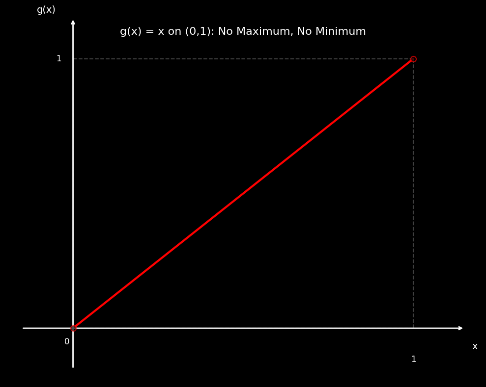
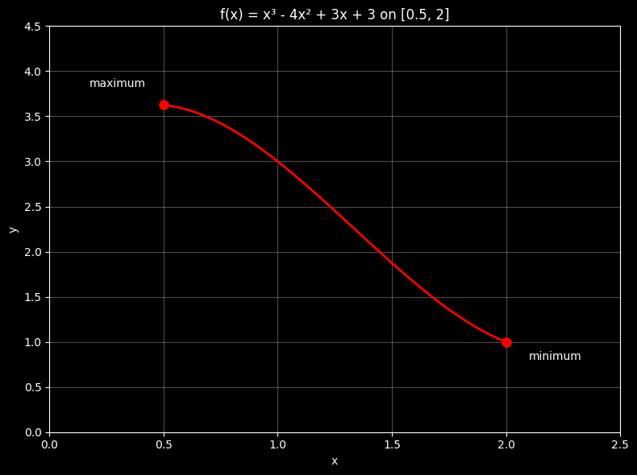
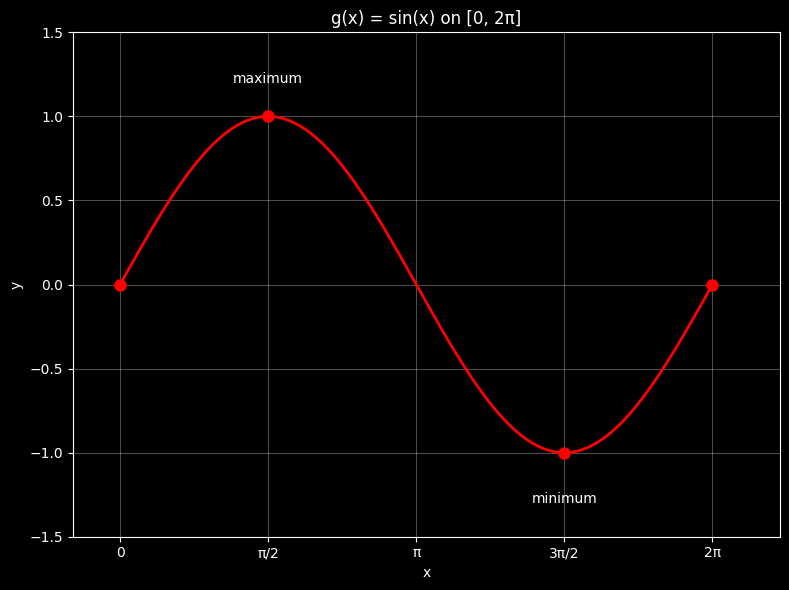
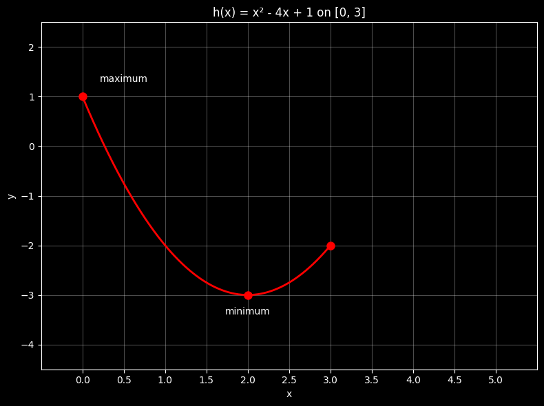
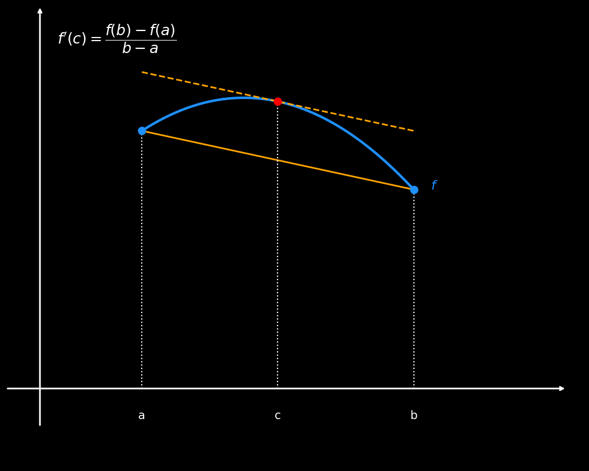
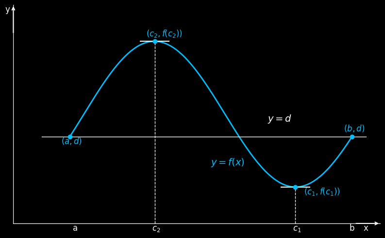
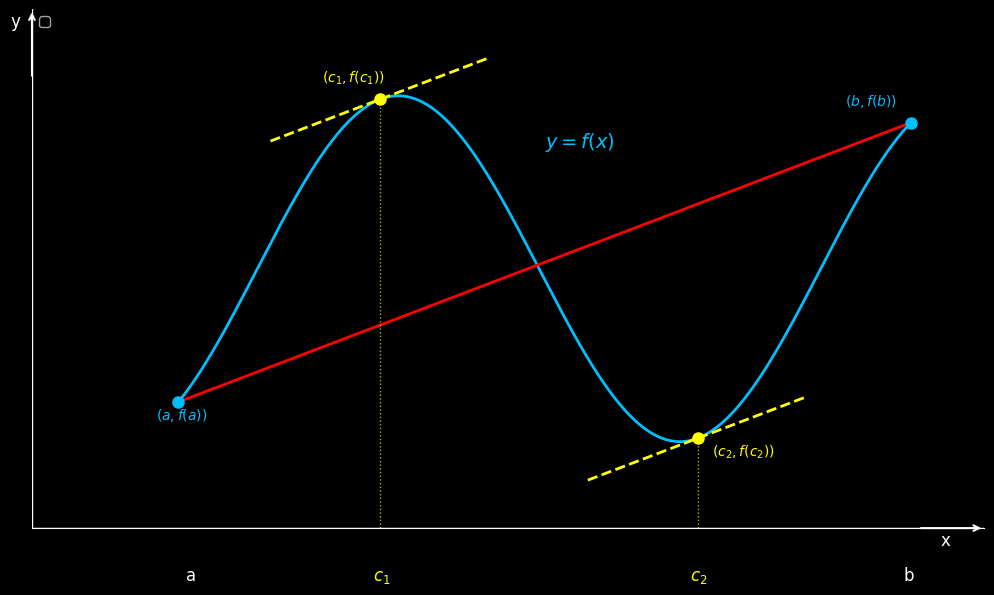

# Appedicses

```
import numpy as np
import matplotlib.pyplot as plt
plt.style.use('dark_background')

# Create figure and axis
fig, ax = plt.subplots(1, 1, figsize=(10, 8))

# Define x values for the function g(x) = x on open interval (0,1)
x = np.linspace(0.001, 0.999, 1000)
y = x  # g(x) = x

# Plot the main line g(x) = x
ax.plot(x, y, 'red', linewidth=3, label='g(x) = x')


# Add lines to show the bounded region (0,1) × (0,1)
ax.plot([0, 0], [0, 1], color='gray', linestyle='--', alpha=0.5)  # Left boundary
ax.plot([1, 1], [0, 1], color='gray', linestyle='--', alpha=0.5)  # Right boundary
ax.plot([0, 1], [1, 1], color='gray', linestyle='--', alpha=0.5)  # Top boundary
ax.plot([0, 1], [0, 0], color='gray', linestyle='--', alpha=0.5)  # Bottom boundary


# Plot open circles at the endpoints to show they're not included
ax.plot(0, 0, 'wo', markersize=8, markerfacecolor='black', markeredgecolor='red',
        markeredgewidth=1.5, zorder=4, alpha=0.7)
ax.plot(1, 1, 'wo', markersize=8, markerfacecolor='black', markeredgecolor='red',
        markeredgewidth=1.5, zorder=4, alpha=0.7)
# Set up the axes
ax.set_xlim(-0.2, 1.2)
ax.set_ylim(-0.2, 1.2)

# Remove all spines
ax.spines['left'].set_visible(False)
ax.spines['bottom'].set_visible(False)
ax.spines['right'].set_visible(False)
ax.spines['top'].set_visible(False)

# Remove axis ticks and labels
ax.set_xticks([])
ax.set_yticks([])

# Add custom axis arrows
ax.annotate('', xy=(1.15, 0), xytext=(-0.15, 0),
            arrowprops=dict(arrowstyle='->', color='white', lw=2))
ax.annotate('', xy=(0, 1.15), xytext=(0, -0.15),
            arrowprops=dict(arrowstyle='->', color='white', lw=2))

# Add axis labels
ax.text(1.18, -0.05, 'x', fontsize=14, color='white', ha='center', va='top')
ax.text(-0.05, 1.18, 'g(x)', fontsize=14, color='white', ha='right', va='center')

# Add 0 and 1 markings on both axes
# ax.plot([-0.03, 0.03], [0, 0], 'white', linewidth=2)
# ax.plot([0, 0], [-0.03, 0.03], 'white', linewidth=2)
ax.text(-0.01, -0.05, '0', fontsize=12, color='white', ha='right', va='center')
# ax.text(0, -0.1, '0', fontsize=12, color='white', ha='center', va='top')

# ax.plot([0.97, 1.03], [1, 1], 'white', linewidth=2)
# ax.plot([1, 1], [0.97, 1.03], 'white', linewidth=2)
ax.text(-0.05, 1, '1', fontsize=12, color='white', ha='left', va='center')
ax.text(1, -0.1, '1', fontsize=12, color='white', ha='center', va='top')

# Add title
ax.text(0.5, 1.1, 'g(x) = x on (0,1): No Maximum, No Minimum', 
        ha='center', va='center', fontsize=16, color='white')

plt.tight_layout()
plt.show()
```



```
import matplotlib.pyplot as plt
import numpy as np

# Plot 1: f(x) = x³ - 4x² + 3x + 3 on [0.5, 2]
plt.figure(figsize=(8, 6))
x1 = np.linspace(0.5, 2, 1000)
y1 = x1**3 - 4*x1**2 + 3*x1 + 3

plt.plot(x1, y1, 'r-', linewidth=2)
plt.grid(True, alpha=0.3)
plt.xlim(0, 2.5)
plt.ylim(0, 4.5)

# Mark endpoints and extrema for function 1
f_05 = 0.5**3 - 4*0.5**2 + 3*0.5 + 3
f_2 = 2**3 - 4*2**2 + 3*2 + 3
plt.plot(0.5, f_05, 'ro', markersize=8)
plt.plot(2, f_2, 'ro', markersize=8)
plt.text(0.3, f_05 + 0.2, 'maximum', fontsize=10, ha='center')
plt.text(2.1, f_2 - 0.2, 'minimum', fontsize=10, ha='left')

plt.xlabel('x')
plt.ylabel('y')
plt.title('f(x) = x³ - 4x² + 3x + 3 on [0.5, 2]')
plt.tight_layout()
plt.show()

# Plot 2: g(x) = sin(x) on [0, 2π]
plt.figure(figsize=(8, 6))
x2 = np.linspace(0, 2*np.pi, 1000)
y2 = np.sin(x2)

plt.plot(x2, y2, 'r-', linewidth=2)
plt.grid(True, alpha=0.3)
plt.xlim(-0.5, 7)
plt.ylim(-1.5, 1.5)

# Mark extrema for function 2
plt.plot(np.pi/2, 1, 'ro', markersize=8)
plt.plot(3*np.pi/2, -1, 'ro', markersize=8)
plt.plot(0, 0, 'ro', markersize=8)
plt.plot(2*np.pi, 0, 'ro', markersize=8)
plt.text(np.pi/2, 1.2, 'maximum', fontsize=10, ha='center')
plt.text(3*np.pi/2, -1.3, 'minimum', fontsize=10, ha='center')

# Add x-axis labels
plt.xticks([0, np.pi/2, np.pi, 3*np.pi/2, 2*np.pi], ['0', 'π/2', 'π', '3π/2', '2π'])
plt.xlabel('x')
plt.ylabel('y')
plt.title('g(x) = sin(x) on [0, 2π]')
plt.tight_layout()
plt.show()

# Plot 3: h(x) = x² - 4x + 1 on [0, 3]
plt.figure(figsize=(8, 6))
x3 = np.linspace(0, 3, 1000)
y3 = x3**2 - 4*x3 + 1

plt.plot(x3, y3, 'r-', linewidth=2)
plt.grid(True, alpha=0.3)
plt.xlim(-0.5, 5.5)
plt.ylim(-4.5, 2.5)

# Mark extrema for function 3
h_0 = 0**2 - 4*0 + 1
h_3 = 3**2 - 4*3 + 1
h_2 = 2**2 - 4*2 + 1
plt.plot(0, h_0, 'ro', markersize=8)
plt.plot(3, h_3, 'ro', markersize=8)
plt.plot(2, h_2, 'ro', markersize=8)
plt.text(0.5, h_0 + 0.3, 'maximum', fontsize=10, ha='center')
plt.text(2, h_2 - 0.4, 'minimum', fontsize=10, ha='center')

# Add x-axis ticks
plt.xticks([0, 0.5, 1, 1.5, 2, 2.5, 3, 3.5, 4, 4.5, 5])
plt.xlabel('x')
plt.ylabel('y')
# plt.title('h(x) = x² - 4x + 1 on [0, 3]')
plt.tight_layout()
plt.show()
```





```
import numpy as np
import matplotlib.pyplot as plt

# Use dark background
plt.style.use('dark_background')

# Define a non-symmetric function
def f(x):
    return -1.2 * (x - 1.2) ** 2 + 3.8

# Define points a, b, c
a, b = 0.6, 2.2
c = (a + b) / 2
fa, fb, fc = f(a), f(b), f(c)

# Function domain only from a to b
x = np.linspace(a, b, 400)
y = f(x)

# Create plot
fig, ax = plt.subplots(figsize=(10, 8))
fig.patch.set_facecolor('black')
ax.set_facecolor('black')

# Plot the curve between a and b
ax.plot(x, y, color='dodgerblue', linewidth=3)

# Plot blue dots at (a, f(a)) and (b, f(b))
ax.plot(a, fa, 'o', color='dodgerblue', markersize=9, zorder=5)
ax.plot(b, fb, 'o', color='dodgerblue', markersize=9, zorder=5)

# Plot red dot at (c, f(c))
ax.plot(c, fc, 'ro', markersize=9, zorder=6)

# Plot secant line from (a, f(a)) to (b, f(b))
ax.plot([a, b], [fa, fb], color='orange', linewidth=2)

# Plot tangent line at c
slope = (fb - fa) / (b - a)
tangent_line = lambda x: slope * (x - c) + fc
x_tan = np.linspace(a, b, 200)
ax.plot(x_tan, tangent_line(x_tan), color='orange', linestyle='--', linewidth=2)

# Vertical dashed lines at a, b, c
ax.vlines([a, b, c], ymin=0, ymax=[fa, fb, fc], colors='white', linestyles='dotted')

# Axes limits
ax.set_xlim(-0.2, 3.2)
ax.set_ylim(-1, 5)

# Remove ticks and spines
ax.set_xticks([])
ax.set_yticks([])
for spine in ax.spines.values():
    spine.set_visible(False)

# Custom axis arrows
ax.annotate('', xy=(3.1, 0), xytext=(-0.2, 0),
            arrowprops=dict(arrowstyle='->', color='white', lw=2))
ax.annotate('', xy=(0, 5), xytext=(0, -0.5),
            arrowprops=dict(arrowstyle='->', color='white', lw=2))

# Label points a, b, c
ax.text(a, -0.4, 'a', fontsize=14, color='white', ha='center')
ax.text(b, -0.4, 'b', fontsize=14, color='white', ha='center')
ax.text(c, -0.4, 'c', fontsize=14, color='white', ha='center')

# Label the curve
ax.text(b + 0.1, f(b), '$f$', fontsize=16, color='dodgerblue')

# Mean Value Theorem formula
ax.text(0.1, 4.5, r"$f'(c) = \dfrac{f(b) - f(a)}{b - a}$", fontsize=18, color='white')

plt.tight_layout()
plt.show()

```


```
import numpy as np
import matplotlib.pyplot as plt

# Dark theme
plt.style.use('dark_background')

# Curve with same start and end values
x = np.linspace(0, 10, 400)
y = np.cos((x - 3) * np.pi / 5) + 1.5

# Setup plot
fig, ax = plt.subplots(figsize=(8, 5))
fig.patch.set_facecolor('black')
ax.set_facecolor('black')

# Plot function
ax.plot(x, y, color='deepskyblue', linewidth=2, label=r'$y = f(x)$')

# Points
a, b = x[0], x[-1]
fa, fb = y[0], y[-1]
c2 = x[np.argmax(y)]
c1 = x[np.argmin(y)]
fc2 = max(y)
fc1 = min(y)

# Draw f(a) = f(b) line
ax.plot([a-1, b+0.5], [fa, fb], color='white', linestyle='-', linewidth=1)

# Vertical dashed lines to local extrema
ax.plot([c2, c2], [0, fc2], 'w--', linewidth=1)
ax.plot([c1, c1], [0, fc1], 'w--', linewidth=1)

# Horizontal caps
ax.plot([c2 - 0.5, c2 + 0.5], [fc2, fc2], 'white', linewidth=1.5)
ax.plot([c1 - 0.5, c1 + 0.5], [fc1, fc1], 'white', linewidth=1.5)

# Mark and label points
ax.plot([a, b], [fa, fb], 'o', color='deepskyblue')
ax.text(a + 0.1, -0.1, 'a', fontsize=12, color='white')  # Adjusted position
ax.text(b - 0.1, -0.1, 'b', fontsize=12, color='white')
ax.text(c2 - 0.1, -0.1, r'$c_2$', fontsize=12, color='white')
ax.text(c1 - 0.1, -0.1, r'$c_1$', fontsize=12, color='white')
ax.text((a + b) / 2, 0.8, r'$y = f(x)$', fontsize=14, color='deepskyblue')
ax.text((a + b) / 2 + 2, 1.4, r'$y=d$', fontsize=14, color='white')

# Move y-axis to the left by adjusting xlim
left_margin = -2  # How much to show left of x=0
ax.set_xlim(left_margin, b + 1)  # Extend left limit

# Axes lines (y-axis will now appear at x=left_margin)
ax.axhline(0, color='white', linewidth=1)
ax.axvline(left_margin, color='white', linewidth=1)  # Moved y-axis to left

# Axis arrows
ax.annotate('', xy=(b +1, 0), xytext=(b + 0.1, 0),
            arrowprops=dict(arrowstyle='->', color='white', lw=1.5))
# Adjust y-axis arrow to new position
ax.annotate('', xy=(left_margin, y.max() + 0.5), 
            xytext=(left_margin, y.max() + 0.1),
            arrowprops=dict(arrowstyle='->', color='white', lw=1.5))

# Mark and label extrema
ax.plot([c1, c2], [fc1, fc2], 'o', color='deepskyblue')
ax.text(c1 + 0.3, fc1 - 0.1, r'$(c_1, f(c_1))$', fontsize=12, color='deepskyblue')
ax.text(c2 - 0.3, fc2 + 0.07, r'$(c_2, f(c_2))$', fontsize=12, color='deepskyblue')
ax.text(a - 0.3, fa - 0.1, r'$(a,d)$', fontsize=12, color='deepskyblue')
ax.text(b - 0.3, fb + 0.07, r'$(b,d)$', fontsize=12, color='deepskyblue')

# Axis labels
ax.text(b + 0.4, -0.1, 'x', fontsize=12, color='white')
# Adjust y-label to new y-axis position
ax.text(left_margin - 0.3, y.max() + 0.4, 'y', fontsize=12, color='white')

# Clean up
ax.set_ylim(y.min() - 0.5, y.max() + 0.5)
ax.set_xticks([])
ax.set_yticks([])
ax.spines['top'].set_visible(False)
ax.spines['right'].set_visible(False)
ax.spines['bottom'].set_visible(True)
ax.spines['left'].set_visible(False)

plt.tight_layout()
plt.show()
```


```
import numpy as np
import matplotlib.pyplot as plt
from scipy.optimize import fsolve

# Dark theme
plt.style.use('dark_background')

# Define the function and its derivative (FIXED: consistent coefficient)
def f(x):
    return np.cos(1.3*(x - 3) * np.pi / 5) + 1.5

def f_prime(x):
    return -1.3 * np.pi / 5 * np.sin(1.3*(x - 3) * np.pi / 5)

# Curve with same start and end values
x = np.linspace(0, 10, 400)
y = f(x)

# Setup plot
fig, ax = plt.subplots(figsize=(10, 6))
fig.patch.set_facecolor('black')
ax.set_facecolor('black')

# Plot function
ax.plot(x, y, color='deepskyblue', linewidth=2)

# Points
a, b = x[0], x[-1]
fa, fb = f(a), f(b)

# Calculate the slope of secant line connecting (a, f(a)) and (b, f(b))
secant_slope = (fb - fa) / (b - a)
print(f"Secant line slope: {secant_slope:.6f}")

# Find points where f'(c) = secant_slope (MVT points)
def equation(c):
    return f_prime(c) - secant_slope

# Find all solutions in the interval [a, b]
mvt_points = []
for start in np.linspace(a, b, 20):
    try:
        sol = fsolve(equation, start)[0]
        if a < sol < b and abs(equation(sol)) < 1e-10:
            # Check if this solution is already in our list
            if not any(abs(sol - existing) < 1e-6 for existing in mvt_points):
                mvt_points.append(sol)
    except:
        pass

mvt_points.sort()
print(f"MVT points (c values): {mvt_points}")
print(f"Derivatives at MVT points: {[f_prime(c) for c in mvt_points]}")

# Draw secant line
ax.plot([a, b], [fa, fb], color='red', linestyle='-', linewidth=2)

# Draw tangent lines at MVT points
for i, c in enumerate(mvt_points):
    fc = f(c)
    slope = f_prime(c)
    
    # Calculate tangent line points
    x_tangent = np.linspace(c - 1.5, c + 1.5, 100)
    y_tangent = slope * (x_tangent - c) + fc
    
    # Plot tangent line
    ax.plot(x_tangent, y_tangent, color='yellow', linestyle='--', linewidth=2)
    
    # Mark MVT point
    ax.plot(c, fc, 'o', color='yellow', markersize=8)
    
    # Vertical dashed line to MVT point
    ax.plot([c, c], [0, fc], 'yellow', linestyle=':', linewidth=1, alpha=0.7)
    
    # Label MVT point - improved positioning
    ax.text(c - 0.1, -0.3, f'$c_{i+1}$', fontsize=12, color='yellow')
    
    # Position labels to avoid overlap
    if i == 0:
        ax.text(c - 0.8, fc + 0.1, f'$(c_{i+1}, f(c_{i+1}))$', fontsize=10, color='yellow')
    else:
        ax.text(c + 0.2, fc - 0.1, f'$(c_{i+1}, f(c_{i+1}))$', fontsize=10, color='yellow')

# Mark and label endpoints
ax.plot([a, b], [fa, fb], 'o', color='deepskyblue', markersize=8)
ax.text(a + 0.1, -0.3, 'a', fontsize=12, color='white')
ax.text(b - 0.1, -0.3, 'b', fontsize=12, color='white')
ax.text(a - 0.3, fa - 0.1, f'$(a, f(a))$', fontsize=10, color='deepskyblue')
ax.text(b - 0.9, fb + 0.1, f'$(b, f(b))$', fontsize=10, color='deepskyblue')

# Function label
ax.text((a + b) / 2, max(y) - 0.3, r'$y = f(x)$', fontsize=14, color='deepskyblue')

# Move y-axis to the left
left_margin = -2
ax.set_xlim(left_margin, b + 1)

# Axes lines
ax.axhline(0, color='white', linewidth=1)
ax.axvline(left_margin, color='white', linewidth=1)

# Axis arrows
ax.annotate('', xy=(b + 1, 0), xytext=(b + 0.1, 0),
            arrowprops=dict(arrowstyle='->', color='white', lw=1.5))
ax.annotate('', xy=(left_margin, max(y) + 0.5),
            xytext=(left_margin, max(y) + 0.1),
            arrowprops=dict(arrowstyle='->', color='white', lw=1.5))

# Axis labels
ax.text(b + 0.4, -0.1, 'x', fontsize=12, color='white')
ax.text(left_margin - 0.3, max(y) + 0.4, 'y', fontsize=12, color='white')

# Clean up
ax.set_ylim(min(y) - 0.5, max(y) + 0.5)
ax.set_xticks([])
ax.set_yticks([])
ax.spines['top'].set_visible(False)
ax.spines['right'].set_visible(False)
ax.spines['bottom'].set_visible(True)
ax.spines['left'].set_visible(False)

# Add legend
ax.legend(loc='upper left', fontsize=10)

# Add title
# ax.set_title('Mean Value Theorem for Derivatives', fontsize=16, color='white', pad=20)

plt.tight_layout()
plt.show()


```



```
import matplotlib.pyplot as plt
import numpy as np


# Dark theme
plt.style.use('dark_background')

# Create figure with two subplots side by side
fig, (ax1, ax2) = plt.subplots(1, 2, figsize=(12, 5))

# Define x values
x = np.linspace(-3, 3, 1000)

# Strictly Increasing Function: f(x) = x^3 + x + 1
y1 = x**3 + x + 1

# Strictly Decreasing Function: f(x) = -x^3 - x + 1  
y2 = -x**3 - x + 1

# Plot Strictly Increasing Function
ax1.plot(x, y1, 'cyan', linewidth=2, label='f(x) = x³ + x + 1')
ax1.grid(True, alpha=0.3)
# ax1.set_xlabel('x')
# ax1.set_ylabel('f(x)')
ax1.set_title('Strictly Increasing Function')
ax1.axhline(y=0, color='k', linewidth=0.5)
ax1.axvline(x=0, color='k', linewidth=0.5)

# Remove axis numbers but keep grid
ax1.set_xticks([])
ax1.set_yticks([])

# Add example points to show x1 < x2 implies f(x1) < f(x2)
x1_inc, x2_inc = -1, 1
y1_inc, y2_inc = x1_inc**3 + x1_inc + 1, x2_inc**3 + x2_inc + 1
ax1.plot([x1_inc, x2_inc], [y1_inc, y2_inc], 'o', markersize=8,color='red')
ax1.plot([x1_inc, x1_inc], [-10, y1_inc], 'w--', alpha=0.7)
ax1.plot([x2_inc, x2_inc], [-10, y2_inc], 'w--', alpha=0.7)
ax1.plot([-3, x1_inc], [y1_inc, y1_inc], 'w--', alpha=0.7)
ax1.plot([-3, x2_inc], [y2_inc, y2_inc], 'w--', alpha=0.7)
ax1.text(x1_inc, -10.75, 'x₁', fontsize=12, ha='center')
ax1.text(x2_inc, -10.75, 'x₂', fontsize=12, ha='center')
ax1.text(-3.25, y1_inc, 'f(x₁)', fontsize=12, ha='center')
ax1.text(-3.25, y2_inc, 'f(x₂)', fontsize=12, ha='center')
# Grid lines
for i in range(-10, 10):
    ax1.axvline(i, color='#4A5568', linewidth=0.5, alpha=0.7)
for i in range(-10, 10):
    ax1.axhline(i, color='#4A5568', linewidth=0.5, alpha=0.7)


# Plot Strictly Decreasing Function
ax2.plot(x, y2, 'cyan', linewidth=2, label='f(x) = -x³ - x + 1')
ax2.grid(True, alpha=0.3)
# ax2.set_xlabel('x')
# ax2.set_ylabel('f(x)')
ax2.set_title('Strictly Decreasing Function')
# ax2.axhline(y=0, color='k', linewidth=0.5)
# ax2.axvline(x=0, color='k', linewidth=0.5)

# Remove axis numbers but keep grid
ax2.set_xticks([])
ax2.set_yticks([])

# Add example points to show x1 < x2 implies f(x1) > f(x2)
x1_dec, x2_dec = -1, 1
y1_dec, y2_dec = -x1_dec**3 - x1_dec + 1, -x2_dec**3 - x2_dec + 1
ax2.plot([x1_dec, x2_dec], [y1_dec, y2_dec], 'o', markersize=8, color='red')
ax2.plot([x1_dec, x1_dec], [-10, y1_dec], 'w--', alpha=0.7)
ax2.plot([x2_dec, x2_dec], [-10, y2_dec], 'w--', alpha=0.7)
ax2.plot([-3, x1_dec], [y1_dec, y1_dec], 'w--', alpha=0.7)
ax2.plot([-3, x2_dec], [y2_dec, y2_dec], 'w--', alpha=0.7)
ax2.text(x1_dec, -10.75, 'x₁', fontsize=12, ha='center')
ax2.text(x2_dec, -10.75, 'x₂', fontsize=12, ha='center')
ax2.text(-3.25, y1_dec, 'f(x₁)', fontsize=12, ha='center')
ax2.text(-3.25, y2_dec, 'f(x₂)', fontsize=12, ha='center')
# Grid lines
for i in range(-10, 10):
    ax2.axvline(i, color='#4A5568', linewidth=0.5, alpha=0.7)
for i in range(-10, 10):
    ax2.axhline(i, color='#4A5568', linewidth=0.5, alpha=0.7)
# Set equal aspect ratio and limits
ax1.set_xlim(-3, 3)
ax1.set_ylim(-10, 10)
ax2.set_xlim(-3, 3)
ax2.set_ylim(-10, 10)

# Add annotations explaining the conditions
ax1.text(0.5, -8, 'x₁ < x₂ ⟹ f(x₁) < f(x₂)', fontsize=12,
         bbox=dict(boxstyle="round,pad=0.3", facecolor="lightcoral", alpha=0.7))
ax2.text(0.5, -8, 'x₁ < x₂ ⟹ f(x₁) > f(x₂)', fontsize=12,
         bbox=dict(boxstyle="round,pad=0.3", facecolor="lightcoral", alpha=0.7))

plt.tight_layout()
plt.show()

```


```
import matplotlib.pyplot as plt
import numpy as np

# Set dark theme
plt.style.use('dark_background')

# Create figure
fig, ax = plt.subplots(1, 1, figsize=(12, 3))

# Define the range for the number line
x_min, x_max = -7, 1

# Draw the main number line
ax.axhline(y=0, color='white', linewidth=3, xmin=0, xmax=1)

# Add tick marks for each integer
for i in range(x_min, x_max + 1):
    ax.plot([i, i], [-0.1, 0.1], color='white', linewidth=2)
    ax.text(i, -0.3, str(i), ha='center', va='top', fontsize=12, color='white')

# Mark -3 and -5 with special highlighting
marked_points = [-3, -5]
for point in marked_points:
    # Draw a larger circle at the marked point
    ax.plot(point, 0, 'o', color='red', markersize=12, markeredgecolor='red', markeredgewidth=2)
    # Add label above the point
    # ax.text(point, 0.4, f'x = {point}', ha='center', va='bottom', fontsize=14, 
    #         color='yellow', fontweight='bold')

# Add arrows at the ends of the number line
# ax.annotate('', xy=(x_min-0.3, 0), xytext=(x_min-0.1, 0),
#             arrowprops=dict(arrowstyle='<-', color='white', lw=2))
# ax.annotate('', xy=(x_max+0.3, 0), xytext=(x_max+0.1, 0),
#             arrowprops=dict(arrowstyle='->', color='white', lw=2))

# Set the limits and appearance
ax.set_xlim(x_min - 0.5, x_max + 0.5)
ax.set_ylim(-0.8, 0.8)

# Remove y-axis and spines
ax.set_yticks([])
ax.spines['top'].set_visible(False)
ax.spines['right'].set_visible(False)
ax.spines['bottom'].set_visible(False)
ax.spines['left'].set_visible(False)

# Add title
# ax.set_title('Number Line: x = -7 to 1 (with marked points at -3 and -5)', 
#              fontsize=16, color='white', pad=20)

# Add grid for better readability (optional)
# ax.grid(True, alpha=0.3, axis='x', color='gray')
ax.set_xticks([])
ax.set_yticks([])
plt.tight_layout()
plt.show()
```


```
import matplotlib.pyplot as plt
import numpy as np

# Create figure with two subplots side by side
fig, (ax1, ax2) = plt.subplots(1, 2, figsize=(12, 5))

# Define x values for both plots
x1 = np.linspace(0, 6, 1000)
x2 = np.linspace(0, 6, 1000)

# Concave up function (e.g., x^2)
y1 = x2**2

# Concave down function (e.g., square root)
y2 = 2 * np.sqrt(x2)

# Plot concave up function
ax1.plot(x1, y1, color='cyan', linewidth=2)
ax1.grid(True, alpha=0.5)
ax1.set_xlim(0, 3)
ax1.set_ylim(0, 6)
ax1.set_xlabel('x')
ax1.set_ylabel('y')
ax1.set_title('Concave up', fontsize=12)

# First tangent line at x = 1
x_tangent1 = 1
y_tangent1 = x_tangent1**2
slope1 = 2 * x_tangent1  # derivative of x^2
x_line1 = np.linspace(0.2, 2.2, 100)
y_line1 = slope1 * (x_line1 - x_tangent1) + y_tangent1
ax1.plot(x_line1, y_line1, color='orange', linewidth=2)
ax1.scatter(1, 1, color='orange', s=40, zorder=5)
ax1.annotate("(1,1)", xy=(1,1), xytext=(-30,10),
             textcoords='offset points', color='orange', fontsize=10)

# Second tangent line at x = 2
x_tangent2 = 2
y_tangent2 = x_tangent2**2
slope2 = 2 * x_tangent2  # derivative of x^2
x_line2 = np.linspace(1, 3, 100)
y_line2 = slope2 * (x_line2 - x_tangent2) + y_tangent2
ax1.plot(x_line2, y_line2, color='magenta', linewidth=2)
ax1.scatter(2, 4, color='magenta', s=40, zorder=5)
ax1.annotate("(2,4)", xy=(2,4), xytext=(-30, 10),
             textcoords='offset points', color='magenta', fontsize=10)

# Plot concave down function
ax2.plot(x2, y2, color='cyan', linewidth=2)
ax2.grid(True, alpha=0.5)
ax2.set_xlim(0, 6)
ax2.set_ylim(0, 6)
ax2.set_xlabel('x')
ax2.set_ylabel('y')
ax2.set_title('Concave down', fontsize=12)

# First tangent line at x = 2
x_tangent3 = 2
y_tangent3 = 2 * np.sqrt(x_tangent3)
slope3 = 1 / np.sqrt(x_tangent3)  # derivative of 2*sqrt(x)
x_line3 = np.linspace(0.5, 4, 100)
y_line3 = slope3 * (x_line3 - x_tangent3) + y_tangent3
ax2.plot(x_line3, y_line3, color='orange', linewidth=2)
ax2.scatter(2, 2.828, color='orange', s=40, zorder=5)
ax2.annotate("$(2,2\\sqrt{2})$", xy=(2,2.828), xytext=(-30,10),
             textcoords='offset points', color='orange', fontsize=10)

# Second tangent line at x = 4
x_tangent4 = 4
y_tangent4 = 2 * np.sqrt(x_tangent4)
slope4 = 1 / np.sqrt(x_tangent4)  # derivative of 2*sqrt(x)
x_line4 = np.linspace(2, 6, 100)
y_line4 = slope4 * (x_line4 - x_tangent4) + y_tangent4
ax2.plot(x_line4, y_line4, color='magenta', linewidth=2)
ax2.scatter(4, 4, color='magenta', s=40, zorder=5)
ax2.annotate("(4,4)", xy=(4,4), xytext=(-30, 10),
             textcoords='offset points', color='magenta', fontsize=10)

# Set background to black
ax1.set_facecolor('black')
ax2.set_facecolor('black')
fig.patch.set_facecolor('black')

plt.tight_layout()
plt.show()
```
